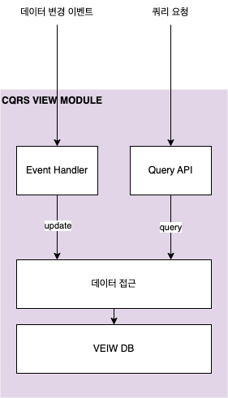

애플리케이션은 다양한 데이터 쿼리 기능을 지원해야 한다. 
만약 모놀로식 애플리케이션이라면 단일 데이터베이스를 사용할 것이고, 이는 적절한 SQL 구문을 통해 처리할 수 있다. 
하지만 MSA에서는 서비스 및 데이터가 분산되어 있으므로 별도의 방법이 필요하다. 

## API Composition

API Composition은 말 그대로 필요한 데이터를 가지고 있는 각 서비스에 데이터를 요청하고 한 곳에서 잘 합쳐서 결과를 제공하는 방식이다. 

문제는 이 쿼리 결과를 조합하는 책임을 누가 가져야하는 것인데 세 가지 선택 사항이 있다. 
첫 번째로는 **데이터를 최종적으로 사용할 클라이언트**(e.g. 웹 애플리케이션)에서 조합하는 것이다. 
이 방법 같은 경우에는 클라이언트가 방화벽 외부에 존재하고 네트워크가 안정적이지 않다면 문제가 될 수 있다. 
두 번째로는 **API 게이트웨이**에 이 역할을 주는 것이다. 쿼리 작업이 외부 API로 제공된다면 효과적인 방법이다. 
다만 기성품으로 존재하는 게이트웨이에서 기능을 제공하지 않을 수 있으며, 이 경우 게이트웨이를 직접 개발해야 한다. 
그리고 마지막으로는 쿼리를 위한 새로운 **stand alone service**를 만드는 것이다. 
내부적으로 많이 사용하는 쿼리라면 이 방식이 적합할 수 있다. 
상당히 직관적인 방법이지만 여러 단점이 존재한다. 

#### 오버헤드의 증가

이 구조에서는 서비스 간에 호출이 발생하고 또 각 서비스마다 내부적으로 별개의 데이터베이스 쿼리가 발생하게 된다. 
모놀로식이라면 한 번의 데이터베이스 쿼리가 발생하는 것과 비교해보면 리소스가 훨씬 많이 소모될 수 밖에 없다. 

#### 가용성 저하

여러 서비스의 참여가 묶여 있는 만큼 가용성이 떨어질 수 밖에 없다. 
최소한 composer 역할을 하는 부분과 둘 이상의 데이터 프로바이더가 참여하기 때문에 단일 서비스 처리에 비하면 가용성이 많이 떨어진다. 
따라서 별도의 가용성을 높일 수 있는 전략을 강구해야 한다. 
예를 들어 composer에서 캐싱을 적절히 사용해서 어떤 서비스가 다운되었을 때 캐싱된 데이터를 반환할 수 있다. 
그리고 반환 데이터 중 마이너한 부분을 담당하는 서비스가 다운되었다면 이를 제외한 미완성 데이터를 반환하는 것도 하나의 방법이 될 수 있다. 

#### 일관성 결여

아무래도 하나의 트랜잭션 내에서 쿼리를 수행하는 것이 아니고 여러 데이터베이스를 대상으로 수행하기 때문에 일관성이 결여될 수 있다. 
데이터에 모순이 있어서는 안된다면 API Composer가 이런 것들을 감지하고 픽스해줘야하는데 그러면 로직이 계속해서 복잡해질 수 밖에 없다. 

#### 비즈니스에 의한 복잡도

위 같이 아키텍처 구조에 의한 근본적 단점도 있지만 비즈니스에 따라 구현을 하기 힘든 케이스도 존재한다. 
음식 배달 애플리케이션에서 특정 사용자의 주문 이력을 조회하는 쿼리가 있다고 해보자. 
쿼리의 입력에는 일단 사용자의 아이디가 있을 것이고, 또 메뉴 이름 같은 검색 조건이 있을 수 있다. 
주문 서비스에서는 주어진 조건을 그대로 전달하여 적절한 데이터를 가져오는 것은 어렵지 않다. 
하지만 문제는 다른 서비스에서 데이터를 조회할 때이다. 
배달 정보를 가져올 배달 서비스나 결제 정보를 가져올 회계 서비스에서는 메뉴 이름과 같이 **필터링 해야하는 데이터를 들고 있지 않기 때문**이다. 

여기에는 두 가지 해결 방법이 있다. 
먼저 배달 서비스나 회계 서비스에는 사용자 아이디만 사용해서 모든 정보를 가져온 다음 composer에서 **In-memory 조인**을 하는 것이다. 
최종적으로 적합한 결과를 얻을 수는 있지만 사용하지 않을 수 많은 데이터를 떠와서 메모리 조인하는 것은 상당히 비효율적일 수 밖에 없다. 
두 번째로는 주문 서비스에서 먼저 적절한 주문을 걸러내고 주문 아이디를 기반으로 배달, 결제 서비스에서 조회를 하는 것이다. 
하지만 이 방법은 배달, 결제 서비스에서 RDB의 IN 구문과 같은 기능을 가진 API를 제공할 때의 이야기이고 그게 아니라면 **주문의 개수만큼 API 호출이 발생**한다. 
결론적으로 둘 다 좋은 방법은 아니다.

또 다른 예시로는 사용자의 현재 위치를 중심으로 주변의 식당을 조회하는 쿼리가 있다고 해보자. 
위치 기반 조회는 데이터가 저장된 데이터베이스에 많이 의존한다. 
지리 데이터를 위한 데이터 타입, 인덱스, 쿼리 기능이 제공하는 데이터베이스가 필요하다. 
그게 아니라면 음식점 정보의 레플리카를 유지해서 별도의 라이브러리를 사용하는 것이 필요한데 이 **레플리카를 항상 최신으로 유지하는 것도 문제**가 된다. 

그리고 이 쿼리는 어디에 정의되어야할까? 
식당 데이터를 소유한 서비스에서 구현해야할까? 
식당 서비스가 사장님들 본인의 식당 정보 관리 및 메뉴 관리에 초점이 맞춰져있다면 정답이 아닐 수도 있다. 
기존의 롤과는 너무 다르기 때문이다. 
이처럼 **실제 데이터를 소유하고 있는 서비스에서 모든 쿼리를 작성해야한다면 적절한 관심사의 분리를 할 수 없게 된다**. 

## CQRS 패턴

**CQRS(Command Query Responsibility Segregation)**는 말 그대로 커맨드와 쿼리를 분리한다는 의미이다. 
대부분의 애플리케이션이 영속성 데이터에 대한 CRUD 작업이 존재하는데 이를 CUD와 R로 분리한다는 것이다. 
여기서는 논리적인 분리만이 아니라 실제 데이터베이스도 커맨드를 위한 데이터베이스와 쿼리를 위한 데이터베이스로 분리된다. 
커맨드 쪽 데이터베이스가 변경될 때마다 이벤트를 발행하고 쿼리를 위한 데이터베이스에서는 이 이벤트를 구독하여 최신화 상태를 유지한다. 

이 패턴을 사용하면 실제 쿼리만 작업하는 별도의 쿼리 서비스를 만들 수 있다. 
앞서 다룬 주문 이력을 조회하는 쿼리를 제공하는 서비스에서 사용하는 데이터베이스는 주문, 배달, 결제 서비스의 커맨드가 발행한 이벤트를 구독해서 뷰를 유지할 수 있다. 
또 이와 유사하게 앞서 음식정 정보의 레플리카를 유지하는 것도 같은 방법으로 최신화 상태를 유지할 수 있다.

CQRS는 API composition에서 발생할 수 있는 언급한 문제들을 모두 해결할 수 있다. 
비효율적인 인메모리 쿼리가 발생하지 않고, 특정 목적에 맞는 데이터베이스를 사용할수도 있으며 그에 따라 관심사의 분리도 용이해진다. 
다만 장점만 있을 수는 없는 법이며 단점도 분명히 존재한다. 

일단 당연히 직관적인 API composition에 비해서 아키텍처가 상당히 복잡하다. 
뷰를 업데이트하고 조회하는 쿼리 서비스를 별도로 작성해야되며 추가적인 데이터 저장소를 관리해야된다. 
그리고 뷰를 담당하는 데이터베이스의 데이터는 '커맨드 처리 - 이벤트 발생 - 뷰 업데이트' 순으로 처리되기 때문에 이 사이에 시간차가 있을 수 밖에 없다. 
따라서 클라이언트에서 업데이트를 하자마자 뷰를 쿼리하면 업데이트 이전의 데이터가 결과로 나올 수도 있다는 것이다. 

 

참고
- 크리스 리처드슨, 마이크로 서비스 패턴, 이일웅, 길벗