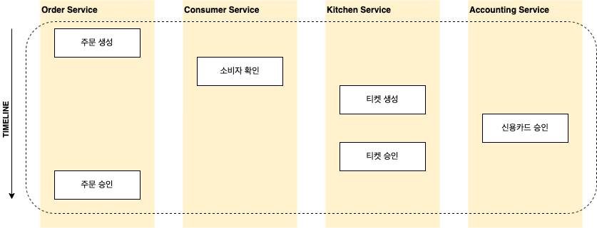
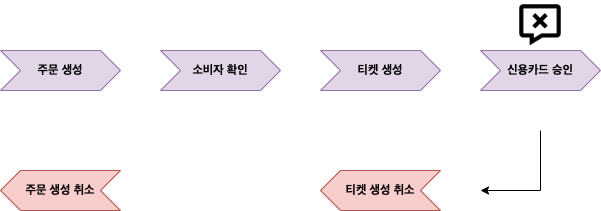
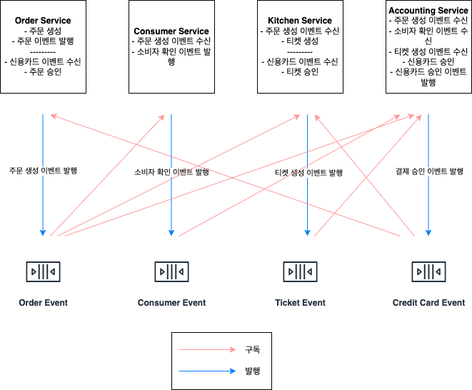
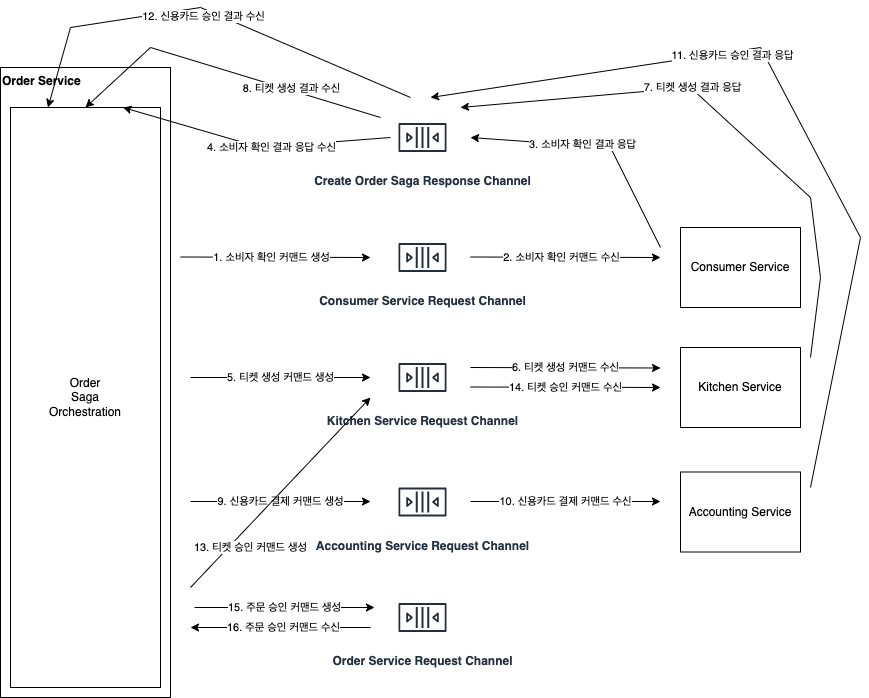

## MSA에서의 트랜잭션

거의 모든 애플리케이션에서는 데이터 일관성을 위해 트랜잭션 개념이 필요하다. 
관계형 데이터베이스 하나가 물려있는 모놀로식 애플리케이션이라면 DB의 트랜잭션을 사용하면 쉽게 ACID를 실현할 수 있다. 
하지만 MSA 같은 경우에는 하나의 서비스를 넘어 여러 서비스에 걸쳐 데이터의 일관성을 유지하는 것이 필요하다. 

일전에는 주로 **분산 트랜잭션**을 통해 일관성을 유지했다. 
분산 트랜잭션에서 2-Phase-Commit은 트랜잭션에 연관된 참여자 모두가 커밋을 하거나 롤백을 하거나를 보장한다. 
여기서는 트랜잭션을 총괄하는 중재자(Coordinator)가 존재하고, 참여자들은 작업에 대한 성공/실패 여부를 여기에 보고한다. 
그리고 모든 참여자에 대한 응답이 왔을 때 중재가 참여자들에게 커밋/롤백에 대한 요청을 하게 된다. 

다만 이 기법은 요즘 애플리케이션들에는 많이 사용되지 않는다. 
일단 NoSQL 제품들이나 카프카 등 메시지 브로커들 현대의 많은 기술들이 분산 트랜잭션 기술 자체를 지원하지 않는다는 점이 있다. 
그리고 두 번째로는 가용성 문제인데, 참여한 모든 서비스가 가동 중이고 정상 처리되어야 커밋이 가능하기에 가용성이 떨어진다. 
트랜잭션의 가용성은 서비스들의 각 가용성 값의 곱이므로 참여하는 서비스가 많아질 수록 가용성이 떨어지게 된다. 
일관성은 확실히 보장하지만 요즘 아키텍처들은 가용성 또한 매우 중요한 요소이므로 좋은 선택이 아니게 된다. 

## SAGA 패턴



위 예시는 주문 생성이라는 비즈니스에 대한 처리이다. 
일련의 작업들을 묶음을 하나의 사가라고 한다. 
사가는 분산 트랜잭션 없이 **데이터의 일관성을 유지하는 방법**이다. 
여러 서비스에 걸쳐 데이터를 업데이트하는 하나의 커맨드에 대해 사가를 일대일로 정의하게 된다. 
각 단계는 서비스 내부적으로 관리되는 로컬 트랜잭션을 사용하기 때문에 손쉽게 구현 가능하며, 로컬 트랜잭션이 완료되면 메시지를 발행하여 다음 단계를 트리거하게 된다. 

이렇게 구성된 패턴에서 첫 번째로 고려해야할 것은 실패에 대한 롤백이다. 
각 단계가 로컬 트랜잭션으로 구현되어 있기 때문에 실패가 발생했을 때 자동으로 롤백되지 않는다. 
만약, 신용카드 승인 단계에서 실패가 발생하게 된다면 앞의 주문 생성, 티켓 생성 과정들을 롤백해야 된다. 
그래서 서비스들에서는 사가가 실패했을 때 복구할 수 있는 undo 프로세스를 정의해야 되는데 이를 **보상 트랜잭션**이라고 한다.



항상 보상 트랜잭션을 정의해야되는 것은 아니다. 
여기서 유효한 소비자인지 확인하는 과정은 조회 성격만 가지고 있기 때문에 정의할 필요가 없다. 
그리고 티켓 승인, 주문 승인은 항상 성공하기 때문에 정의할 필요가 없으며 이들을 **재시도 가능한 트랜잭션**이라고 한다. 
신용 카드 승인 같은 경우에는 재시도 가능한 트랜잭션들 바로 앞에 위치한 **피봇 트랜잭션**이기에 정의할 필요가 없다. 
그래서 실제로 보상 트랜잭션이 정의되야하는 것은 주문 생성과 티켓 생성이 된다. 

사가는 실행 단계를 정의하는 로직으로 구성된다. 
첫 번째 사가 참여자를 정하여 로컬 트랜잭션 실행을 지시하고, 트랜잭션이 완료되면 그 다음 참여자를 호출하는 방식으로 구성된다. 
이를 구성하는 방법은 두 가지 코레오그래피 방식과 오케스트레이션 방식이 존재한다. 

### Choreography

코레오그래피 사가 방식은 사가에 참여자에게 모든 의사 결정을 맡기게 된다. 
참여자들 서로가 이벤트를 교환해서 그에 따라 동작하게 된다. 



이 방식에서는 두 가지 고려해야 할 점이 있다. 
사가 참여자가 자신의 데이터베이스를 업데이트하고 트랜잭션의 일부로 이벤트를 발행해야 한다는 것이다. 
반드시 **데이터베이스를 업데이트하는 작업과 이벤트 발행은 원자적**으로 일어나야 한다. 
두 번째는 자신이 수신한 이벤트를 데이터와 연관 지을 수 있어야 한다는 것이다. 
예를 들어 신용카드 승인 이벤트가 떨어졌을 때 이 승인이 어떤 주문 건에 대한 것인지 파악 가능해야한다는 것이다. 

이 패턴은 사가를 어느 한 곳에 정의한 것이 아니라 로직이 서비스 전반에 흩어져 있어 이해하기가 어렵다. 
그리고 참여자는 자신에게 영향을 주는 모든 이벤트를 구독해야하며, 또 참여자가 서로 이벤트를 구독하기 때문에 순환 참조가 발생할 수 있다. 
간단한 비즈니스라면 이 방식으로 구현해도 무방하나 복잡해지는 경우에는 아래 오케스트레이션 방식을 사용하는 것이 좋다.

### Orchestration

오케스트레이션 사가 방식은 동작 로직을 오케스트레이터에 중앙화 시킨다. 
오케스트레이터가 각 참여자에게 커맨드를 보내 수행할 작업을 지시한다. 



이 패턴은 코레오그래피 방식에 비해 의존 관계가 단순화 된다. 
하나의 오케스트레이터가 각 참여자에 의존하고 있고 다른 서비스들 간의 의존은 없기 때문에 순환 참조에 대한 걱정도 필요 없다. 
그리고 각 서비스는 사가가 블랙박스이기 때문에 결합도가 낮으며 비즈니스 로직도 단순해질 수 있다. 오케스트레이터가 호출하는 API만 구현하면되는 것이다. 
하지만 이 경우 비즈니스 로직을 오케스트레이터에 너무 넣으면 오케스트레이터에 모든 비즈니스가 집중되고 각 서비스는 비즈니스 없는 깡통으로 변할 가능성도 있다. 

## 비격리 문제

위 처럼 사가에 의한 트랜잭션은 로컬 트랜잭션과 다르게 ACID 중 격리성을 만족시킬 수 없다. 
사가들이 동시에 실행될 때 한 사가 과정에서 변경한 데이터를 다른 사가에서도 바라볼 수 있게 된다. 
이 경우 다양한 이상 현상이 나타날 수 있다. 

예를 들어, 주문을 생성하는 사가가 실행되는 도중에 주문 취소 사가가 실행되었다고 해보자. 
주문 취소 사가가 완료되고 주문 생성 사가에서 최종적으로 주문 승인을 해버린다면 취소에 대한 동작은 승인으로 덮어 써지게 된다. 
이를 **업데이트 소실**이라고 한다. 

그리고 주문 취소가 아래와 같은 트랜잭션으로 구성된다고 가정해보자.

1. 소비자 서비스 : 잔고를 늘린다.
2. 주문 서비스 : 주문을 취소 상태로 변경한다.
3. 배달 서비스 : 배달을 취소한다. 

주문 취소 사가가 실행되다가 어떤 이유로 실패하게 된다고 해보자. 
그래서 잔고를 늘리는 작업이 결국 롤백되야 하는데 이 틈에 주문 생성 사가가 실행되었다고 해보자. 
그러면 주문 생성 사가는 롤백되어야할 잔고 데이터를 읽게 되는 **Dirty Read**가 발생할 수 있다. 
이런 문제들은 상황에 따라 다르겠지만 아래와 같은 대책들이 있을 수 있다. 

### 시맨틱 락

보상 가능한 트랜잭션이 생성 및 수정하는 레코드에는 항상 상태 값 플래그를 두는 것이다. 
예를 들어 주문 생성 시 주문 레코드에 상태 값을 두는 것이다. 
사가에서 최초 생성 시에는 ```APPROVAL_PENDING``` 상태이고 사가 작업이 모두 마무리되고 마지막 단계에서 이를 ```APPROVAL```로 변경하는 것이다. 
이렇게 되면 특정 주문이 ```APPROVAL_PENDING``` 상태라면 주문 생성 작업이 실행 중임을 알 수 있고 이를 통해 접근을 막거나하는 등의 처리를 할 수 있다. 

### 교환적 업데이트

업데이트 작업을 동작 순서와 무관하게 설계하는 것도 방법이다. 
어떤 계좌 서비스가 있고 입금, 출금 기능이 있다고 했을 때 입금에 대한 보상 트랜잭션 자체를 출금 기능으로 지정하면 된다. 

### 비관적 관점

위 주문 취소에 대한 Dirty Read 현상을 다시 한 번 보자.

1. 소비자 서비스 : 잔고를 늘린다.
2. 주문 서비스 : 주문을 취소 상태로 변경한다.
3. 배달 서비스 : 배달을 취소한다. 

이 경우 사가의 순서를 조정하면 위험을 크게 줄일 수 있다. 

1. 주문 서비스 : 주문을 취소 상태로 변경한다.
2. 배달 서비스 : 배달을 취소한다. 
3. 소비자 서비스 : 잔고를 늘린다.

### 값 다시 읽기

이는 레코드를 업데이트하기 전 값을 다시 읽어 값이 변경되지 않았는지 확인한다. 
다시 읽었을 때 변경이 발생했다면 사가를 중단하는 것이다. 

### 버전 파일

레코드에 수행한 작업을 하나하나 기록하는 방법이다. 
예를 들어 주문 생성 사가와 주문 취소 사가가 동시에 실행되는 경우 결제 서비스에서는 실제 결제 승인이 떨어지지도 않았는데 승인 취소를 하는 기현상이 발생할 수 있다. 
이 때 작업 내용을 기록해둬서 승인 취소가 일어난 후 승인 작업이 들어왔다면, 이미 승인 취소 요청이 접수되었으니 아무 동작을 하지 않는다라는 정책으로 갈 수 있다. 

### 값의 특성에 의한

비즈니스 상황에 따라 다른 동시성 메커니즘을 사용할 수 있다. 
예를 들어, 금전적으로 아주 큰 거래를 다루는 비즈니스 같은 경우에는 분산 트랜잭션을 사용하여 구현할 수 있다.

<br/>

참고
- 크리스 리처드슨, 마이크로 서비스 패턴, 이일웅, 길벗