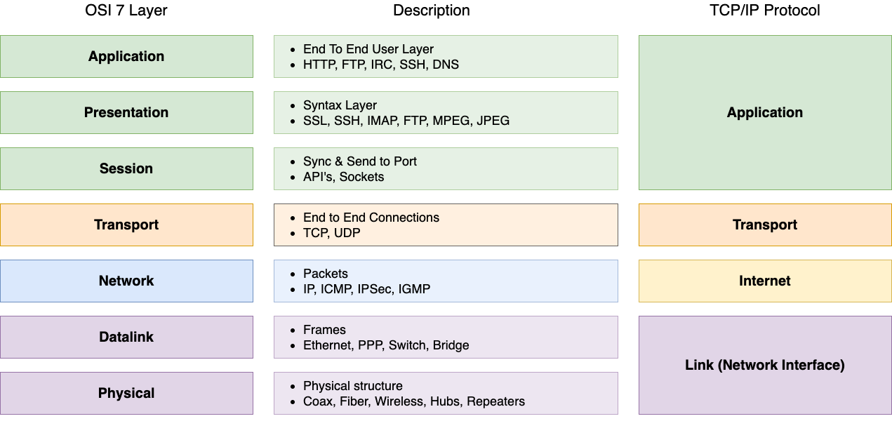

## OSI 7 계층  

#### 1. Physical layer (물리 계층)

물리 계층은 말 그대로 전기적, 광학적인 물리적 매체를 통하여 비트의 스트림을 전달하는데 필요한 기능들을 제공한다. 

#### 2. Data Link layer (데이터 링크 계층)

이 계층에서는 비트 스트림을 **frame**이라는 데이터 단위로 나누며, 에러 컨트롤을 통해 손상되거나 손실된 frame을 감지한다. 
즉, 물리 계층의 전송은 비신뢰성을 신뢰할 수 있도록 바꾸어주는 역할을 한다. 
네트워크 브릿지나 스위치가 이 계층에서 동작하며 각 point는 MAC Address로 식별된다. 

#### 3. Network Layer

출발지에서 목적지까지 전송을 담당하며 어떤 주소를 어떤 경로로 찾아갈지 결정하는 계층이다. 
라우터가 이 계층에서 동작하며 논리적인 주소는 IP Address로 표현된다. 

#### 4. Transport Layer

End-to-End 간에 데이터를 주고 받을 수 있게 한다. 
TCP가 가장 잘 알려진 예시이며 Flow Control, Error Control를 통해 신뢰성 있는 데이터 전송을 가능하게 한다. 

#### 5. Session Layer

두 End Point 사이 어떻게 통신을 하는가에 대한 방법을 제공한다. 
Duplex, Half-Duplex, Full-Duplex 방식을 정의하고, TCP/IP 세션을 관리하는 책임을 가진다. 

#### 6. Presentation Layer

데이터의 표현 방식을 결정한다. 
데이터의 압축, 암호화 같은 동작들이 이 계층에서 이루어진다. 

#### 7. Application Layer

실제 응용 애플리케이션이나 사용자가 접근하는 단계이다. 
HTTP, FTP, SMTP, Telnet과 같은 프로토콜들이 이 레이어에 해당한다. 

 

참고  
- [OSI Model: The 7 Layers of Network Architecture](https://www.bmc.com/blogs/osi-model-7-layers/)
- [OSI 모형](https://ko.wikipedia.org/wiki/OSI_%EB%AA%A8%ED%98%95)