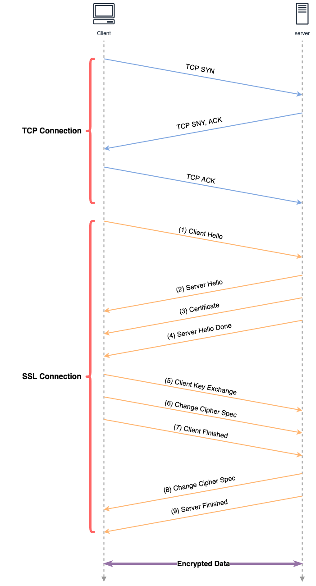

## HTTPS  

단순히 HTTP만을 사용하는 것은 보안적으로 취약하며 정보보안에 있어 중요한 요소들을 위반한다. 
예를 들어 쇼핑몰 사이트에서 물건 구매 요청을 보낸다고 가정해보자. 

1. **기밀성**   
기밀성은 오직 인가된 주체만이 접근 가능함을 의미하며, 접근제어나 암호화를 통해 구현된다. 
하지만 HTTP 메시지에는 이러한 장치가 존재하지 않으며 네트워크 상에서 충분히 snooping될 수 있다. 
구매 요청 메시지에서 신용카드 정보 등의 중요한 데이터를 그대로 가져올 수 있는 것이다.  

2. **무결성**  
무결성은 불법적으로 생성 또는 변경되거나 삭제되지 않도록 보호되어야함을 의미한다.  
무결성이 존재하지 않는다면 구매 요청 메시지를 수정하여 악의적인 행동을 할 수 있다. 
구매 수량을 변경해버린다거나 배송 주소를 다른 곳으로 돌린다거나 하는 식으로 말이다. 

3. **인증**  
클라이언트와 서버 상호 간의 메시지가 서로 신뢰 가능한지를 의미한다. 
예를 들어, 서버의 인증이 제공되지 않는다면 서버의 응답을 가로채 피싱 사이트로 연결할 수 있다. 
그리고 클라이언트에서 그대로 다시 요청을 보낸다면 모든 정보는 피싱 사이트로 들어가게 된다. 

## SSL  

이러한 문제점을 해결하는 것이 HTTPS, **H**yper**T**ext **T**ransfer **P**rotocol over **S**ecure Socket Layer이다. 
말 그대로, 기존의 HTTP를 **SSL(Secure Sockets Layer)**이라는 보안 계층 위에서 동작하게 함으로써 '안전한 HTTP'를 제공하는 것이다. 

> 사실 오늘 날 SSL이라고 제공되는 것들 중 대부분은 IETF에 의해 표준화된 SSL Version 3의 변형된 버전인 TLS, Transport Sockets Security이다. 

핸드셰이크 과정에서 optional하게 수행될 수 있는 부분을 제외하면 아래와 같은 흐름을 가진다. 
먼저, TCP Connection을 위한 HandShake 수행하고 이 후 SSL을 위한 HandShake가 진행된다. 

1. **Client Hello**

SSL Connection을 위한 시작 지점이다. 클라이언트에서 사용 가능한 암호화 알고리즘을 포함하여 서버에 전송한다.

2. **Server Hello**  

서버는 사용 가능한 암호화 알고리즘에서 대칭키 알고리즘(e.g. AES), 공개키 알고리즘(e.g. RSA), MAC 알고리즘을 선택하여 응답한다. 

3. **Certificate**  

서버는 자신의 인증서를 클라이언트에게 전송한다. 
이 인증서는 CA(Certificate Authority)의 비밀키로 암호화되어 있기 때문에 CA의 공개키에 의해서만 복호화 가능하다. 
클라이언트가 이를 검증 했을 때 제대로 복호화되어 있다는 것은, 해당 인증서가 정말 CA에 의해 발급된 인증서임을 신뢰할 수 있다. 
따라서, 클라이언트는 인증서 내의 공개키가 진짜 서버의 공개키임을 신뢰할 수 있다. 

4. **Server Hello Done**  

Server Hello 작업이 종료되었음을 의미한다. 

5. **Client Key Exchange**  

클라이언트는 클라이언트-서버 사이의 데이터 전송을 암호화하기 위한, 대칭키인 **PMS(Pre-Master Secret)**을 생성하여 보낸다. 
이 때 PMS는 인증서로 부터 획득한 서버의 공개키로 암호화된다.  

이 과정을 통해 클라이언트와 서버만 알 수 있는 키를 공유하였기에, 그대로 사용할 수도 있으나 실제 일반적으로 사용되는 키들은 아래와 같은 과정을 가진다. 
먼저, 클라이언트와 서버는 SSL 표준에 지정된 동일한 키 유도 함수를 사용하여 PMS와 넌스로부터 **MS(Master Secret)**을 유도한다. 
그리고 MS는 아래 4개의 키로 분할 된다.  

    - 클라이언트가 서버에 보내는 데이터에 대한 세션 암호화 키
    - 클라이언트가 서버에 보내는 데이터에 대한 세션 MAC 키
    - 서버가 클라이언트에 보내는 데이터에 대한 세션 암호화 키
    - 서버가 클라이언트에 보내는 데이터에 대한 세션 MAC 키

6. **Change Cipher Spec**  

클라이언트에서 공유키를 성공적으로 생성했으며, 이 후 메시지는 암호화하여 전송할 것임을 알린다.

7. **Client Finished**  

모든 작업이 완료되었음을 알린다. 
이 단계는 HandShake 자체가 훼손 당한지를 검증하게 된다. HandShake 자체는 암호화되어 있지 않기 때문에 메시지 변조가 있을 수 있다. 
예를 들어 1번 과정에서 공격자가 메시지를 탈취하여 높은 수준의 암호화 알고리즘을 모두 제거하는 등의 공격이 가능하다. 
따라서, 클라이언트는 HandShake 과정에서 발생한 모든 메시지를 합쳐 이에 대한 해시 값을 전송하고 서버는 이를 자신이 주고 받은 메시지와 일치하는지 검증한다. 

8. **Change Cipher Spec**  

서버에서 공유키를 성공적으로 생성했으며, 이 후 메시지는 암호화하여 전송할 것임을 알린다.

9. **Server Finished**  

모든 작업이 완료되었음을 알린다.
Client Finished와 마찬가지로 HandShake 메시지 변조에 대한 검증을 하기 위한 해시 값을 전송한다. 

 

참고  
- James Kurose , Keith Ross, Computer Networking: A Top-Down Approach, Pearson