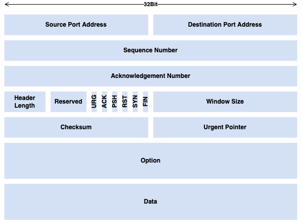
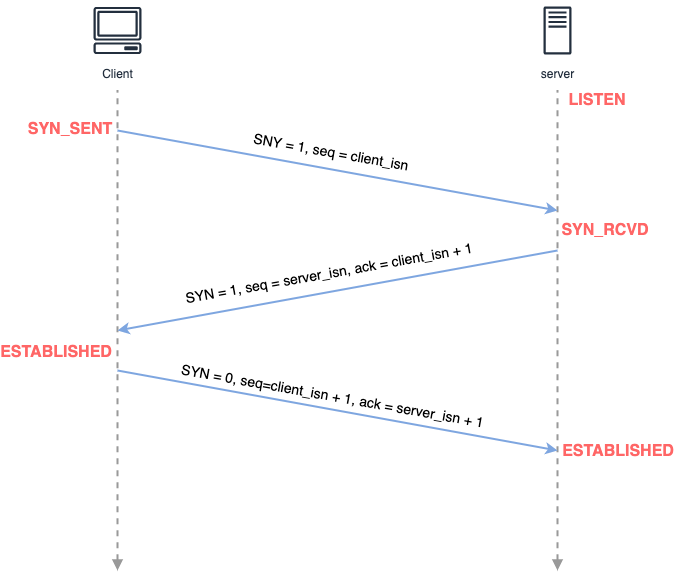
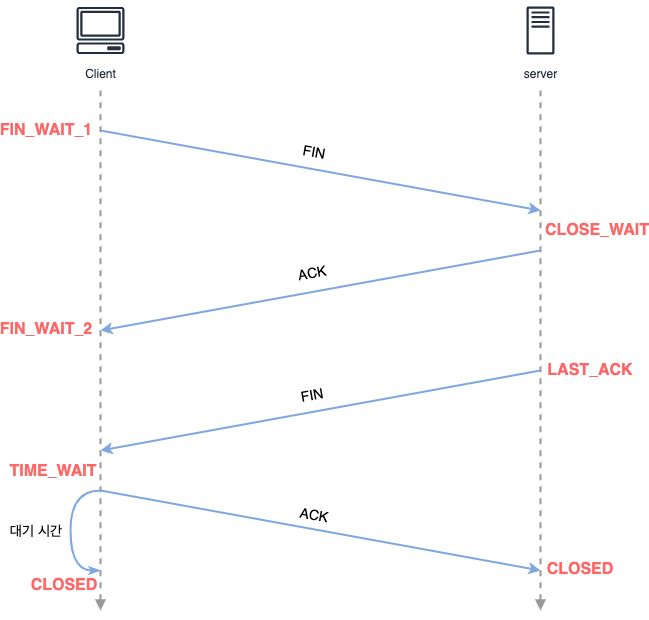

## TCP 연결 관리  

TCP 프로토콜은 연결 지향적(connection-oriented)인 성격을 갖는다. 
먼저, TCP에서 통신하기 위해 TCP 관련 헤더와 클라이언트의 데이터를 하나로 묶는데 이를 **TCP Segment**라고 하며 구조는 아래와 같다. 

### TCP 연결 초기화 

TCP에서 클라이언트가 어느 서버와 통신을 시작한다고 해보자. 
이 때 무작정 데이터를 전송하는 것이 아니라, 둘 사이 연결을 초기화하는 과정을 거치게되는데 이를 **3-Way Handshake**라고 한다. 

**Step1 - SYN**  
먼저 클라이언트의 TCP는 서버 TCP에 연결을 위한 Segment를 전송한다. 
이 때 애플리케이션 레벨의 데이터는 포함되지 않으며, 헤더에 SYN라고 불리는 하나의 비트를 포함한다. 
그리고 통신을 시작의 시작점인 Sequence Number에 적절한 client_isn 값을 선택하여 전송한다. 

**Step2 - SYN+ACK**  
서버는 위의 세그먼트가 도착했을 때, TCP 버퍼와 변수들을 할당한다. 
그리고 위의 대한 응답으로 3개의 데이터를 포함하게 된다. 
첫 번째로는 **SYN** 비트이며 이는 1로 설정된다. 
두 번째로는 Segment 헤더 상 **Acknowledgement Number**는 client_isn + 1로 설정된다. 
마지막으로는 Sequence Number에 서버의 최초 번호인 server_isn을 선택한다. 

**Step3 - ACK**  
클라이언트가 위의 응답을 수신하면 서버와 마찬가지로 TCP 버퍼와 변수들을 할당한다. 
그리고 서버로 응답을 받았음을 의미하는 세그먼트를 전송하게 된다. 
이 때, 연결이 설정된 이 후이기 때문에 SYN 비트는 0으로 설정된다. 
그리고 Acknowledgement Number에는 server_isn + 1의 값이 설정된다. 

### TCP 연결 종료  

TCP 연결의 종료는 4개의 스텝으로 구성되는데 이에 기반하여 **4-Way Handshake**라고 부르기도 한다. 

연결의 종료는 **FIN**으로 명명된 비트 필드를 사용한다. 
먼저 클라이언트가 연결의 종료를 한다고 했을 때 FIN 비트를 1로 설정하여 서버로 전송하고 서버는 이에 대해 응답한다. 
그리고 서버 또한 클라이언트의 행동과 동일하게 FIN 비트를 1로 설정하여 클라이언트로 전송하고 클라이언트는 이에 대해 응답한다. 

이 때, 특이한 점은 클라이언트가 마지막 ACK를 송신하고 바로 CLOSED 상태로 빠지는 것이 아니라 일정 시간 동안 TIME_WAIT 상태로 있다는 것이다. 
이는 자신이 송신한 ACK가 손실되는 경우 재전송을 하기 위함이며 구현에 따라 다르지만 대채로 30초, 1분, 2분의 시간을 가진다. 

 

참고  
- James Kurose , Keith Ross, Computer Networking: A Top-Down Approach, Pearson