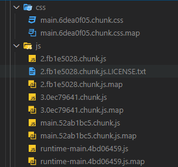

## 리액트의 빌드  

리액트 애플리케이션은 빌드를 하여 배포된다. 
웹 팩은 빌드 과정에서 JS의 불필요한 주석, 경고, 공백 등을 제거하여 파일을 최소화하기도 하고 
JSX, 최신 문법을 브라우저 호환성을 가지도록 트랜스 파일해주기도 한다. 

웹팩에서 별도의 설정 없이는 모든 JS 파일이 하나의 파일로 합쳐지고, 
CSS 파일 또한 하나의 파일로 합쳐진다. 

```Create React App```을 통해 생성된 프로젝트를 빌드할 때는 
기본적으로 설정이 되어 있으며 파일을 일부 분리시켜 준다. 



파일 이름에는 해시 값이 포함되어 있는데 좀 보기 싫지만 
이는 신규 배포 시 브라우저에서 로컬 캐시를 사용하여 반영 내용을 가져오지 못하는 현상을 방지할 수 있다. 

이 기본적인 설정 값으로는 브라우저의 캐시를 효율적으로 사용할 수 있다. 
'2.fb1e5028.chunk'와 같이 2로 시작하는 파일에는 변경 가능성이 적은 ```node_module```에 포함된 내용으로 이루어져 있다. 
신규 모듈이 발생하지 않는 이상 해시 값이 수정되지 않고 브라우저 캐시를 사용한다. 

직접 구현한 소스는 'main.52ab1bc5.chunk'와 같이 main으로 시작되는 파일에 포함된다. 
기본 설정만으로는 이 소스에 대한 분리를 진행할 수 없다. 

예를 들어 다수의 페이지로 구성된 SPA를 개발했다고 가정하였을 때, 
사용자가 아직 방문하지 않은 페이지의 리소스는 불필요하다. 
하지만 하나의 파일로 구성되어 최초 로드 시 모두 가져오게되며 이는 불필요한 오버헤드를 발생시킨다. 

## 함수 비동기 로딩  

컴포넌트가 아닌 일반 함수를 스플릿하는 예시이다. 

``` js
// notify.js
const notify = () => {
	alert('안녕!');
};

export default notify;
```

``` js
// App.js
const App = () => {
  const onClick = () => {
    import('./notify').then(result => result.default());
  }
  
  return (
    <div>
      <button onClick={onClick}>Hello React!</button>
    </div>
  )
}
```

정말 말 그대로 비동기로 가져온다. 
```import``` 구문은 ```promise```를 반환하며, ```onClick```이 동작할 때 가져온다.
이렇게 작성했을 때 ```notify``` 관련 내용은 별도의 파일로 빠지게 된다.

## React.lazy, Suspense  

컴포넌트를 스플릿하며 리액트 16.6 버전부터 지원을 하고 있다. 

``` js
import React, {Suspense} from 'react';

const SplitTarget = React.lazy(() => import('./SplitTarget'));

const App = () => {  
  return (
    <Suspense fallback={<div>loading...</div>}>
      <SplitTarget/>
    </Suspense>
  )
}
```

필요한 컴포넌트는 ```React.lazy``` 구문을 통해서 ```import```하여 사용한다. 
여기서 ```SplitTarget``` 관련 코드는 별도의 파일로 분리된다. 
그리고 ```SplitTarget``` 을 표현하는 부분이 ```Suspense``` 태그로 감싸져 있다. 
이 구문으로 Lazy loading을 통해 컴포넌트를 가져오는 시점을 결정할 수 있고, 
로딩 시간 동안 보여줄 부분을 정의할 수 있다.

## Loadable Components  

이는 리액트 내장이 아닌 서드 파티 라이브러리이다. 
React.lazy는 서버 사이드 렌더링에서는 지원하지 않는 반면, 이는 서버 사이드 렌더링을 지원한다. 
그리고 리액트 공식 홈페이지에서도 서버 사이드 렌더링 시 이를 권장하고 있다. 

``` js
import React, {Suspense} from 'react';
import loadable from '@loadable/component';

const SplitTarget = loadable(() => import('./SplitTarget'), {
  fallback: <div>loading...</div>
});

const App = () => {
  return (
    <SplitTarget/>
  );
}
```

컴포넌트를 스플릿하기 위한 사용법 자체는 비슷하다. 
차이점은 ```Suspense```와 같은 별도 트리거 구문이 없다는 점, 
```Suspense```에 정의된 로딩 시 보여지는 구문이 ```loadable``` 함수로 옮겨진 부분이다.


<br/>

참고
- 김민준, 리액트를 다루는 기술, 길벗