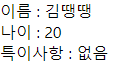

## 컴포넌트  

리액트에서 화면은 여러 개의 컴포넌트로 구성되어 있다. 
컴포넌트는 단순히 UI를 정의하는 템플릿이 아니다. 
화면에 어떻게 나타날지를 포함하여 속성 값, 라이프 사이클 이벤트 등을 정의하여 여러 동작을 가능하게 한다.  

컴포넌트를 선언하는 방법은 클래스 형태의 컴포넌트 함수 형태의 컴포넌트 두 가지가 있다.  

``` js
import React from 'react';
import './App.css'

// 함수형
function App(){
	const name = 'react';
	return <>{name}</>;
}

export default App;
```

``` js
import React, { Component } from 'react';

// 클래스형
class App extends Component {
	// 필수 요소
	render() {
		const name = 'react';
		return <>{name}</>;
	}
}

export default App;
```

두 컴포넌트의 형태가 다른데 클래스형 컴포넌트는 state와 라이프 사이클 api를 사용할 수 있는반면, 
함수형 컴포넌트는 이를 Hooks을 사용하여 유사한 작업을 한다. 

## props  

**props**는 properties를 의미하며 컴포넌트의 속성 값을 나타낸다. 
이 props 값은 해당 컴포넌트를 사용하는 부모 컴포넌트에서 설정할 수 있다. 

``` js
// MyComponent.js
import React from 'react';

const MyComponent = (props) => {
	return <div> 이름 : {props.name} </div>;
};

export default MyComponent;
```

``` js
// App.js
import './App.css';
import MyComponent from './MyComponent';

const App = () => {
  return <MyComponent name="박리액트"/>;
}

export default App;
```

```MyComponent```를 사용하는 App.js에서 name을 정의하여 동적으로 렌더링 할 수 있다. 
기본적인 구조는 위와 같고 좀 더 상세한 기능을 살펴보면 설정 또는 제약을 걸 수 있음을 확인할 수 있다.

``` js
// MyComponent.js
import React from 'react';
import PropTypes from 'prop-types';

// Parameter : ES6의 비구조화 할당으로 값 추출
const MyComponent = ({name, age, children}) => {
	return (
		<>
			<div> 이름 : {name} </div>
			<div> 나이 : {age} </div>
			{/* children : 부모 컴포넌트에서 선언한 부분의 태그 사이 내용*/}
			<div> 특이사항 : {children}</div>
		</>
	);
};

// 값을 지정하지 않을 때 사용할 디폴트 값
MyComponent.defaultProps = {
	age: 20
};

// props의 타입, 필수 요소를 지정
MyComponent.propTypes = {
	name: PropTypes.string.isRequired,
	age: PropTypes.number
};

export default MyComponent;
```

``` js
// App.js
import './App.css';
import MyComponent from './MyComponent';

const App = () => {
  return <MyComponent name="김땡땡">없음</MyComponent>;
}

export default App;
```

그리고, 이를 클래스형 컴포넌트로 나타내면 아래와 같다.

``` js
// MyComponent.js
import React, {Component} from 'react';
import PropTypes from 'prop-types';

class MyComponent extends Component {
	render() {
		const { name, age, children } = this.props;
		return (
			<>
				<div> 이름 : {name} </div>
				<div> 나이 : {age} </div>
				{/* children : 부모 컴포넌트에서 선언한 부분의 태그 사이 내용*/}
				<div> 특이사항 : {children}</div>
			</>
		);
	};

	static defaultProps = {
		age: 20
	};

	static propTypes = {
		name: PropTypes.string.isRequired,
		age: PropTypes.number
	};
}

export default MyComponent;
```



## state

props 같은 경우에는 컴포넌트를 사용하는 부모의 입장에서 값들을 정의하고, 
컴포넌트 내부에서는 read-only인 데이터들이다. 
반면, **state**는 컴포넌트 내부에서 변화하는 값들을 말한다. 
state 값이 변하면 컴포넌트가 동적으로 다시 렌더링된다.

이러한 state는 내부에서 정의하고 setState 함수로 값을 변경시킨다. 
```setState(updater[, callback])``` 형태를 가지며 
아래는 버튼 클릭 시 그 수를 내부적으로 관리하는 컴포넌트이다.

``` js
// Counter.js
import React, {Component} from 'react';

class Counter extends Component{
	state = {
		number: 0
	};

	render() {
		const {number} = this.state;
		return (
			<div>
				<h1>{number}</h1>
				<button onClick = {() => {
					this.setState(
						// updater
						(prev, props) => ({
							number: prev.number + 1
						}),
						// callback
						() => {
							console.log('This is Callback Functions');
						}
					);	
				}}>
				Click!
				</button>
			</div>
		);
	}
}

export default Counter;
```

함수형 컴포넌트에서는 ```useState```라는 함수를 사용하여 관리하고, 이는 **Hooks**의 한 종류이다. 

``` js
import React, {useState} from 'react';

const Counter = () => {
	// 배열 비구조화 할당
	// useState의 인자에는 초기 값을 넣어준다
	const [number, setNumber] = useState(0);

	return (
		<div>
			<h1>{number}</h1>
			<button onClick = {() => {
				setNumber(number+1);
			}}>
			Click!
			</button>
		</div>
	);
};

export default Counter;
```

<br/>

참고
- 김민준, 리액트를 다루는 기술, 길벗