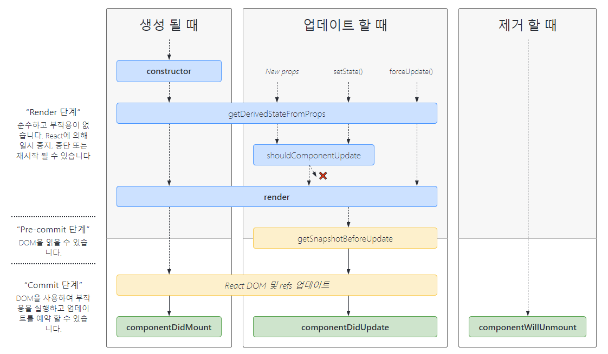

## LifeCycle Method  

컴포넌트는 렌더링되기 전부터 페이지에서 사라져 리소스가 회수될 때 까지의 라이프 사이클을 가지게 된다. 
컴포넌트를 렌더링하기 이전에 일련의 작업이 필요이 필요하거나 업데이트 전후로 어떤 작업이 필요할 수도 있다. 
이 때 사용하는 것이 라이프사이클 메서드이다. 
이는 클래스형 컴포넌트에서 오버라이딩하여 사용할 수 있으며, 함수형 컴포넌트에서는 훅으로 대체된다. 

리액트에서 라이프사이클은 3가지로 분류된다. 
DOM이 생성되고 화면에 나타나는 **마운트** 과정, 그리고 화면에서 사라지는 **언마운트** 과정, 그리고 중간에 발생하는 **업데이트** 과정이다. 
업데이트가 발생되는 조건은 아래와 같다.  

- props가 바뀔 때
- state가 바뀔 때
- 부모 컴포넌트가 다시 렌더링될 때
- this.forceUpdate로 강제로 렌더링을 할 때 

각 상황에 따라 호출되는 라이프사이클 메서드는 차이가 있으며 그 종류를 전체적으로 알아본다. 
```Will```이 접두사로 포함되면 어떤 **작업 이전** 에 수행한다는 의미이며, ```Did```는 **작업 이후** 에 수행한다는 의미이다.

#### ```render()```  

``` js
render()
```

이는 컴포넌트의 모양을 결정하는 메서드이며, 컴포넌트 클래스에서 반드시 구현해야하는 메서드이다. 
이는 ```props```와 ```state```에 접근하여 아래 중 하나를 반환하게 된다.

- React Element: 일반적으로 JSX로 정의되며 ```<div/>``` 같은 태그나 직접 정의한 ```<MyComponent/>``` 등이 될 수 있다
- 배열과 Fragment: Fragment를 통해 여러 개의 엘리먼트를 반환한다
- Portal: 부모 컴포넌트 밖에 있는 DOM 요소 밑에 자식 엘리먼트를 렌더링한다
- 문자열, 숫자, null: 텍스트만을 그대롤 렌더링하거나 아무것도 표시하지 않는다

#### ```constructor()```  

``` js
constructor(props)
```

말 그대로 컴포넌트가 생성될 때 호출되는 생성자이다. 
이는 ```state```를 초기화하거나 메서드를 바인딩할 때 사용되며 이 외에는 구현하지 않아도 무방하다.

#### ```componentDidMount()```  

``` js
componentDidMount()
```

컴포넌트가 마운트 된 이 후인 DOM 트리 삽입 이 후에 호출된다. 
외부를 호출할 필요가 있다면 여기가 적절한 위치가 될 수 있다.

#### ```componentDidUpdate()```

``` js
componentDidUpdate(prevProps, prevState, snapshot)
```

컴포넌트가 업데이트 처리된 이 후 호출된다. 
갱신 이후 DOM 조작을 하기에 적합한 위치이다. 
그리고 주어진 파라미터처럼 이전의 ```props```와 ```state```, 
그리고 ```getSnapshotBeforeUpdate``` 메서드에서 반환한 값을 전달 받아 활용할 수 있다.

#### ```componentWillUnmount()```  

``` js
componentWillUnmount()
```

컴포넌트가 언마운트 되기 전에 호출된다. 
타이머나 네트워크 요청 등의 작업이 있으며 여기서 전부 해제해야한다. 
일반적인 언어에서 ```destructor```과 비슷하게 볼 수 있다. 

#### ```getDerivedStateFromProps()```

``` js
shouldComponentUpdate(nextProps, nextState)
```

컴포넌트에서 업데이트가 발생할 때 다시 렌더링하는 것이 필요할 수도, 필요 없을 수도 있는데 그 여부를 판단하는 메서드이다. 
재정의하지 않으면 항상 ```true```가 반환되며 성능적인 측면에서 최적화가 필요할 때는 내부 로직을 구현해 렌더링을 막을 수 있다. 
렌더링을 방지하는 용으로 구현되며 이 외 용도로 사용할 시 버그로 이어질수 있다. 

#### ```static getDerivedStateFromProps()```  

``` js
static getDerivedStateFromProps(props, state)
```

최초 마운트할 때와 업데이트 과정에 모두 포함되는 과정이며 ```state```가  ```props```에 의존할 때 드물게 구현하는 메서드이다.

#### ```getSnapshotBeforeUpdate()```  

``` js
getSnapshotBeforeUpdate(prevProps, prevState)
```

렌더링 결과가 브라우저에 실제로 반영되기 전에 호출된다. 
이 때는 컴포넌트가 업데이트 직전에 마지막으로 값을 참조할 필요가 있는 경우, 
예를 들어 스크롤바의 마지막 위치를 기억하는 등에 사용할 수 있다. 
그리고 여기서 반환하는 값은 ```componentDidUpdate()```에서 ```snapshot``` 파라미터로 넘어가게 된다. 

#### ```componentDidCatch()```  

``` js
componentDidCatch(error, info)
```

자손 컴포넌트에서 에러가 발생했을 때 발생되며 ```error```는 어떤 에러가 발생했는지, 
```info```는 어떤 컴포넌트가 에러를 발생했는지의 정보를 담게 된다. 
에러 발생 시 서버 API를 호출 시키는 등의 조치를 하면 에러를 수집할 수 있게 된다.

<br/>

라이프사이클 관련 메서드를 쭉 나열했는데 위에서 말한 것 처럼 마운트, 언마운트, 업데이트 과정에서 호출되는 메서드와 순서는 다르다. 




<br/>

참고
- 김민준, 리액트를 다루는 기술, 길벗
- https://ko.reactjs.org/