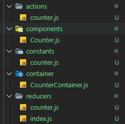
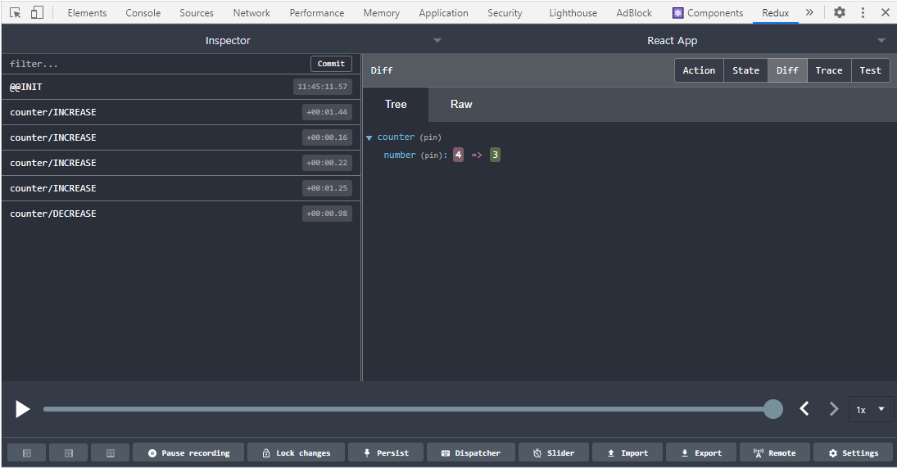

## Redux란 무엇인가? 

리덕스는 가장 많이 사용되는 상태(state) 관리 라이브러리이다. 
리덕스에서는 상태의 업데이트 관련 로직을 컴포넌트에서 분리하여 효율적으로 관리할 수 있으며, 
Context API를 사용하는 것보다 좀 더 체계적으로 전역 상태를 관리할 수 있다. 
또한, 미들웨어를 통한 비동기 작업을 관리할 수 있다. 

### Action  

어떤 상태가 변화할 때, 어떻게 변화할지를 정의한다. 
예를 들어 하나의 정수로 표현되는 상태가 존재할 때 
이에 대한 액션은 값의 증가, 감소가 있을 수 있다. 

액션은 하나의 객체로 정의된다. 
객체에는 액션을 정의하는 ```type``` 필드를 가지고 있어야 한다. 
그리고 이 외의 필드는 상태 업데이트에 필요한 값들을 개발자가 임의로 전달할 수 있다. 

``` js
{
  type: 'INCREASE'
  value: 5
}
```

### Reducer  

액션이 발생하면 리듀서가 **현재 상태**와 **액션**을 파라미터로 받아 상태를 갱신한다.

``` js
function reducer(state, action) {
  switch (action.type) {
    case 'increment':
      return {count: state.count + 1};
    case 'decrement':
      return {count: state.count - 1};
    default:
      return state;
  }
}
```

리덕스에서 관리하는 상태는 ```state```와 마찬가지로 ```immutable``` 하다. 
따라서, 업데이트 시 원본은 건드리지 않고 새로운 상태를 만들어내는 것이 중요하다. 

또한, 리듀서는 순수 함수여야 한다. 
순수 함수는 함수의 파라미터로 들어온 값을 제외하고는 다른 값들은 의존하지 않는 함수이다. 
입력이 같다면 반드시 출력 또한 동일해야 한다. 

### Store  

현재 애플리케이션의 상태와 리듀서를 포함해서 몇 가지 내장 함수를 지닌다. 

내장 함수 중 **dispatch**는 액션을 발생시키는 것 정도로 이해하면 된다. 
```dispatch(action)``` 과 같은 형태로 호출을 하면 등록된 리듀서가 실행이 된다. 

**subscribe** 함수는 함수를 파라미터로 받으며, 액션이 디스패치되어 상태가 업데이트될 때마다 호출된다. 

``` js
const listener = () => {
  console.log('상태 업데이트');
}

const unsubscribe = store.subscribe(listener);

// 반환된 함수를 호출하면 리스닝 중지
unsubscribe();
```

일반적으로 애플리케이션은 하나의 스토어만 가진다. 
여러 개를 사용하는 것이 불가능한 것은 아니나, 불필요하게 복잡해지므로 권장되지 않는다. 


## Redux 프로젝트 구조  

  

리덕스를 사용하는 프로젝트의 구조는 위와 같이 구성할 수 있다. 
하지만, 어디까지나 일반적으로 많이 구성하는 패턴이지 강제성을 띄지는 않는다. 

먼저 **actions**, **constants**, **reducers** 세 가지로 리덕스 관련 코드를 구분한다. 
여기서 constants에는 액션 타입 명과 같은 상수의 성격을 갖는 친구들이 존재한다. 
이러한 구조는 리덕스 공식 도큐먼트에서 사용되는 방식이다. 

그리고, 컴포넌트도 **components** 와 **containers** 로 구분할 수 있다. 
components에 위치하는 컴포넌트는 presentational component라고 하는데, 
이 컴포넌트에서는 상태 값 관리 없이 ```props```를 통해 UI만을 구성하는 컴포넌트를 말한다. 
그리고 container에 위치하는 컴포넌트는 리덕스와 연동이 되는 컴포넌트가 된다. 
여기서 리덕스에서 관리하는 값을 읽어오기도 하고, 액션을 디스패치하여 상태 값을 변경시킨다.  

예시를 통해 실제 코드 구성을 살펴본다. 
정수 형태의 상태가 하나 있고, 두 개의 버튼으로 값을 증가시키고 감소시키는 로직은 아래와 같이 작성될 수 있다.  


### constants  

constants에서는 상수들을 정의한다. 
여기서는 증가, 감소 액션의 타입을 정의하였다. 
그리고 INCREASE, DECREASE와 같은 보편적인 단어들은 다른 상태의 액션 타입과 중복이 될 수 있다. 
관례적으로 타입은 **모듈명/액션명**으로 표현하여 충돌을 방지한다. 

``` js
// constants/counter.js

export const INCREASE = 'counter/INCREASE';
export const DECREASE = 'counter/DECREASE';
```


### actions  

actions에서는 액션을 생성하는 함수들을 정의한다. 

``` js
// actions/counter.js

import {INCREASE, DECREASE} from '../constants/counter';

const increase = () => {
	return ({
		type: INCREASE
	});
}

const decrease = () => {
	return ({
		type: DECREASE
	});
}

export {increase, decrease};
```

각 함수들은 액션을 만들어 리턴한다. 
액션 객체는 항상 type이라는 필드를 가지고 이를 지정하여 리턴해줘야 하는데, 
```redux-action``` 라이브러리를 사용하면 좀 더 간편하게 생성할 수 있다. 

``` js
import {INCREASE, DECREASE} from '../constants/counter';
import { createAction } from 'redux-actions';

const increase = createAction(INCREASE);
const decrease = createAction(DECREASE);

export {increase, decrease};
```


### reducers  

reducers에서는 액션을 처리하는 리듀서 함수들을 관리한다. 

``` js
// reducers/counter.js

import {INCREASE, DECREASE} from '../constants/counter';

// 초기 값 설정
const initialState = {
	number: 0
};

const counter = (state=initialState, action) => {
	switch(action.type){
		case INCREASE:
			return {
				number: state.number + 1
			};
		case DECREASE:
			return {
				number: state.number - 1
			};
		default:
			return state;
	}
}

export default counter;
```

리듀서도 ```redux-action```을 통해 개선할 수 있다. 
```switch``` 구문을 제거하는 것이다. 

``` js
import {INCREASE, DECREASE} from '../constants/counter';
import { handleActions } from 'redux-actions';

const initialState = {
	number: 0
};

const counter = handleActions(
	{
		[INCREASE]: (state, action) => ({number: state.number + 1}),
		[DECREASE]: (state, action) => ({number: state.number - 1})
	},
	initialState
);

export default counter;
```

### store 생성  

작성한 리듀서를 실제 스토어를 생성하고 등록을 해야한다. 
이는 프로젝트 제일 상단에 위치한 /src/index.js에서 구성을 하게된다. 

``` js
import React from 'react';
import ReactDOM from 'react-dom';
import App from './App';
import reportWebVitals from './reportWebVitals';

import { createStore } from 'redux';
import rootReducer from './reducers';
import { Provider } from 'react-redux';
import { composeWithDevTools } from 'redux-devtools-extension';

const store = createStore(rootReducer, composeWithDevTools());

ReactDOM.render(
  <Provider store={store}>
    <App />
  </Provider>,
  document.getElementById('root')
);

reportWebVitals();
```

내부 함수를 사용하여 스토어를 생성하고 이를 ```Provider```를 통해 주입해주면 된다. 


```createStore``` 을 살펴보면 첫 번째 인자로 
작성한 ```counter``` 리듀서가 아닌 ```rootReducer```이라는 것을 받고 있다. 
스토어를 생성할 때는 하나의 리듀서만 받을수 있다. 
따라서 애플리케이션에서 리듀서가 여러 개 있는 경우에는 작성한 모든 리듀서를 묶어서 하나로 만들어줘야 한다. 

``` js
// reducers/index.js

import { combineReducers } from 'redux';
import counter from '../reducers/counter';

const rootReducer = combineReducers({
	counter,
});

export default rootReducer;
```

이는 리덕스에서 제공하는 ```combineReducers```를 사용하여 
모든 리듀서를 하나로 묶은 ```rootReducer```를 생성할 수 있다. 

다시 돌아와 ```createStore```가 두 번째로 받는 인자는 디버깅하기 위한 용도로 
크롬 익스텐션을 설치해 리덕스 상태를 개발자 도구에서 추적할 수 있다. 

```redux-devtools-extension```를 추가하고 크롬 익스텐션 또한 설치가 되어야 한다. 




### containers  

containers에서는 실제로 리덕스에서 관리하고 있는 상태와 연동이 되는 컴포넌트가 위치한다. 

``` js
// components/Counter
import React from 'react';

const Counter = ({number, onIncrease, onDecrease}) => {
	return (
		<div>
			<h1>{number}</h1>
			<div>
				<button onClick={onIncrease}>+1</button>
				<button onClick={onDecrease}>-1</button>
			</div>
		</div>
	)
};

export default Counter;
```

``` js
// container/CounterContainer.js

import React from 'react';
import { connect } from 'react-redux';
import Counter from '../components/Counter';
import { increase, decrease } from '../actions/counter'

const CounterContainer = ({number, increase, decrease}) => {
	return (
	<Counter number={number} onIncrease={increase} onDecrease={decrease}/>
	);
};

const mapStateToProps = (state) => ({
	number: state.counter.number,
});

const mapDispatchToProps = (dispatch) => ({
	increase: () => {
		dispatch(increase());
	},
	decrease: () => {
		dispatch(decrease());
	},
});

const makeContainer = connect(mapStateToProps, mapDispatchToProps);
export default makeContainer(CounterContainer);
``` 

여기서 핵심은 ```connect``` 함수이며 두 가지 파라미터 함수로 리덕스와 연동을 한다. 

- ```mapStateToProps``` : 스토어 내부의 상태 값을 컴포넌트의 ```props```에 전달하기 위한 함수
- ```mapDispatchToProps``` : 액션 생성 함수를 컴포넌트의 ```props```에 전달하기 위한 함수

``` js
// container/CounterContainer.js

import React from 'react';
import { useDispatch, useSelector } from 'react-redux';
import Counter from '../components/Counter';
import { increase, decrease } from '../actions/counter'

const CounterContainer = () => {
	const number = useSelector(state => state.counter.number);
	const dispatch = useDispatch();

	return (
		<Counter
			number={number}
			onIncrease={() => dispatch(increase())}
			onDecrease={() => dispatch(decrease())}
		/>
	);
};

export default React.memo(CounterContainer);
```

```connect``` 함수를 사용하지 않고, 훅을 통해 연동이 가능하다. 
```useSelector``` 구문은 상태의 조회이다. 
```connect```를 사용한 연동에서 ```mapStateToProps``` 함수와 일치하게 된다. 
```useDispatch```는 컴포넌트 내부에서 스토어 내장 함수 ```dispatch```를 사용할 수 있게 한다.  

한 가지 눈여겨 볼점은 ```export``` 구문에서 ```React.memo```를 사용한 것이다. 
```connect```를 사용하는 방법은 부모 컴포넌트에서 렌더링이 발생했을 때, 
```props``` 값이 변하지 않았다면 렌더링을 방지해주는 기능이 포함되어 있어 성능 최적화가 이미 되어있다. 
하지만 훅을 사용한 방법에는 적용되어 있지 않으며, 필요한 경우 명시적으로 ```React.memo```를 통해 최적화를 진행해야 한다.

## 리덕스 미들웨어  

리덕스 미들웨어는 비동기 작업을 효율적으로 관리한다. 
대표적으로 API 서버와 연동을 할 때는 비동기 요청이 필수적으로 포함된다. 

액션이 디스패치되면 리듀서에서 작업을 처리하게 되는데, 
이름 처럼 미들웨어는 액션과 리듀서 **사이**에 존재하게 된다. 

리듀서로 액션이 전달되기에 앞서 여러 작업을 처리한다. 
특정 조건에 따라 액션을 무시하기도 하고, 다른 액션을 디스패치 한다거나 액션의 정보를 가공하는 등의 작업이 이루어진다. 

``` js
function MyMiddleware(store){
	return function(next){
		return function(action){
			console.log(store.getState()); // 이전 상태
			next(action);
			console.log(store.getState()); // 이후 상태
		}
	}
}
```

미들웨어의 구조는 위와 같이 구성되어 있다. 
```next```의 역할은 다음 미들웨어, 다음 미들웨어가 없다면 리듀서에게 액션을 전달하는 함수이다. 

그리고 미들웨어는 ```store```를 생성할 때 적용하게 된다. 

``` js
const store = createStore(rootReducer, applyMiddleware(loggerMiddleware));
```

실제로 미들웨어를 직접 생성할 일은 거의 없다. 
구조를 파악하고 잘 만들어진 미들웨어를 가져다 쓰면 된다. 
위 코드 처럼 logger를 담당하는 미들웨어도 이미 존재하며 ```redux-logger```를 끌어다 쓰면 된다. 


### redux-thunk  

비동기 작업을 처리할 수 있는 기본적인 미들웨어이며, 
객체가 아닌 함수 형태의 액션을 디스패치할 수 있는 것이 큰 특징이다. 

먼저 **thunk**는 쉽게 말하면, 특정 연산을 필요할 때 계산할 수 있도록 함수 형태로 감싸는 것을 의미한다. 

``` js
const addOne = x => x + 1;
addOne(1); // 호출 시점에서 연산
```

``` js
const addOneThunk = (x) => {
	return x => x + 1;
};

const fn = addOneThunk(1);
setTimeout(() => {
	const value = fn(); // 연산되는 시점
}, 1000)
```


<br/>

참고
- 김민준, 리액트를 다루는 기술, 길벗