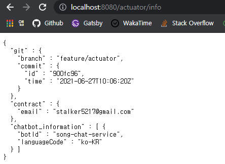
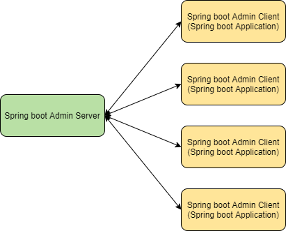
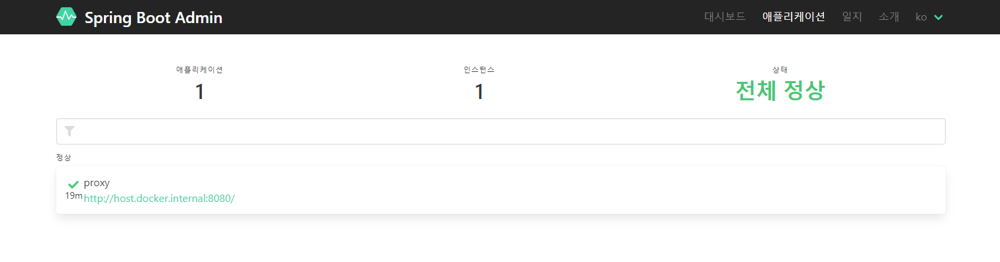
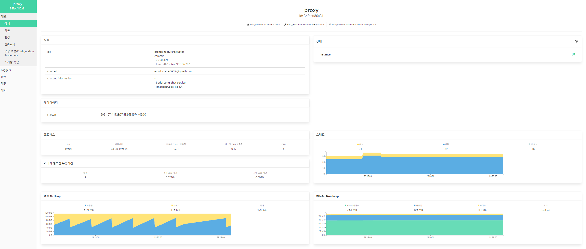
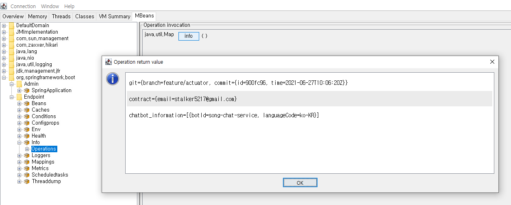

## Spring Actuator  

Spring actuator는 애플리케이션에 대해 각종 모니터링을 가능하게 해준다. 
다양한 정보를 HTTP 또는 JMX(Java Management Extensions) endpoint로 제공해준다. 
actuator 스타터팩 의존성을 주입하는 것만으로도 기본적인 사용 준비는 완료된다. 

``` groovy
// gradle
dependencies {
    implementation 'org.springframework.boot:spring-boot-starter-actuator'
}
```

``` xml
<!--maven-->
<dependencies>
    <dependency>
        <groupId>org.springframework.boot</groupId>
        <artifactId>spring-boot-starter-actuator</artifactId>
    </dependency>
</dependencies>
```

### Endpoints  

actuator를 설정하면 '/actuator'를 basepath로 해서 아래와 같은 정보를 얻을 수 있다. 

|identify|description|
|:---|:---|
|/auditevents|호출된 audit event에 대한 리포트를 생성한다.|
|/beans|애플리케이션 컨텍스트의 모든 빈에 대한 정보를 제공한다.|
|/caches|사용 가능한 캐시 정보를 제공한다.|
|/conditions|auto-configuration에 대한 정보와 설정 성공, 실패 여부를 제공한다.|
|/configprops|모든 ```@ConfigurationProperties```를 제공한다.|
|/env|환경변수, JVM 시스템 속성, 프로퍼티 등의 모든 환경 속성을 제공한다.|
|/env/{toMatch}|일치하는 환경의 내용을 제공한다.|
|/flyway|적용된 Flyway database migration을 제공한다. Flyway Bean을 필요로 한다.|
|/health|헬스 체크 역할. UP/DOWN/UNKNIOWN/OUT_OF_SERVICE 의 상태를 가질 수 있다.|
|/httptrace|가장 최근 100개의 Http 요청에 대한 트레이스를 제공한다.|
|/heapdump|hprof heap dump 파일을 반환한다. HotSpot JVM이 필요하다.|
|/info|애플리케이션의 정보를 반환한다. 개발자가 정의하며 프로퍼티에 info 속성을 정의하거나 ```@Component```로 커스텀 할 수 있다. |
|/integrationgraph|Spring Integration graph를 제공한다. spring-integration-core 의존성이 필요하다.|
|/jolokia|HTTP를 통해 JMX 빈을 제공한다. jolokia-core 의존성이 필요하다.|
|/logfile|로그 파일의 내용을 반환한다.|
|/loggers|애플리케이션의 logger 구성을 제공한다.|
|/loggers/{name}|지정된 로거의 로깅 정보를 제공하며, POST 요청으로 로깅 레벨을 수정할 수도 있다.|
|/liquibase|적용된 Liquibase database migration을 제공한다. Liquibase Bean을 필요로 한다.|
|/metrics|애플리케이션에서 생성되는 메모리, 프로세스, 가비지컬렉션, HTTP 요청 등의 메트릭 정보를 제공한다.|
|/metrics/{name}||
|/mappings|모든 ```@RequestMapping``` 정보를 제공한다.|
|/prometheus|Prometheus 서버에서 스크랩할 수 있는 형식으로 메트릭을 노출한다.|
|/quartz|Quartz 스케줄러 작업에 대한 정보를 제공한다.|
|/scheduledtasks|스케줄되어 있는 작업들 정보를 제공한다.|
|/sessions|Servelt 기반이라면 Spring session에서의 세션 정보를 제공하며 검색 및 삭제가 가능하다.|
|/shutdown|애플리케이션을 종료한다.|
|/startup|```ApplicationStartUp```에서 수집된 시작 단계 데이터를 제공한다. ```BufferingApplicationStartup```이 구성되어 있어야 한다.|
|/threaddump|스레드 덤프를 수행한다.|


위 정보들은 민감한 정보를 포함할 수 있다. 
HTTP Endpoints 같은 경우에는 기본적으로 health, info를 제외한 모든 영역이 비활성화되어 있다. 
endpoint를 노출하기 위해서는 별도의 설정이 필요하다. 

``` yml
# 모든(*) endpoint를 활성화
# env, beans는 endpoint를 비활성화
management:
  endpoints:
    web:
      exposure:
        include: "*"
        exclude: "env,beans"
```

endpoint의 활성화, 비활성화는 actuator의 영역이지만 활성화된 endpoint에 대한 접근 제어는 별도로 처리해야한다. 
이 또한 스프링 시큐리티로 처리할 수 있으며 endpoint의 경로 모음을 포함하고 있는 ```EndPointRequest```를 활용하면 된다. 

``` java
@Override
protected void configure(HttpSecurity) throws Exception {
	http
		.requestMatcher(EndpointRequest.toAnyEndpoint())
			.authorizeRequests()
				.anyRequest().hasRole("ENDPOINT_ADMIN"))
		.and()
        .http.httpBasic();
}
```

### Custom Actuator  

기본적으로 제공되는 정보를 넘어 커스텀이 가능하다. 
/info 같은 경우에는 처음에는 아무 정보를 담고 있지 않은데 프로퍼티 파일에 ```info``` 속성을 정의하거나 ```InfoContributor```를 주입하여 설정할 수 있다. 

``` java
@Component
public class SystemInfoContributor implements InfoContributor {
    private final ChatbotInfoRepository chatbotInfoRepository;

    public SystemInfoContributor(ChatbotInfoRepository chatbotInfoRepository) {
        this.chatbotInfoRepository = chatbotInfoRepository;
    }

    @Override
    public void contribute(Info.Builder builder) {
        // 개발자 Contract 정보
        Map<String, String> contractMap = new HashMap<>();
        contractMap.put("email", "stalker5217@gmail.com");
        builder.withDetail("contract", contractMap);
        
        // 서비스 챗봇 리스트
        List<ChatbotInfo> chatbotList = new ArrayList<>();
        chatbotInfoRepository.findAll().forEach(chatbotList::add);
        builder.withDetail("chatbot_information", chatbotList);
    }
}
```



지정한 contract 및 chatbot_information이 포함되었다. 
git에 대한 정보가 부가적으로 들어가 있는데 이는 별도의 플러그인 설정으로 자동으로 포함되게 할 수 있다. 

``` groovy
plugins {
    id "com.gorylenko.gradle-git-properties" version "2.3.1"
}
```

``` xml
<build>
	<plugins>
		...
		<plugin>
			<groupId>pl.project13.maven</groupId>
    		<artifactId>git-commit-id-plugin</artifactId>
		</plugin>
		...
	</plugins>
</build>
```

마찬가지로 Health Check도 커스텀이 가능하다. 
외부 시스템과 연동되어 있는 경우 외부 시스템 호출 결과에 따라 헬스의 여부를 정하는 경우 유용하게 사용할 수 있다. 

``` java
@Component
public class MyHealthIndicator implements HealthIndicator {

    @Override
    public Health health() {
        int errorCode = check();
        if (errorCode != 0) {
            return Health.down().withDetail("Error Code", errorCode).build();
        }
        return Health.up().build();
    }

    private int check() {
        // perform some specific health check
        return ...
    }

}
```

또한, 완전히 새로운 엔드포인트를 생성할 수도 있다. 
Endpoint는 Http 요청만을 처리하는 것이 아니라 JMX에 노출되어 사용될수도 있다. 
엔드포인트는 단순히 컨트롤러를 구현한 것이 아니며 좀 더 상위 개념으로 볼 수 있다. 
컨트롤러와 대응되는 개념은 아래와 같다. 

|Controller|Endpoint|
|:---|:---|
|@Controller|@Endpoint|
|@GetMapping|@ReadOpration|
|@PostMapping|@WriteOpration|
|@DeleteMapping|@DeleteOperation|

``` java
@Component
@Endpoint(id="myEndpoint", enableByDefault=true)
public class MyEndpoint {
	...

	@ReadOpeation
	public List<?> myRead() {
		...
	}
	
	...
}
```

## Spring Boot Admin  

Http Endpoint를 확인해보면 JSON 형태의 문서를 반환한다. 
이를 활용하여 본인의 시스템에 맞게 기능들을 확장해갈 수도 있지만, 이를 활용한 프론트 인터페이스를 제공해주는 도구인 **Spring Boot Admin**이 존재한다. 

Spring Boot Admin은 스프링 자체 진영에서 제공하는 것은 아니고 서드파티에서 제공된다. 
하나의 스프링부트 애플리케이션 내부에 부가 기능으로 동작하는 것이 아니라, 
독립형 애플리케이션이며 여러 endpoint를 가진 여러 스프링부트 애플리케이션을 등록하여 사용할 수 있다. 



admin server 역할을 하는 프로젝트에서 아래 의존성을 추가한다. 

``` groovy
// gradle
dependencies {
    implementation group: 'de.codecentric', name: 'spring-boot-admin-starter-server', version: '2.4.3'
}
```

``` xml
<!--maven-->
<dependency>
    <groupId>de.codecentric</groupId>
    <artifactId>spring-boot-admin-starter-server</artifactId>
    <version>2.4.3</version>
</dependency>
```

그리고 아래와 같이 ```@EnableAdminServer```를 통해 활성화 한다.

``` java
@SpringBootApplication
@EnableAdminServer
public class SimpleChatbotAdminApplication {
    public static void main(String[] args) {
        SpringApplication.run(SimpleChatbotAdminApplication.class, args);
    }
}
```

그리고 상태 정보를 제공할 클라이언트 측에서는 admin server에 정보를 전달해야 한다. 
admin client 역할을 하는 프로젝트에서는 아래 의존성을 추가한다.

``` groovy
// gradle
dependencies {
    implementation group: 'de.codecentric', name: 'spring-boot-admin-starter-client', version: '2.4.3'
}
```

``` xml
<!--maven-->
<dependency>
    <groupId>de.codecentric</groupId>
    <artifactId>spring-boot-admin-starter-client</artifactId>
    <version>2.4.3</version>
</dependency>
```

그리고 admin server에 대한 정보를 입력한다. 
이 때 admin client에서 endpoint에 대한 보안 처리를 해놨다면 admin server 또한 인증 정보 없이 endpoint에 접근 할 수 없다. 
그래서 admin server에 등록하는 과정에서 인증 정보를 함께 넘겨줘야 한다. 

``` yaml
spring:
  application:
    name: proxy
  boot:
    admin:
      client:
        url: http://localhost:9090
        instance:
            metadata:
                user.name: ${spring.security.user.name}
                user.password: ${spring.security.user.password}
```

> actuator endpoint에 대한 보안을 처리를 한 것처럼 admin server에 대한 접근에 대해서도 별도로 보안을 구성해야 한다. 

정보 등록과 admin server, client에 대한 구동이 끝났다면 admin server에서 아래와 같은 페이지를 확인할 수 있다.





## JMX  

JMX는 Java Management Extensions는 자바 애플리케이션을 모니터링하고 관리하는 표준 방법이다. 
```MBeans``` 로 알려진 컴포넌트들을 노출함으로써 JMX 클라이언트에서 다양한 모니터링을 할 수 있다. 
지금까지 설정한 actuator의 엔드포인트들 또한 MBeans로 노출되기에 이를 통한 관리가 가능하다. 

JMX 클라이언트는 jconsole, visualVM을 포함해서 여러가지가 있다. 
그 중 jconsole은 JDK에 포함되어 있으며 JDK만 제대로 설치되어 있다면 별도의 설치 없이 터미널에서 'jconsole' 명령으로 실행할 수 있다. 



<br/>

참고  
- [Spring Boot Reference Documentation](https://docs.spring.io/spring-boot/docs/current/reference/htmlsingle/#howto.webserver.enable-response-compression)
- Craig Walls, Spring in Action 5/E, 심재철, 제이펍   