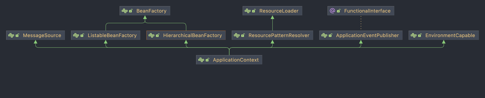
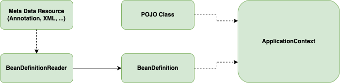

## IoC Container  

스프링에서는 오브젝트의 생성, 관계 설정, 제거, 사용 등의 라이프 사이클을 Spring Container가 제어를 한다. 
개발자가 코드로 직접 제어하는 것이 아니라 제어권이 스프링 측에 있다고하여 IoC(Inversion of Control)라 하고 Spring Container를 **IoC Container**라고도 한다.

## ApplicationContext  

  

실제 컨테이너의 역할을 수행하는 객체는 ```ApplicationContext``` 인터페이스를 구현한 오브젝트이다. 
여기서 가장 상위 인터페이스는 ```BeanFactory```인데 빈의 생성 및 DI와 같은 역할을 한다. 
이런 관점에서 봤을 때 Spring Container를 그냥 ```BeanFactory```라고 부르기도 한다. 
하지만 실제 ```ApplicationContext```는 빈 팩토리의 역할 뿐만 아니라 많은 기능을 가지고 있다. 

이를 구현하고 있는 구현체들은 많이 존재한다. 

- ```StaticApplicationContext```
- ```GenericApplicationContext```
- ```GenericXmlApplicationContext```
- ```AnnotationConfigApplicationContext```
- ```WebApplicationContext```
- ...

각 구현체는 빈에 대한 메타 정보의 소스가 어떤 것이냐에 따라 달리 구분할 수 있다. 
예를 들어 ```GenericXmlApplicationContext```는 빈의 정보가 XML 파일로 구성된 경우이며, 
```AnnotationConfigApplicationContext```는 어노테이션 기반으로 구성된 경우이다. 
```GenericApplicationContext``` 같은 경우에는 좀 더 일반적인 표현이며 위 두 객체가 상속하는 부모 클래스이다.    

``` java
public class ApplicationContextTest {
	@Test
	void findBeanByParentTypeDuplicate() {
		ApplicationContext ctx = new AnnotationConfigApplicationContext(AnnotatedConfig.class);
		
		MyService myService = ctx.getBean("myService", MyService.class);
		
		assertThat(myService).isNotNull();
	}

	@Configuration
	static class AnnotatedConfig {
		@Bean
		public MyService myService() {
			return new MyService();
		}
	}
}
```

## BeanDefinition

Bean은 예전 스프링 같은 경우에는 XML 파일을 통해 많이 나타내었고, 요즘에는 어노테이션 기반으로 많이 나타낸다. 
하지만 어떤 식으로 표현하든 빈의 메타 정보는 ```BeanDefinition```이라는 인터페이스에 정의된 스펙으로 변환되며 아래와 같은 정보를 가진다. 

- 빈 아이디, 이름, 별칭 : 빈 오브젝트를 구분할 수 있는 식별자
- 클래스 또는 클래스 이름 : 빈으로 만들 POJO Class 또는 서비스 클래스 정보
- 스코프 : 싱글톤, 프로토타입과 같은 빈의 생성 방식과 존재 범위
- 프로퍼티 값 또는 참조 : DI에 사용할 프로퍼티 이름과 값 또는 참조하는 빈의 이름
- 생성자 파라미터 값 또는 참조 : DI에 사용할 생성자 파라미터 이름과 값 또는 참조할 빈의 이름
- 지연 로딩 여부, 우선 빈 여부, Autowiring 여부, 빈 팩토리 이름 등



<br/>

참고
- 이일민, 토비의 스프링 3.1, 에이콘