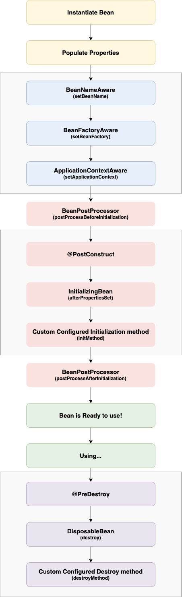

## Life Cycle Callback Method  

단순히 초기화 작업이라고 했을 때 초기화가 되는 시점은 여러가지 있을 수 있다. 
클래스가 로드될 때 ```static``` 요소들을 초기화하는 작업이 있을 것이고, 객체가 생성될 때 생성자에서 처리할 수 있는 작업이 있을 것이다. 
그리고 어떤 작업들은 다른 빈에 의존하고 있어 DI가 완료된 후 가능한 작업이 있을 수도 있다. 
그래서 스프링에서는 빈의 생성, 소멸이라는 라이프사이클에 맞추어 실행할 수 있는 콜백 메서드를 제공한다. 

### JSR-250

```@PostConstruct```, ```@PreDestroy```는 JSR-250 스펙에 정의된 어노테이션이며, 현재 스프링에서 라이프사이클 콜백을 구현하는데 가장 Best Practice로 간주된다. 
의미는 직관적이다. 
```@PostConstruct```가 정의된 메서드는 빈이 생성되고 DI가 이루어진 후에 실행되고, ```@PreDestory```는 빈이 소멸되기 직전에 호출된다. 

``` java
@Component
public class MyClass {
    @PostConstruct
    public void myInit() {
      // do some initialization work
    }

    @PreDestroy
    public void myDestroy() {
      // do some destroy work
    }
}
```
### Bean 정의 시 사용하기

``` java
@Bean(initMethod = "myInit", destroyMethod = "myDestroy")
public MyClass myClass() {
    return new MyClass();
}
```

위 방법처럼 ```@Bean``` 어노테이션을 활용해서, 라이프사이클 콜백을 호출할 수 있다. 
이 경우는 개발자가 직접 핸들링할 수 없는 외부 라이브러리를 다룰 때 유용하게 사용할 수 있다. 

### Interface 구현

스프링에서 제공하는 인터페이스인 ```InitializingBean```, ```DisposableBean```를 사용하여 구현할 수도 있다. 

``` java
public class AnotherExampleBean implements InitializingBean {
  @Override
  public void afterPropertiesSet() {
    // do some initialization work
  }
}
```

``` java
public class AnotherExampleBean implements DisposableBean {
  @Override
  public void destroy() {
    // do some destruction work (like releasing pooled connections)
  }
}
```

하지만 이 방식은 현재 **스프링에서도 권장하지 않는 방법**이다. 
스프링에서 제공하는 인터페이스를 구현해버리는 순간 불필요한 커플링이 발생하기 때문이다. 
앞에서 명시한 내용처럼 의존성을 줄인 방식으로 구현하는 것이 더 좋다.

### 호출 순서

현재 스프링에서 제공하는 라이프사이클 메서드는 위 3가지이며, 메서드의 실행은 ```BeanPostProcessor```에 의해 수행된다. 
그리고 만약 각 초기화 메서드를 각기 다른 이름으로 구현하고 모두 적용한 경우에는 아래 순서에 맞게 실행된다. 
객체의 파괴 시 수행되는 메서드도 위 구조와 동일하다. 

1. ```@PostConstruct``` 어노테이션이 달린 메서드
2. ```InitializingBean```에 의해 구현된 ```afterPropertiesSet()```
3. Bean Definition 시 정의한 커스텀 메서드

## Spring Bean Life Cycle

빈의 라이프 사이클을 더 상세하게 확인하자면 아래와 같은 구조를 가진다. 



여기서 ```XXXAware``` 형태로 나타나는 인터페이스들은 구현하면 ```XXX``` 객체의 레퍼런스를 얻을 수 있다. 
마땅한 예시는 현재 떠오르지 않지만 빈이 초기화될 때 한 번 저 레퍼런스들이 필요하다면 사용을 고려해볼 수 있다. 

``` java
public interface ApplicationContextAware {
  void setApplicationContext(ApplicationContext applicationContext) throws BeansException;
}
```

``` java
public interface BeanNameAware {
  void setBeanName(String name) throws BeansException;
}
```
 
> Aware 인터페이스는 명시된 것 말고도 많으니 스프링 레퍼런스를 참조하자

<br/>

참고
- 이일민, 토비의 스프링 3.1, 에이콘
- [Core Technologies](https://docs.spring.io/spring-framework/docs/current/reference/html/core.html#beans-factory-lifecycle)
- [Spring bean Lifecycle Callbacks](https://jstobigdata.com/spring/spring-bean-lifecycle-callbacks/)