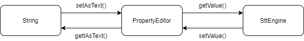

# Data Binding  

컨트롤러 메서드에 선언된 ```@ModelAttribute```는 아래와 같은 과정으로 내부에 값이 할당된다. 

1. 파라미터 타입의 오브젝트를 생성한다. 이를 위해서는 객체에 파라미터 값이 없는 디폴트 생성자가 만드시 필요하다.
2. HTTP 요청에 담긴 값들은 모두 문자열이다. 
   객체에 프로퍼티 타입이 문자열이 아니라면 스프링에서 제공하는 기본 프로퍼티 에디터를 사용하여 변환 과정을 거친다. 
   이 때 전환이 불가능한 경우라면 ```BindingResult``` 오브젝트에 해당 오류를 담아 넘겨주거나 ```Exception```을 발생시킨다. 
3. 바인딩된 값을 검증하는 과정을 거친다. 프로퍼티가 필수로 값을 가져야하는 경우, 숫자일 때는 양수만 입력되어야하는 경우 등 비즈니스 로직에 필요한 제약사항을 검증한다. 

## 값의 변환  

``` java
public enum SttEngine {
    GOOGLE,
    AWS,
    CLOVA,
    KAKAO
}
```

``` java
@Controller
@Slf4j
public class SomeController {
	@GetMapping("/stt")
    public String stt(@RequestParam SttEngine sttEngine) {
		...
    }
}
```

위와 같은 enum과 컨트롤러가 있다고 가정하자. 
이에 '/stt?sttEngine=google'이라고 요청을 하면 500 에러가 발생한다. 
문자열을 ```SttEngine``` 타입으로 변환하는 방법이 정의되어 있기 않기 때문이다. 

#### ```PropertyEditor```  

이는 스프링이 아니라 자바빈 표준에 정의된 인터페이스이다. 
원래 IDE에서 프로퍼티를 나타내는 창과 GUI 컴포넌트의 실제 프로퍼티의 값 사이의 변환을 지원하기 위해 만들어진 것이 ```PropertyEditor```이다. 

스프링에서는 이를 문자열과 객체 간의 상호 변환을 위해서 초기부터 사용해 왔다. 

``` java
// PropertyEditor 인터페이스를 모두 구현하는 것보다 이를 상속하여 필요한 기능만 오버라이딩한다.
public class SttEnginePropertyEditor extends PropertyEditorSupport {
    @Override
	public void setAsText(String text) {
        this.setValue(SttEngine.valueOf(text.toUpperCase()));
    }

	@Override
    public String getAsText() {
        return this.getValue().toString();
    }
}
```



이제 이를 컨트롤러 파라미터 바인딩에 사용될 수 있도록 등록해줘야 한다. 
```AnnotationMethodHandlerAdapter```에서는 파라미터 바인딩이 필요할 때 ```WebDataBinder```를 생성하는데, 여기에 생성한 ```PropertyEditor```를 등록해줘야 한다. 
그리고 이는 아래 어노테이션 처리에 사용된다.  

- ```@RequestParam```
- ```@CookieValue```
- ```@RequestHeader```
- ```@PathVariable```
- ```@ModelAttribute```

``` java
@Controller
@Slf4j
public class SomeController {
    @InitBinder
    public void initBinder(WebDataBinder binder) {
        binder.registerCustomEditor(SttEngine.class, new SttEnginePropertyEditor());
    }

    @GetMapping("/stt")
    public ResponseEntity<Void> stt(@RequestParam SttEngine sttEngine) {
        ...
    }
}
```

```@InitBinder```를 통한 프로퍼티 에디터 등록은 해당 컨트롤러 클래스에서만 동작한다. 
만약 전역적으로 등록이 필요하다면 ```WebBindingInitializer```를 통해 프로퍼티 에디터를 추가하고 빈으로 등록하면 된다.  

``` java
public class MyWebBindingInitializer implements WebBindingInitializer {
    @Override
    public void initBinder(WebDataBinder binder) {
        binder.registerCustomEditor(SttEngine.class, new SttEnginePropertyEditor());
    }
}
```

``` xml
<bean class="org.springframework.web.servlet.mvc.annotation.AnnotationMethodHandlerAdapter"> 
    <property name="webBindingInitializer">
        <bean class="...MyWebBindingInitizlier"/>
    </property> 
</bean>
```

또는, ```@ControllerAdvice```가 기본적으로는 모든 컨트롤러를 대상으로 적용된다는 점을 통해 이를 통한 구현도 가능하다. 

``` java
@ControllerAdvice
public class MyControllerAdvice {
    @InitBinder
    public void initBinder(WebDataBinder binder) {
        binder.registerCustomEditor(SttEngine.class, new SttEnginePropertyEditor());
    }
}
```

위의 모든 예시들에서 새로운 프로퍼티 에디터 객체를 생성하여 등록해줬다.  
이는 파라미터 바인딩이 일어날 때마다 해당 객체가 새롭게 생성되는 것을 의미한다. 

이를 빈으로 등록해서 사용하지 않는 이유는 동작 방식에 있다. 
변환 과정은 두 단계로 이루어지는데 먼저 ```set-``` 메서드를 통해 일단 프로퍼티 에디터 객체에 값을 저장하고, ```get-``` 메서드로 변환된 값을 가져오는 것이다. 
이 때 객체 내부에 값이 저장되기 때문에 이 객체는 상태 값을 지니게되는 것이다. 
따라서 이는 Thread Safe하다고 볼 수 없다. 빈으로 다룰 수 없기에 내부에서 다른 빈들을 참조하는 것도 불가능하다. 

#### ```Converter``` & ```Formatter```  

**Converter**

스프링 3.0에서부터 ```PropertyEditor```를 대체할 수 있는 ```Converter``` 인터페이스를 제공하고 있다. 

``` java
public interface Converter<S, T> {
	T convert(S source);
}
```

이는 Source 타입에서 Target 타입으로의 전환을 지원한다. 

``` java
@Component
public class SttEngineConverter implements Converter<String, SttEngine> {
    @Override
    public SttEngine convert(String source) {
        return SttEngine.valueOf(source.toUpperCase());
    }
}
```

**Formatter**  

```PropertyEditor```가 문자열과 객체 사이의 변환을 지원하는 것에 비해 ```Converter```는 Source, Target을 유연하게 설정할 수 있다. 
또한, ```PropertyEditor```가 두 타입 사이의 양방향 전환을 지원하는 것과는 달리 Source >> Target 단방향으로 이루어진다. 

```Formatter```는 ```PropertyEditor``` 처럼 문자열과 객체 사이의 전환, 그리고 양방향 변환에 특화된 형태이다. 

``` java
public interface Formatter<T> {
    // Object를 String으로 변환
    String print(T object, Locale locale);

    // String을 Object로 변환
    T parse(String text, Locale locale) throws ParseException;
}
```

```Locale```이 기본적으로 파라미터에 있는데 다국어 제공 등의 서비스에서 활용할 수 있다. 

``` java
@Component
public class SttEngineFormatter implements Formatter<SttEngine> {
    @Override
    public SttEngine parse(String text, Locale locale) throws ParseException {
        return SttEngine.valueOf(text.toUpperCase());
    }

    @Override
    public String print(SttEngine object, Locale locale) {
        return object.toString();
    }
}
```

```Converter```와 ```Formatter``` 모두 Thread Safe하므로 위와 같이 빈으로 등록해서 사용해도 무방하다. 
그리고 이들도 타입 변환에 사용하려면 적절한 등록 과정을 거쳐야 한다. 

생성한 ```Converter```를 사용하려면 ```ConversionService``` 타입 객체에 등록해야 한다.  
주로 해당 인터페이스를 구현한 ```GenericConversionService```를 빈으로 등록해서 사용할 수 있다.  
```Formatter```를 사용하려면 ```FormatterRegistry``` 타입 객체에 이를 등록해야 하며, 
이는 또 해당 인터페이스를 구현한 ```FormattingConversionService```를 빈으로 등록해서 사용할 수 있다. 
그리고 이를 ```@InitBinder```에서 설정하여 사용하거나, ```ConfigurableWebBindingInitializer```를 통해 전역적으로 사용할 수 있다. 

스프링 3.1 이상 환경이라면 ```WebMvcConfigurer```를 통해 설정할 수 있다. 
```@EnableWebMvc```를 사용하면 ```ConversionService```와 ```FormatterRegistry```를 복합적으로 구현하는 ```DefaultFormattingConversionService```가 생성되고, ```WebDataBinder```는 이를 사용하게 된다.

``` java
@Configuration
@EnableWebMvc
public class WebConfig implements WebMvcConfigurer {
    // Add Converters and Formatters in addition to the ones registered by default.
    @Override
    public void addFormatters(FormatterRegistry registry) {
        registry.addConverter(new SttEngineConverter());
        registry.addFormatter(new SttEngineFormatter());
    }
}
```

스프링부트 환경이라면 별도로 설정할 것이 없다. 
스프링부트에서는 기본적으로 ```DefaultFormattingConversionService```를 상속한 ```WebConversionService```를 빈으로 제공하고 있는데, ```Converter```와 ```Formatter```를 빈으로 등록하기만하면 알아서 찾아서 등록해주기 때문이다.


## 값의 검증  

```@ModelAttribute```로 지정된 객체의 바인딩이 실패하는 경우는 두 가지가 있다. 
- 문자열이 프로퍼티의 타입으로 변환이 불가능한 경우
- 변환 이후 값의 유효성 검증에 통과하지 못하는 경우

#### Validator  

``` java
public interface Validator {
    // 해당 Validator가 검사 가능한 타입인지 확인
	boolean supports(Class<?> clazz);

    // 값에 대한 검증
	void validate(Object target, Errors errors);
}
```

```Validator```는 스프링에서 제공하는 검증을 위한 인터페이스이다.  
메소드 ```validate```에는 값에 대한 검증 코드가 들어가며 주로 필수 값의 존재여부나 값의 범위, 길이, 형식 등을 검증한다. 
```Errors```는 검증 실패에 대한 오류 관련 정보를 담는 인터페이스며 ```BindingResult```라는 구현체를 사용할 수 있다. 
검증 결과가 유효하지 않다면 해당 객체를 통해 오류 관련 정보가 컨트롤러로 넘어가게 된다. 

``` java
@NoArgsConstructor
@Getter
@Setter
public class User {
    private String name;
    private int age;
}
```

``` java
public class UserValidator implements Validator {
    @Override
    public boolean supports(Class<?> clazz) {
        return (User.class.isAssignableFrom(clazz));
    }

    @Override
    public void validate(Object target, Errors errors) {
        User user = (User) target;

        // 이름이 비어있으면 안된다.
        // "field.required"는 message property의 key 값이다.
        ValidationUtils.rejectIfEmpty(errors, "name", "field.required");
        
        // 나이는 음수여서는 안된다.
        if (user.getAge() < 0) {
            errors.rejectValue("age", "field.min", new Object[] {0}, null);
        }
    }
}
```

User 객체의 필드 값 검증을 위한 ```Validator```를 작성하였고 이를 통해 유효성을 검증하게 된다. 
작성한 ```Validator```를 빈으로 등록해서 사용할 수 있으며, 아래와 같이 컨트롤러 내에서 명시적으로 호출하여 확인할 수 있다. 

``` java
@Controller
@Slf4j
public class SomeController {
    @Autowired
    UserValidator validator;

    @PostMapping("/user")
    public ResponseEntity<Void> addUser(@ModelAttribute User user, BindingResult result) {
        validator.validate(user, result);

        if(result.hasErrors()) {
            return ResponseEntity.badRequest().build();
        }
       
        ...
    }
}
```

컨트롤러 내에서 명시적으로 호출하는 것대신에 ```javax.validation.Valid``` 어노테이션을 통해 구현할 수도 있다.
```@Valid``` 어노테이션을 모델 선언에 추가하고, ```WebDataBinder```에 작성한 ```Validator```를 설정하면 된다. 
아래는 위 코드와 동일한 동작을 한다. 

``` java
@Controller
@Slf4j
public class SomeController {
    @Autowired
    UserValidator validator;

    @InitBinder
    public void initBinder(WebDataBinder binder) {
        binder.setValidator(validator);
    }

    @PostMapping("/user")
    public ResponseEntity<Void> addUser(@ModelAttribute @Valid User user, BindingResult result) {
        if(result.hasErrors()) {
            System.out.println(result.getFieldError().toString());
        }
        else {
            System.out.println(user.getName());
            System.out.println(user.getAge());
        }

        return ResponseEntity.ok().build();
    }
}
```

#### JSR-380

유효성을 검증하는 또 다른 표준으로는 JSR-380이 있다. 
스프링에서는 ```LocalValidatorFactoryBean```을 통해 이를 ```Validator``` 처럼 값 검증 기능에 사용할 수 있다. 
별도의 파일 작성 없이 모델 프로퍼티에 어노테이션으로 제약 조건을 줄 수 있다. 

``` java
@NoArgsConstructor
@Getter
@Setter
public class User {
    @NotEmpty
    private String name;
    
    @Min(0)
    private int age;
}
```

위와 같이 어노테이션 기반으로 직관적으로 작성할 수 있다. 
검증 과정에 이를 사용하기 위해서는 ```LocalValidatorFactoryBean```를 주입 받아 명시적으로 ```validate```를 호출해도 되고, 
```@Valid``` 어노테이션을 사용해서도 검증 과정을 할 수 있다. 

|annotation|description|지원 타입|
|:---|:---|:---|
|```@NotNull```|null이 아니여야 한다|All|
|```@NotEmpty```|null, ""가 아니여야 한다|Array, Map, Collection, CharSequence|
|```@NotBlank```|null, "", " "가 아니여야 한다|CharSequence|
|```@AssertTrue```|필드 값이 true여야 한다|boolean|
|```@AssertFalse```|필드 값이 false여야 한다|boolean|
|```@Size```|크기가 지정한 최소 값과 최대 값의 사이여야 한다|Array, Map, Collection, CharSequence|
|```@Min```|지정한 값 보다 커야 한다|기본 숫자형 또는 Wrapper, BigInteger|
|```@Max```|지정한 값 보다 작아야 한다|기본 숫자형 또는 Wrapper, BigInteger|
|```@Positive```|양수여야 한다|기본 숫자형 또는 Wrapper, BigInteger|
|```@PositiveOrZero```|0 또는 양수여야 한다|기본 숫자형 또는 Wrapper, BigInteger|
|```@Negative```|음수여야 한다|기본 숫자형 또는 Wrapper, BigInteger|
|```@NegativeOrZero```|0 또는 음수여야 한다|기본 숫자형 또는 Wrapper, BigInteger|
|```@Past```|날짜가 과거여야 한다|Date|
|```@PastOrPresent```|날짜가 과거 또는 현재여야 한다|Date|
|```@Future```|날짜가 미래여야 한다|Date|
|```@FutureOrPresent```|날짜가 미래 또는 현재여야 한다|Date|
|```@Pattern```|정규식을 통해 검증한다|CharSequence|
|```@Email```|이메일 형태의 포맷을 가져야 한다|CharSequence|


<br/>

참고
- 이일민, 토비의 스프링 3.1, 에이콘