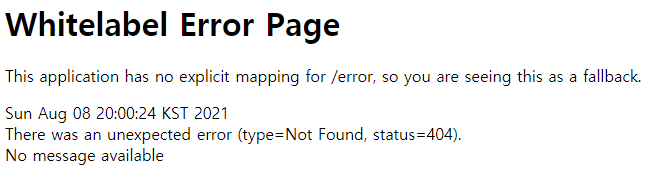

## Exception Handling  

### ```@ExceptionHandler```  

컨트롤러 클래스 내부에 구현되며, 해당 컨트롤러에서 발생한 예외를 처리하는데 사용된다. 
애플리케이션 전체에 대해 공통 예외 처리 로직을 적용하려면, ```BaseController```를 두고 이를 상속하는 식으로 구현할 수 있다. 
하지만 이런 상속 구조를 사용할 수 없는 상황이라면 각 컨트롤러마다 같은 기능을 구현해줘야 한다. 

``` java
@Controller
@Slf4j
public class SomeController {
    @GetMapping("/hello")
    public ResponseEntity<Void> hello() throws Exception {
        throw new Exception();
    }

	// Exception 발생 시 동작
    @ExceptionHandler(Exception.class)
    public ResponseEntity<ErrorMessage> exceptionHandler(HttpServletRequest request, Exception exception) {
        ErrorMessage errorMessage = new ErrorMessage();

        errorMessage.setUrl(request.getRequestURI());
        errorMessage.setMessage(exception.getMessage());

        return ResponseEntity
                .status(HttpStatus.INTERNAL_SERVER_ERROR)
                .body(errorMessage);
    }
}
```

### ```@ControllerAdvice```  

스프링 3.2에서부터 ```@ControllerAdvice``` 어노테이션을 지원한다.. 
```@ExceptionHandler```를 컨트롤러 클래스 내에 구현하는 것이 아니라 해당 어노테이션이 선언된 클래스에 구현하며, 모든 컨트롤러의 예외를 처리를 한다. 
대상을 ```RestController```만 지정한다거나, 특정 패키지 또는 특정 컨트롤러 클래스만 적용되도록 한다거나 다양한 조정할 수 있다. 

``` java
@ControllerAdvice
public class MyControllerAdvice {
	// Exception 발생 시 동작
    @ExceptionHandler(Exception.class)
    public ResponseEntity<ErrorMessage> exceptionHandler(HttpServletRequest request, Exception exception) {
        ErrorMessage errorMessage = new ErrorMessage();

        errorMessage.setUrl(request.getRequestURI());
        errorMessage.setMessage(exception.getMessage());

        return ResponseEntity
                .status(HttpStatus.INTERNAL_SERVER_ERROR)
                .body(errorMessage);
    }
}
```

``` java
// Target all Controllers annotated with @RestController
@ControllerAdvice(annotations = RestController.class)
public class ExampleAdvice1 {}

// Target all Controllers within specific packages
@ControllerAdvice("org.example.controllers")
public class ExampleAdvice2 {}

// Target all Controllers assignable to specific classes
@ControllerAdvice(assignableTypes = {ControllerInterface.class, AbstractController.class})
public class ExampleAdvice3 {}
```

### ```BasicErrorHandler```  

위 케이스들은 Handler Mapping이 이루어진 후 비즈니스 로직을 처리하는 과정에서 발생한 오류를 처리했다. 
존재하지 않는 리소스를 호출하는 404를 비롯해서, 처리되지 않은 모든 에러를 핸들링하기 위해 스프링부트에서는 기본적으로 ```BasicErrorHandler```를 제공한다. 

에러 발생 시 별도로 설정하지 않았다면 '/error'에 매핑되어 처리되며 ```BasicErrorHandler```는 아래와 같이 구현되어 있다. 

``` java
@RequestMapping("${server.error.path:${error.path:/error}}")
public class BasicErrorController extends AbstractErrorController {
    ...
}
```

흔하게 보는 화이트 라벨 페이지가 이를 통해 구현된 것이다.



템플릿 엔진을 사용하고 있다면 간단하게 디폴트 에러 페이지를 교체할 수 있다. 
아래처럼 '/error' 디렉토리에 특정 에러 코드에 해당하는 페이지를 위치시키면 된다. 

``` text
src/
 +- main/
     +- java/
     |   + <source code>
     +- resources/
         +- public/
             +- error/
             |   +- 404.html
             +- <other public assets>
```

좀 더 세부적인 처리가 필요하다면 ```ErrorViewReolsver```를 구현해야한다. 

``` java
public class MyErrorViewResolver implements ErrorViewResolver {

    @Override
    public ModelAndView resolveErrorView(HttpServletRequest request, HttpStatus status, Map<String, Object> model) {
        // Use the request or status to optionally return a ModelAndView
        if (status == HttpStatus.INSUFFICIENT_STORAGE) {
            // We could add custom model values here
            new ModelAndView("myview");
        }
        return null;
    }
}
```

<br/>

참고
- [docs.spring.io](https://docs.spring.io/spring-framework/docs/3.0.0.M4/reference/html/ch15s09.html)
- [Spring Boot Reference Documentation](https://docs.spring.io/spring-boot/docs/current/reference/htmlsingle/#features.developing-web-applications.spring-mvc.error-handling)
- [Error Handling for REST with Spring](https://www.baeldung.com/exception-handling-for-rest-with-spring)
- [Exception Handling in Spring MVC](https://spring.io/blog/2013/11/01/exception-handling-in-spring-mvc)