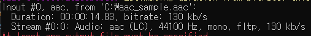
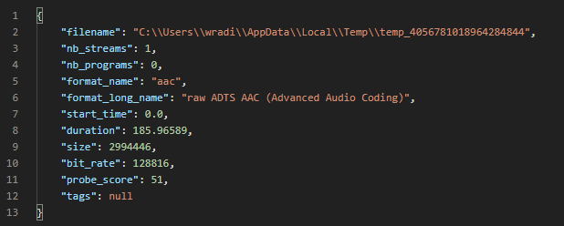

프로젝트 진행 증 오디오 파일 길이 등 메타 정보를 읽어야할 필요가 생겼다. 
JAVA SOUND API에서는 기본적으로 wav 파일에 대한 핸들링만 지원했기에 기타 다른 포맷의 오디오 파일은 읽을 수가 없었다. 

대신 JAVA SOUND API에서는 다른 오디오 포맷을 위해 SPI(Service Provider Interface)를 제공하고 있으며 이를 구현한 몇 가지 서드파티 라이브러리를 찾을 수 있었다. 
JAAD(Java Advanced Audio Decoder), mp3spi, JAudioTagger 등을 사용해 특정 파일에 대한 정보를 추출할 수 있었으나, 오디오 파일의 인코딩 방식이 워낙 다양하기 때문에 일부 파일에만 제한적으로 사용할 수 밖에 없었다.  

추후에 새로운 파일을 지원해야 한다고 생각했을 때, 그 때마다 또 적합한 SPI를 찾거나 인코딩 스펙에 맞게 기능을 직접 구현하는 것은 비효율적으로 보였다. 그래서 직접 처리하는 것보다는 외부 프로그램을 사용하는 것이 낫다고 판단했다.

현재로서는 필요한 기능에 비해서 서드 파티를 설치하는 것은 너무 오버 스펙이 아닌가라는 생각도 들지만, 최근들어 오디오 파일을 다룰 일이 많이 생기는 것을 감안해보면 추후에 유용하게 사용할 수 있을듯 하다.

## FFMPEG  

FFmpeg is the leading multimedia framework, able to decode, encode, transcode, mux, demux, stream, filter and play pretty much anything that humans and machines have created. It supports the most obscure ancient formats up to the cutting edge. No matter if they were designed by some standards committee, the community or a corporation. It is also highly portable: FFmpeg compiles, runs, and passes our testing infrastructure FATE across Linux, Mac OS X, Microsoft Windows, the BSDs, Solaris, etc. under a wide variety of build environments, machine architectures, and configurations.

위는 ffmpeg에서 제공하는 소개 글이며, 존재하는 모든 형태의 비디오/오디오에 대해 관련 작업을 할 수 있도록 목표를 하는 프레임워크라고 소개하고 있다. 
그리고 실제 ffmpeg는 이미 비디오/오디오를 다루는 수 많은 프로그램에서 사용되고 있으며, 사실 상의 표준으로 사용되고 있다고 봐도 무방하다고 한다. 

ffmpeg는 커맨드라인 기반으로 동작한다. 
OS에 맞게 설치를 하면 마치면, 아래 커맨드로 파일 정보를 얻을 수 있었다. 

``` text
ffmpeg -i file
```



## ffmpeg-cli-wrapper  

처음에는 애플리케이션에서 커맨드를 실행시켜 그 결과를 파싱하는 방식으로 구현해야 된다고 생각했는데, ffmpeg와 인터페이스를 해주는 wrapper 라이브러리가 존재했다. 

``` xml
<!-- maven -->
<dependency>
    <groupId>net.bramp.ffmpeg</groupId>
    <artifactId>ffmpeg</artifactId>
    <version>0.6.2</version>
</dependency>
```

``` groovy
// gradle
implementation group: 'net.bramp.ffmpeg', name: 'ffmpeg', version: '0.6.2'
```

의존성을 추가하면 제공하는 객체를 통해 ffmpeg의 기능을 활용할 수 있다. 
아래는 멀티파트로 전송한 오디오 파일의 정보를 반환하는 샘플 코드이며, ffmpeg가 설치된 경로를 지정해주기 위해 ```ffProbePath```에 경로 값을 주입했다. 

```
// properties
ffmpeg.path.ffmpeg= C:\\Program Files\\ffmpeg-4.4-essentials_build\\bin\\ffmpeg.exe
ffmpeg.path.ffplay= C:\\Program Files\\ffmpeg-4.4-essentials_build\\bin\\ffplay.exe
ffmpeg.path.ffprobe= C:\\Program Files\\ffmpeg-4.4-essentials_build\\bin\\ffprobe.exe
```

``` java
@Slf4j
@RestController
@RequestMapping("/audio")
public class AudioController {
    @Value("${ffmpeg.path.ffprobe}")
    private String ffProbePath;

    @PostMapping(path = "/info", consumes = MediaType.MULTIPART_FORM_DATA_VALUE)
    public ResponseEntity<FFmpegFormat> audioInformation(@RequestParam MultipartFile multipartFile) {
        log.info("[GET AUDIO INFORMATION] START");

        File file = null;
        try {
            file = File.createTempFile("temp_" , "");
            multipartFile.transferTo(file);

            FFprobe ffProbe = new FFprobe(ffProbePath);
            FFmpegProbeResult ffmpegProbeResult = ffProbe.probe(file.getPath());
            FFmpegFormat ffmpegFormat = ffmpegProbeResult.getFormat();

            return ResponseEntity.ok(ffmpegFormat);
        } catch (IOException e) {
            log.info("[GET AUDIO INFORMATION] ERROR");
            log.error(e.getMessage());

            ResponseEntity.status(HttpStatus.INTERNAL_SERVER_ERROR);
        } finally {
            if(file != null) file.delete();
        }

        log.info("[GET AUDIO INFORMATION] END");

        return ResponseEntity.ok().build();
    }
}
```



https://github.com/stalker5217/spring-ffmpeg-sample

<br/>

참고  

- [ffmpeg](https://www.ffmpeg.org/)
- [ffmpeg-cli-wrapper](https://github.com/bramp/ffmpeg-cli-wrapper)
- [(Java) ffmpeg을 활용한 동영상 처리하기](https://velog.io/@ace0390/Java-ffmpeg을-활용한-동영상-처리하기)