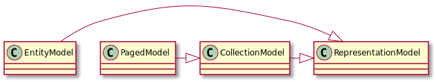

## hateoas

보통 API를 사용하기 위해서는 클라이언트에서 URL을 하드코딩하여 사용한다.  
이러한 이유로 End point URL이 일단 정해지면 이를 변경하기 어렵다는 단점이 있다. 
이러한 형태는 REST API라고 볼 수 없다. 

REST API를 만들기 위해서는 REST 설계 원칙 중 HATEOAS(Hypermedia As The Engine Of Application State)를 만족해야한다.
기존 API에서 반환하던 리소스에 더해서, 앞으로 어떤 동작을 할 수 있는지에 관한 하이퍼링크를 제공하며, 
애플리케이션은 이를 기반으로 전개되어야 한다. 

예를들면, 챗봇 API라면 처음 진입했을 때 챗봇의 인사 메시지는 다음과 같이 올 수 있다.  

``` json
{
    "text": "안녕하세요!"
}
```

여기서 HATEOAS를 적용하면 앞으로 챗봇과 대화를 하기 위한 링크를 API에서 제공해줄 수 있다. 
스펙을 이렇게 구현하였다면 만약 추후에 챗봇과 대화하는 query에 관한 링크가 변경되어도 클라이언트 수정 없이 서비스 가능하다.

``` json
{
    "text": "안녕하세요!",
    "_links": {
        "query": {
            "href": "http://localhost:8080/chat/query"
        }
    }
}
```

## 스프링에서 HATEOAS 사용하기  

먼저 스프링부트에서는 스타터를 의존성에 추가함으로써 간단히 사용할 수 있다. 

``` groovy
implementation group: 'org.springframework.boot', name: 'spring-boot-starter-hateoas'
```

스프링 HATEOAS는 하이퍼링크 리소스를 나타내기 위해 여러 객체를 제공하고 있다. 



> 한가지 주의해야할 점은 이는 특정 버전을 기준으로 객체 이름이 다시 명명되었으며, 
> 구버전에서는 다음과 같은 객체를 사용해야 한다.

> |0.x release|1.0 <= release|
> |:---|:---|
> |ResourceSupport|RepresentationModel|
> |Resource|EntityModel|
> |Resources|CollectionModel|
> |PagedResources|PagedModel|


#### RepresentationModel  

가장 나이브하게 사용하는 방법은 ```RepresentationModel``` 객체를 사용하는 것이다. 

``` java
@Getter
public class ResultMessageModel extends RepresentationModel<ResultMessageModel> {
    private final ResultMessage resultMessage;

    public ResultMessageModel(ResultMessage resultMessage){
        this.resultMessage = resultMessage;
    }
}
```

``` java
@GetMapping("/welcome")
public ResponseEntity<ResultMessageModel> welcome(@RequestParam String targetBot) throws IOException {
    ...

    ResultMessageModel resultMessageModel = new ResultMessageModel(welcomeMessage);
    resultMessageModel.add(linkTo(ChatController.class).slash("query").withRel("query"));

    ResponseEntity<ResultMessageModel> ret = ResponseEntity
            .ok()
            .body(resultMessageModel);

    return ret;
}
```

원래 반환하는 데이터를 표현하는 객체인 ```ResultMessage```를 ```RepresentationModel``` 내부에 포함 시키고, 
해당 객체에서 원하는 링크를 추가할 수 있다. 

```
{
    "resultMessage": {
        "text": "안녕하세요!"
    },
    "_links": {
        "query": {
            "href": "http://localhost:8080/chat/query"
        }
    }
}
```

여기서는 반환 데이터를 포함하는 resultMessage 객체로 JSON이 한 번 더 묶이게 된다. 
이렇게 사용해도 무방하나 이를 묶지 않고 밖으로 뺄 수도 있다. 

``` java
public class ResultMessageModel extends RepresentationModel<ResultMessageModel> {
    private final ResultMessage resultMessage;

    public ResultMessageModel(ResultMessage resultMessage){
        this.resultMessage = resultMessage;
    }

    @JsonUnwrapped
    public ResultMessage getResultMessage(){
        return resultMessage;
    }
}
```

위와 같이 데이터를 반환하는 getter에서 ```JsonUnwrapped```를 지정하면 아래와 같이 반환이 된다.

```
{
    "text": "안녕!",
    "_links": {
        "query": {
            "href": "http://localhost:8080/chat/query"
        }
    }
}
```

#### EntityModel  

```RepresentationModel```를 직접 구현하는 것보다 단일 리소스에 대한 핸들링을 쉽게할 수 있는 ```EntityModel``` 객체가 제공된다. 

``` java
@GetMapping("/welcome")
public ResponseEntity<EntityModel<ResultMessage>> welcome(@RequestParam String targetBot) throws IOException {
    ...

    EntityModel<ResultMessage> entityModel = EntityModel.of(welcomeMessage);
    entityModel.add(linkTo(ChatController.class).slash("query").withRel("query"));

    ResponseEntity<EntityModel<ResultMessage>> ret = ResponseEntity
            .ok()
            .body(entityModel);

    return ret;
}
```

```
{
    "text": "안녕!",
    "_links": {
        "query": {
            "href": "http://localhost:8080/chat/query"
        }
    }
}
```

#### CollectionModel  

만약 리턴해야하는 리소스들이 여러 개라서 컬렉션으로 표현할 필요가 있을 때 사용한다. 

``` java
@GetMapping("/person")
public ResponseEntity<CollectionModel<EntityModel<Person>>> temp(){
    ...

    CollectionModel<EntityModel<Person>> collectionModel = CollectionModel.wrap(personList);
    collectionModel.add(linkTo(methodOn(PersonController.class).temp()).withSelfRel());

    ResponseEntity<CollectionModel<EntityModel<Person>>> ret = ResponseEntity
            .ok()
            .body(collectionModel);

    return ret;
}
```

```
{
    "_embedded": {
        "personList": [
            {
                "id": 1,
                "name": "James",
                "age": 21
            },
            {
                "id": 2,
                "name": "Jessica",
                "age": 23
            },
            {
                "id": 3,
                "name": "Jenny",
                "age": 25
            }
        ]
    },
    "_links": {
        "self": {
            "href": "http://localhost:8080/person"
        }
    }
}
```

여기서 ```Entity<Person>``` 에 각각 링크를 추가하려면 어떻게 해야할까? 
단순히 ```CollectionModel``` 을 순회하여 만들수도 있지만, 
assembler 구현을 통해 각 리소스에 대한 링크를 지정해줄 수 있다.

``` java
@Getter
public class PersonModel extends RepresentationModel<PersonModel> {
    private final Person person;

    public PersonModel(Person person){
        this.person = person;
    }
}
```

``` java
class PersonModelAssembler extends RepresentationModelAssemblerSupport<Person, PersonModel> {

    public PersonModelAssembler() {
        super(PersonController.class, PersonModel.class);
    }

    @Override
    public PersonModel toModel(Person person) {
        // self 자동 생성
        PersonModel resource = createModelWithId(person.getId(), person);
        return resource;
    }

    @Override
    protected PersonModel instantiateModel(Person person) {
        return new PersonModel(person);
    }
}
```

``` java
@GetMapping
public ResponseEntity<CollectionModel<PersonModel>> temp() {
    ...

    PersonModelAssembler assembler = new PersonModelAssembler();
    CollectionModel<PersonModel> collectionModel = assembler.toCollectionModel(personList);
    collectionModel.add(linkTo(methodOn(PersonController.class).temp()).withSelfRel());

    ResponseEntity<CollectionModel<PersonModel>> ret = ResponseEntity
            .ok()
            .body(collectionModel);

    return ret;
}
```

```
{
    "_embedded": {
        "personModelList": [
            {
                "person": {
                    "id": 1,
                    "name": "James",
                    "age": 21
                },
                "_links": {
                    "self": {
                        "href": "http://localhost:8080/person/1"
                    }
                }
            },
            {
                "person": {
                    "id": 2,
                    "name": "Jessica",
                    "age": 23
                },
                "_links": {
                    "self": {
                        "href": "http://localhost:8080/person/2"
                    }
                }
            },
            {
                "person": {
                    "id": 3,
                    "name": "Jenny",
                    "age": 25
                },
                "_links": {
                    "self": {
                        "href": "http://localhost:8080/person/3"
                    }
                }
            }
        ]
    },
    "_links": {
        "self": {
            "href": "http://localhost:8080/person"
        }
    }
}
```

<br/>

참고  
- [Spring HATEOAS - Reference Documentation](https://docs.spring.io/spring-hateoas/docs/current/reference/html/#reference)