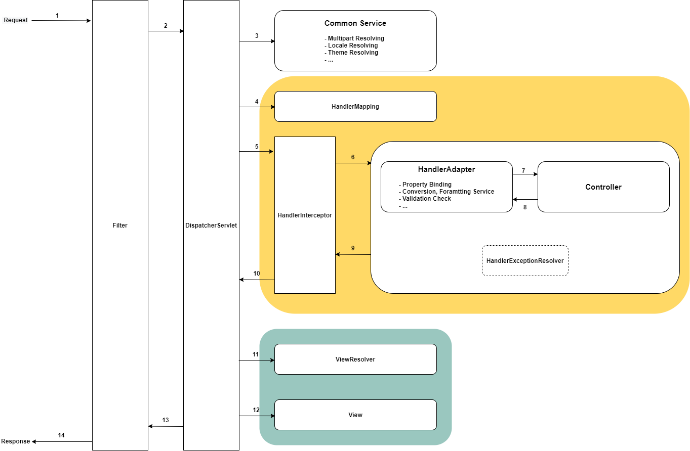

## 인터셉터  



인터셉터는 컨트롤러 호출 전후로 요청과 응답을 참고하여 적절한 처리할 수 있는 작업을 할 수 있다. 
여러 부분에서 공통적으로 사용하는 로직(인증, 로깅 등)을 처리하는데 활용할 수 있다. 
어찌보면 모든 요청 이전에 실행된다는 점에서 필터와 유서한데 서블릿 필터는 보다는 좀 더 구체적인 구현이 가능하다. 
실행된 Handler나 Model 등을 참조할 수 있기 때문이다. 

```HandlerMapping```의 기본적인 역할은 URL 요청이 어떤 컨트롤러가 처리해야되는지 결정해주는 것이다. 
하지만 이 인터셉터를 적용해주는 역할을 한다. ```HandlerMapping```은 하나 이상의 ```HandlerInterceptor```가 실행되도록 ```HandlerExecutionChain```을 반환해준다.  

인터셉터는 ```HandlerInterceptor```를 구현하여 작성하며 실행 시점에 따른 3가지 메서드를 제공한다. 

``` java
public class MyHandlerInterceptor implements HandlerInterceptor {
    /**
     * 컨트롤러가 호출되기 이전에 실행된다
     * @param request - Current Http Request
     * @param response - Current Http Response
     * @param handler - HandlerMapping이 찾은 Handler 객체
     * @return 이 후 인터셉터 체인과 핸들러의 실행 여부를 결정
     * @throws Exception
     */
    @Override
    public boolean preHandle(HttpServletRequest request, HttpServletResponse response, Object handler) throws Exception {
        return HandlerInterceptor.super.preHandle(request, response, handler);
    }

    /**
     * 컨트롤러가 호출된 이후, view를 렌더링하기 전에 실행된다
     * @param request - Current Http Request
     * @param response - Current Http Response
     * @param handler - HandlerMapping이 찾은 실행된 Handler 객체
     * @param modelAndView - Handler에서 반환한 ModelAndView 객체
     * @throws Exception
     */
    @Override
    public void postHandle(HttpServletRequest request, HttpServletResponse response, Object handler, ModelAndView modelAndView) throws Exception {
        HandlerInterceptor.super.postHandle(request, response, handler, modelAndView);
    }

    /**
     * view 렌더링을 포함한 모든 작업이 완료된 후 실행된다
     * @param request - Current Http Request
     * @param response - Current Http Response
     * @param handler - HandlerMapping이 찾은 실행된 컨트롤러 객체
     * @param ex - Handler에서 발생한 Exception 객체
     * @throws Exception
     */
    @Override
    public void afterCompletion(HttpServletRequest request, HttpServletResponse response, Object handler, Exception ex) throws Exception {
        HandlerInterceptor.super.afterCompletion(request, response, handler, ex);
    }
}
```

## 인터셉터 등록

작성한 인터셉터는 MVC 설정으로 등록해야하며 ```@EnableWebMvc``` 를 사용할 수 있다. 
여러 개를 등록하여 호출 순서를 제어할 수도 있으며 인터셉터가 실행될 URL 패턴 또는 실행되지 않을 URL 패턴을 지정할 수 있다. 

``` java
@Configuration
@EnableWebMvc
public class WebConfig implements WebMvcConfigurer {
    @Override
    public void addInterceptors(InterceptorRegistry registry) {
        registry
                .addInterceptor(new MyHandlerInterceptor())
                .addPathPatterns("/my/**") // 실행할 URL 패턴
                .excludePathPatterns("/your/**") // 제외할 URL 패턴
                .order(0); // 값이 작을 수록 우선 순위가 높음
    }
}
```

<br/>

참고
- 이일민, 토비의 스프링 3.1
- [Web on Servlet Stack](https://docs.spring.io/spring-framework/docs/current/reference/html/web.html#spring-web)