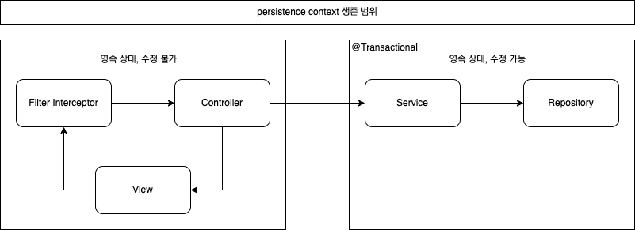

## 스프링과 Persistence context  

스프링에서 JPA를 사용한다면 보통 ```EntityManager```를 직접 다루지 않고, 스프링 컨테이너가 제공하는 전략을 따라가게 된다. 
스프링 컨테이너에서는 트랜잭션 범위의 영속성 컨텍스트를 기본 전략으로 하고 있다. 
스프링에서 제공하고 있는 트랜잭션 AOP. 즉, ```@Transactional``` 어노테이션 레벨로 영속성 컨텍스트를 다루는 것이다. 
여러 스레드에서 동시에 요청이 발생하여 같은 엔티티 매니저를 사용해도 영속성 컨텍스트 관리가 트랜잭션 레벨로 이루어지므로 멀티 스레드 환경에서도 안전하다. 

``` java
@Service
public class HelloService {
    @Transactional
    public void hello() {
        // 메소드 호출 시 영속성 컨텍스트에 의한 관리 시작
        ...

        // 메서드 종료 시 트랜잭션이 종료되면서 영속성 컨텍스트 종료
    }
}
```

하지만 주의해야할 점도 존재한다. 
트랜잭션 외부인 컨트롤러나 뷰 레벨에서는 엔티티가 영속성 컨텍스트의 관리를 받지 못하는 준영속 상태이기 때문에 **지연 로딩을 사용할 수 없다**는 것이다. 
필요한 모든 요소는 트랜잭션 내부에서 미리 초기화해두어야 하며, 준영속 상태에서 지연 로딩을 시도한다면 이는 ```Exception```으로 이어진다. 

## OSIV(Open Session In View)  

트랜잭션 단위의 영속성 컨텍스트 관리는 계층 분리가 확실하지만 유연하지 못하다. 
사용 유무에 상관 없이 연관된 모든 속성들을 모두 초기화 해버리는 것은 성능 상의 이슈가 있을 수 있고, 
상황에 맞게 적절하게 초기화를 미리 해두는 것은 어플리케이션의 복잡도가 많이 올라간다. 

이 모든 문제는 결국 트랜잭션 외부인 컨트롤러나 뷰 레벨에서는 준영속 상태이기에 발생하는 문제이다. 
이를 해결하기 위한 개념 중 하나가 **OSIV(Open Session in View) 또는, OEIV(Open EntityManager in View)**라고 불리는, 
영속성 컨텍스트를 API 요청이 발생할 때 생성하여, API 요청이 종료될 때 까지까지 살려두는 전략이다. 
스프링부트에서는 기본적으로 osiv가 켜진 상태, ```spring.jpa.open-in-view=true```로 되어 있다. 

  

OSIV를 사용하면 트랜잭션은 트랜잭션대로 돌고, 영속성 컨텍스트의 범위만 넓어진다. 
만약 트랜잭션의 범위까지 같이 늘어나 버린다면 뷰 계층에서 데이터가 수정되어버릴 가능성이 존재하기 때문이다. 

당연히 단점도 존재한다. 
영속성 컨텍스트의 생명 주기가 길어진 만큼 요청마다 커넥션을 물고 있는 시간이 많이 늘어날 수 밖에 없다.
이는 실시간 트래픽에 민감한 서비스라면 문제가 발생할 수도 있다. 

또한, 하나의 영속성 컨텍스트를 여러 트랜잭션이 공유하는 경우의 수도 고려해줘야 한다. 
특히 롤백의 경우에는 데이터베이스에 대한 롤백이지 자바 객체 내용을 원래대로 복구해주지는 않는다.
트랜잭션과 영속성 컨텍스트의 범위가 같다면 상관없지만, 
영속성 컨텍스트의 범위가 더 넓은 OSIV 같은 경우에는 다른 트랜잭션에서 잘못된 영속성 컨텍스트를 사용하게 된다는 문제점이 있다. 
스프링의 경우 롤백 발생 시 ```entityManager.clear()```를 호출하여 이를 예방해주고 있다. 

<br/>

참고  
- 김영한, 자바 ORM 표준 JPA 프로그래밍, 에이콘