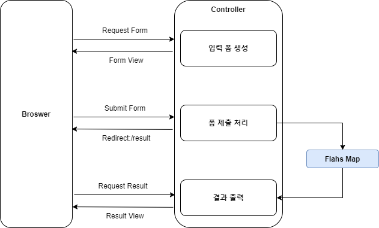

## Redirect  

Request Handler에서 문자열 반환 시 해당 String과 일치하는 View를 렌더링하게된다. 
그러나 클라이언트에게 지정한 페이지로 리다이렉션 할 것을 지정할 수도 있다. 
```redirect:```를 prefix로 두고 요청 URL을 주는 것이다. 

View에 Model 정보를 주는 것처럼 해당 Handler에서 생성한 Model을 그대로 리다이렉션 URL로 넘길 수 있다. 
하지만 리다이렉션하여 사용할 정보 이외에 불필요한 정보를 포함할 수도 있고, 스프링부트 환경에서는 Model 값을 넘기는 것이 디폴트 설정에서는 false로 설정되어 있다. 
리다이렉트와 관련된 정보를 넘길 때는 ```RedirectAttributes```를 사용할 수 있다. 

``` java
@PostMapping("/order")
public String order(Order order, RedirectAttributes ra){
	...
	ra.addAttribute("status", status);
	
	return "redirect:/result";
}
```

리다이렉션은 대표적으로 폼 전송에 사용될 수 있다. 
POST로 폼 결과를 제출했을 때 View를 바로 반환하게 되면 전송 결과가 브라우저에 남아있게 된다. 
따라서 이 페이지에서 새로 고침을하면 폼이 다시 제출될 수 있는 위험이 존재한다. 
그렇기 때문에 View를 바로 반환하는 것이 아닌 결과 페이지로 리다이렉트 시키는 패턴을 많이 사용하는데 이를 **Post/Redirect/Get 패턴**이라고 한다.  

## Flash Map  

```RedirectAttribute```에서 그냥 attribute를 통해 정보를 넘기는 것은 몇가지 한계점을 가진다. 
전달할 내용이 String으로 처리 되기 때문에 객체를 통으로 넘기기는 어렵다는 점과 내용들이 query parameter로 포함되어 URL에 노출된다는 것이다. 

스프링 3.1에서부터는 ```FlashMap```이 추가되었다. 
플래시 맵은 플래시 어트리뷰트를 저장할 수 있는 맵이며, 플래시 어트리뷰트는 **어떤 요청에서 생성되어 바로 다음 요청으로 전달되는 정보**를 말한다. 
서로 다른 요청에서 사용하기에 세션과 유사하지만 바로 직후의 요청에서 사용되고 제거되는 특징을 가진다. 
그리고 이를 사용하면 ```RedirectAttribute```를 사용했을 때의 한계점을 해결할 수 있다. 



그렇다면 이 정보는 어디에 임시로 어디에 저장되는 것일까? 
이를 정의하는 것이 ```FlashMapManager``` 인터페이스인데 디폴트 전략은 저장소로 HTTP Session을 사용하는 ```SessionFlashMapManager```이다. 
원한다면 Custom Manager를 구현하여 RDB나 NoSQL 등의 별도 저장소에 저장하는 것도 가능하다. 

``` java
@Controller
@Slf4j
public class MyController {
    @GetMapping("/user/form")
    public String getCreateUserForm() {
		...

        return "user-form";
    }

    @PostMapping("/user")
    public String createUser(@ModelAttribute User user, RedirectAttributes redirectAttributes) {
		...

        redirectAttributes.addFlashAttribute("user", user);

        return "redirect:/user";
    }

    @GetMapping("/user")
    public String getUserInformation(Model model) {
		...

		User user = (User) model.asMap().get("user");

        return "user-info";
    }
}
```

<br/>

참고
- 이일민, 토비의 스프링 3.1, 에이콘