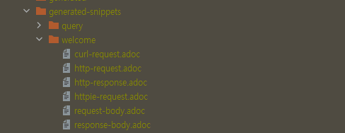
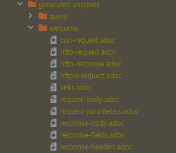
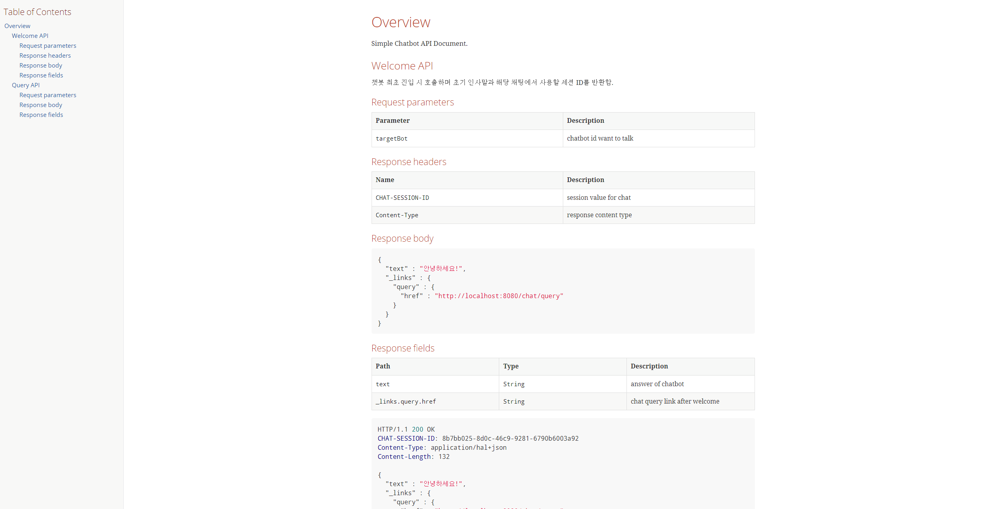

## Spring REST Docs  

API에 대한 문서를 작성하는 것은 쉬운 일이 아니다. 
계속 변경되는 API를 일일히 문서를 최신화하면서 문서의 품질 또한 유지하는 것은 어렵다. 

**Spring REST Docs** 는 RESTful 서비스에 대한 문서 스니펫을 자동 생성 할 수 있다. 
Spring MVC라면 ```MockMvc```를 기반으로하는 테스트 프레임워크, 
Spring WebFlux의 ```WebTestClient```, 
Rest Assured 3 등을 기반으로 스니펫을 만들어낸다. 

작성한 문서 템플릿에서 생성된 스니펫을 참고하여 최종 문서를 생성한다. 
디폴트로는 Asciidoctor로 만들어진 HTML을 문서를 생성하며, Markdown을 선호하는 경우에는 Markdown으로 생성도 가능하다. 

### Build Configuration

``` groovy
plugins { 
  // 1. Asciidoctor 플러그인 설정
	id "org.asciidoctor.convert" version "1.5.9.2"
}

dependencies {
  // 2 asciidoctor. 
  // 생성된 adoc 스니펫 파일을 build/generated-snippets으로 위치
  // operation block macro 사용 가능
	asciidoctor 'org.springframework.restdocs:spring-restdocs-asciidoctor:{project-version}' 
  // 3. mockMvc를 restdocs에 사용 가능
	testCompile 'org.springframework.restdocs:spring-restdocs-mockmvc:{project-version}' 

  implementation 'org.springframework.boot:spring-boot-starter-hateoas'
}

ext { 
  // 4 스니펫의 생성 경로 정의
	snippetsDir = file('build/generated-snippets')
}

test { 
  // 5 스니펫 생성 경로 지정
	outputs.dir snippetsDir
}

// 6 asciidoctor에 대한 작업 구성
asciidoctor { 
  // 7 사용할 스니펫의 경로
	inputs.dir snippetsDir 
	// 8 해당 작업 전에 test가 싱핼되도록 종속성 설정
  dependsOn test 
}

bootJar {
  // 9 해당 작업 전에 asciidoctor가 실행되도록 종속성 설절
	dependsOn asciidoctor 
  // 10 패키징된 문서를 static/docs 경로에 복사
	from ("${asciidoctor.outputDir}/html5") { 
		into 'static/docs'
	}
}
```

### 테스트 코드 작성  

``` java
@ExtendWith(SpringExtension.class)
@SpringBootTest
@AutoConfigureMockMvc
@AutoConfigureRestDocs
class ChatControllerTest {
    @Autowired
    private MockMvc mockMvc;

    @Test
    void welcome() throws Exception {
        mockMvc
                .perform(
                MockMvcRequestBuilders
                        .get("/chat/welcome")
                        .param("targetBot", "song-chat-service")
                )
                .andDo(print())
                .andExpect(header().exists("CHAT-SESSION-ID"))
                .andExpect(header().string(HttpHeaders.CONTENT_TYPE, MediaTypes.HAL_JSON_VALUE))
                .andExpect(status().isOk())
                .andExpect(jsonPath("text").exists())
                .andExpect(jsonPath("_links.query").exists())
                .andDo(document("welcome"));
    }
}
```

스프링부트에서는 ```@AutoConfigureRestDocs```를 통해 적용 가능하다. 
다음 테스트를 수행하면 아래와 같이 스니펫들이 생성된다.  
이는 기본적으로 request, response body에 대한 정보를 포함하며, 생성 위치는 빌드 도구에 따라 달라진다. 

|Build tool|생성 파일 위치|
|:------|:------|
|Maven|target/generated-snippets|
|Gralde|build/generated-snippets|



``` java
@ExtendWith(SpringExtension.class)
@SpringBootTest
@AutoConfigureMockMvc
@AutoConfigureRestDocs
class ChatControllerTest {
    @Autowired
    private MockMvc mockMvc;

    @Test
    void welcome() throws Exception {
        mockMvc
                .perform(
                MockMvcRequestBuilders
                        .get("/chat/welcome")
                        .param("targetBot", "song-chat-service")
                )
                .andDo(print())
                .andExpect(header().exists("CHAT-SESSION-ID"))
                .andExpect(header().string(HttpHeaders.CONTENT_TYPE, MediaTypes.HAL_JSON_VALUE))
                .andExpect(status().isOk())
                .andExpect(jsonPath("text").exists())
                .andExpect(jsonPath("_links.query").exists())
                .andDo(document(
                        "welcome",
                        requestParameters(
                                parameterWithName("targetBot").description("chatbot id want to talk")
                        ),
                        responseHeaders(
                                headerWithName("CHAT-SESSION-ID").description("session value for chat"),
                                headerWithName(HttpHeaders.CONTENT_TYPE).description("response content type")
                        ),
                        responseFields(
                                fieldWithPath("text").description("answer of chatbot"),
                                fieldWithPath("_links.query.href").description("chat query link after welcome")
                        ),
                        links(
                                linkWithRel("query").description("chat query link after welcome")
                        ))
                ));
    }
}
```

그리고 필요한 요소들을 추가적으로 정의하면 된다. 
각 API가 포함하는 Header, Parameter, HyperMedia, Constraint 등을 명시할 수 있다. 



``` java
@TestConfiguration
public class RestDocsConfiguration {
    @Bean
    public RestDocsMockMvcConfigurationCustomizer restDocsConfigurationCustomizer() {
        return configurer -> configurer
                .operationPreprocessors()
                .withRequestDefaults(prettyPrint())
                .withResponseDefaults(prettyPrint());
    }
}
```

API 명세 이외에도 Docs에 대한 설정과 PreProcessor를 지정할 수 있다. 
위 예시는 ```prettyPrint()```를 통해 생성되는 스니펫 내부의 JSON 등의 포맷을 읽기 쉽게 포맷팅 해준다. 
위와 같이 Bean을 작성하고 테스트 클래스에 ```@Import(RestDocsConfiguration.class)``` 어노테이션을 지정하면 설정이 적용된다. 

### 템플릿 작성  

실제 생성되는 API 문서의 템플릿이며 스니펫들을 참조하여 작성한다. 
이 때 템플릿의 위치는 빌드 도구에 따라 달라진다. 

|Build tool|Template 위치|생성 파일 위치|
|:------|:------|:------|
|Maven|src/main/asciidoc/*.adoc|target/generated-docs/*.html|
|Gradle|src/docs/asciidoc/*.adoc|build/asciidoc/html5/*.html|

``` adoc
:doctype: book
:icons: font
:source-highlighter: highlightjs
:toc: left
:toclevels: 4
:sectlinks:
:operation-curl-request-title: Example request
:operation-http-response-title: Example response

[[Overview]]
== Overview

Simple Chatbot API Document.

[[welcome]]
=== Welcome API

챗봇 최초 진입 시 호출하며 초기 인사말과 해당 채팅에서 사용할 세션 ID를 반환함.

operation::welcome[snippets='request-parameters,response-headers,response-body,response-fields']

[[query]]
=== Query API

챗봇에 질의를 하고 그에 대한 응답을 반환함.

operation::query[snippets='request-parameters,response-body,response-fields']
```



[링크](./api-guide.html)

<br/>

참고  
- [Spring REST Docs](https://docs.spring.io/spring-restdocs/docs/2.0.5.RELEASE/reference/html5/)
- [Creating API Documentation with Restdocs](https://spring.io/guides/gs/testing-restdocs/)