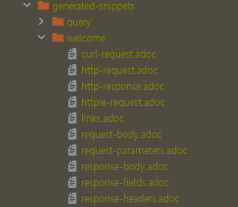
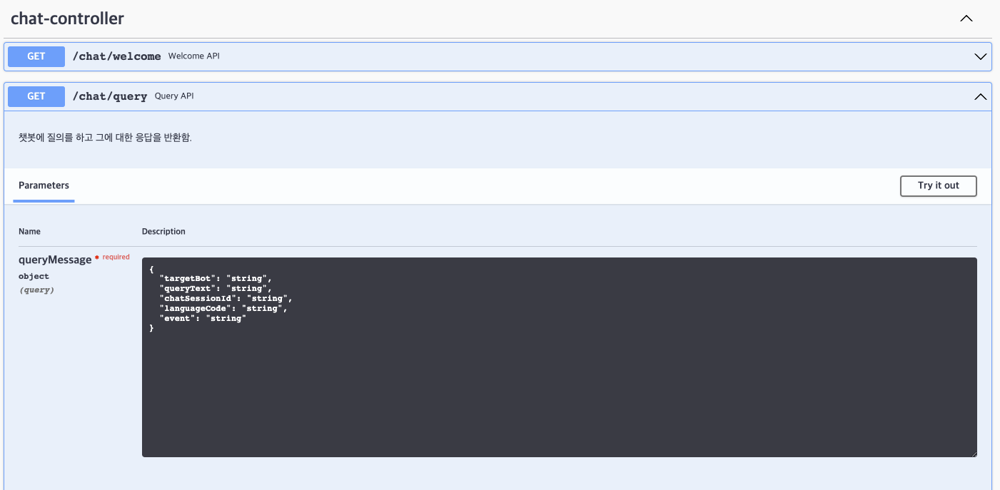
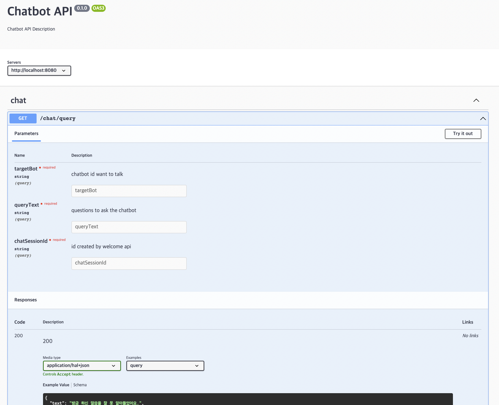

# 문서 자동화  

API 서버를 다룬다면 생성한 API를 클라이언트들이 사용할 수 있도록 관련 명세를 문서화하는 것이 필요하다. 
물론, 별도의 편집기로 직접 작성을 할 수도 있지만 이를 스펙이 변할 때마다 지속해서 최신화하고 품질을 유지하는 것은 결코 쉬운 일이 아니다. 
그래서 이러한 문서들을 코드 레벨에서 자동 생성할 수 있는 도구들이 존재하는데 스프링 진영에서 많이 사용되는 것은 **Spring Rest Docs**와 **Swagger**이다. 

## Spring REST Docs  

**Spring REST Docs** 는 RESTful 서비스에 대한 문서 스니펫을 자동 생성 할 수 있다. 
Spring MVC라면 ```MockMvc```를 기반으로하는 테스트 프레임워크, 
Spring WebFlux라면 ```WebTestClient```, 
Rest Assured 3 등을 기반으로 스니펫을 만들어낸다. 

그리고 작성한 문서 템플릿이 생성된 스니펫을 참고하여 최종 문서를 생성한다. 
디폴트로는 Asciidoctor로 만들어진 HTML을 문서를 생성한다. 

### Build Configuration  

gradle 프로젝트에서 REST Docs를 사용하기 위한 기본적인 빌드 설정은 아래와 같다. 

``` groovy
plugins { 
  // Asciidoctor 플러그인 설정
  id 'org.asciidoctor.jvm.convert' version '3.3.2'
}

configurations {
  asciidoctorExt
}

dependencies {
  asciidoctorExt 'org.springframework.restdocs:spring-restdocs-asciidoctor'
  testCompile 'org.springframework.restdocs:spring-restdocs-mockmvc' 
}

ext {
    snippetsDir = file("build/generated-snippets")
}

test {
  useJUnitPlatform()
  outputs.dir snippetsDir
}

asciidoctor { 
	inputs.dir snippetsDir 
	configurations 'asciidoctorExt' 
	dependsOn test 
}

bootJar {
  dependsOn asciidoctor

  // jar 내부로 카피
  from("${asciidoctor.outputDir}/html5"){
    into "static/docs"
  }
}
```

### Snippet 생성

이후 API에 대한 스니펫을 생성하기 위한 코드를 작성한다. 
스니펫의 디폴트 생성 위치는 빌드 도구에 따라 달라진다. 

|Build tool|생성 파일 위치|
|:------|:------|
|Maven|target/generated-snippets|
|Gralde|build/generated-snippets|

```mockMvc```를 사용한 테스트 코드 이 후 마지막에 작성된 ```document("welcome")``` 을 통해 스니펫을 생성할 수 있다. 이는 기본적으로 request, response body에 대한 정보를 포함하고 header, parameter, hypermedia, constraint 등을 필요에 따라 정의하면 된다. 

``` java
@ExtendWith(SpringExtension.class)
@SpringBootTest
@AutoConfigureMockMvc
@AutoConfigureRestDocs
class ChatControllerTest {
    @Autowired
    private MockMvc mockMvc;

    @Test
    void welcome() throws Exception {
        mockMvc
                .perform(
                RestDocumentationRequestBuilders
                        .get("/chat/welcome")
                        .param("targetBot", "song-chat-service")
                )
                .andDo(print())
                .andExpect(header().exists("CHAT-SESSION-ID"))
                .andExpect(header().string(HttpHeaders.CONTENT_TYPE, MediaTypes.HAL_JSON_VALUE))
                .andExpect(status().isOk())
                .andExpect(jsonPath("text").exists())
                .andExpect(jsonPath("_links.query").exists())
                .andDo(document(
                        "welcome",
                        requestParameters(
                                parameterWithName("targetBot").description("chatbot id want to talk")
                        ),
                        responseHeaders(
                                headerWithName("CHAT-SESSION-ID").description("session value for chat"),
                                headerWithName(HttpHeaders.CONTENT_TYPE).description("response content type")
                        ),
                        responseFields(
                                fieldWithPath("text").description("answer of chatbot"),
                                fieldWithPath("_links.query.href").description("chat query link after welcome")
                        ),
                        links(
                                linkWithRel("query").description("chat query link after welcome")
                        ))
                ));
    }
}
```

API 명세 이외에도 문서에 대해 PreProcessor를 지정할 수 있다. 
아래 예시는 ```prettyPrint()```를 통해 생성되는 스니펫 내부의 JSON 등의 포맷을 읽기 쉽게 포맷팅 해준다. 
빈을 생성하고 테스트 클래스에 ```@Import(RestDocsConfiguration.class)``` 어노테이션을 지정하면 설정이 적용된다. 

``` java
@TestConfiguration
public class RestDocsConfiguration {
    @Bean
    public RestDocsMockMvcConfigurationCustomizer restDocsConfigurationCustomizer() {
        return configurer -> configurer
                .operationPreprocessors()
                .withRequestDefaults(prettyPrint())
                .withResponseDefaults(prettyPrint());
    }
}
```



### 템플릿 작성  

생성 문서의 템플릿을 나타내며 이를 따라 스니펫들을 조합하여 실제 문서가 생성된다. 
이 때 템플릿의 디폴트 위치는 빌드 도구에 따라 달라진다. 

|Build tool|Template 위치|생성 파일 위치|
|:------|:------|:------|
|Maven|src/main/asciidoc/*.adoc|target/generated-docs/*.html|
|Gradle|src/docs/asciidoc/*.adoc|build/asciidoc/html5/*.html|

``` adoc
:doctype: book
:icons: font
:source-highlighter: highlightjs
:toc: left
:toclevels: 4
:sectlinks:
:operation-curl-request-title: Example request
:operation-http-response-title: Example response

[[Overview]]
== Overview

Simple Chatbot API Document.

[[welcome]]
=== Welcome API

챗봇 최초 진입 시 호출하며 초기 인사말과 해당 채팅에서 사용할 세션 ID를 반환함.

operation::welcome[snippets='request-parameters,response-headers,response-body,response-fields']

[[query]]
=== Query API

챗봇에 질의를 하고 그에 대한 응답을 반환함.

operation::query[snippets='request-parameters,response-body,response-fields']
```


[생성된 문서](./api-guide.html)

## Swagger  

Swagger는 API를 설명하는 하나의 표준인 OAS(Open API Specification)를 따라 이를 시각화해주는 도구이다. 
스프링 진영에서는 이를 자동화하는 도구로 'springfox' 또는 'springdoc'을 많이 사용한다. 
springfox가 몇 년간 업데이트가 없으면서 springdoc으로 많이 넘어갔으나, 요즘 다시 업데이트하고 있는 것으로 보인다.

``` groovy
dependencies {
  ...
  implementation 'org.springdoc:springdoc-openapi-ui:1.6.6'
}
```

``` java
@Operation(summary = "Query API", description = "챗봇에 질의를 하고 그에 대한 응답을 반환함.")
@ApiResponses({
    @ApiResponse(responseCode = "200", description = "OK"),
})
@GetMapping("/query")
public ResponseEntity<EntityModel<ResultMessage>> chatQuery(
    ...

    return ret;
}
```



간단하게 의존성을 추가하고 어노테이션을 정의하는 것만으로 화면을 구성할 수 있다. 
이처럼 Swagger는 초기 설정이나 사용법이 비교적 더 간단하며 UI에서 제공하는 기능 자체도 풍부하다. 

하지만 단점도 존재한다. 
문서화를 위한 각종 어노테이션들이 코드에 포함되어 가독성을 해친다는 점이며, 
또한 이렇게 문서화된 결과가 실제 API 스펙과 일치한다는 보장이 없다는 것이다. 

## Spring Rest Docs + Swagger UI  

Spring Rest Docs에서는 기본적으로 adoc 파일을 생성하지만, OAS으로 추출해주는 오픈 소스가 존재한다. 
그리고 이렇게 생성된 파일을 기반으로 swagger UI로 보여줄 수 있다. 

``` groovy
plugins {
  // Rest Docs > Open API Specification
  id 'com.epages.restdocs-api-spec' version '0.15.3'
  // Swagger
  id 'org.hidetake.swagger.generator' version '2.18.2'
}

dependencies {
  testImplementation 'com.epages:restdocs-api-spec-mockmvc:0.15.2'
  swaggerUI 'org.webjars:swagger-ui:4.5.0'
}

openapi3 {
  server = 'http://localhost:8080'
  title = 'Chatbot API'
  description = 'Chatbot API Description'
  version = '0.1.0'
  format = 'yaml'
}

generateSwaggerUI {
  inputFile = file("${project.buildDir}/api-spec/openapi3.yaml")
  dependsOn 'openapi3'
}

bootJar {
  dependsOn generateSwaggerUI

  from("${generateSwaggerUI.outputDir}") {
      into 'static/docs/swagger-ui'
  }
}
```

이 때 테스트 코드 작성 시 ```document()``` 메서드는 ```org.springframework.restdocs.mockmvc```가 아니라 ```com.epages.restdocs.apispec```에 정의된 것을 사용해야 한다. 

openapi3 태스크가 실행되면 아래와 같이 OAS를 준수하는 yml파일이 생성된다. 
그리고 이를 기반으로 generateSwaggerUI 태스크는 swagger-ui를 생성해준다. 

``` yml
openapi: 3.0.1
info:
  title: Chatbot API
  description: Chatbot API Description
  version: 0.1.0
servers:
- url: http://localhost:8080
tags: []
paths:
  /chat/query:
    get:
      tags:
      - chat
      operationId: query
      parameters:
      - name: targetBot
        in: query
        description: chatbot id want to talk
        required: true
        schema:
          type: string
      - name: queryText
        in: query
        description: questions to ask the chatbot
        required: true
        schema:
          type: string
      - name: chatSessionId
        in: query
        description: id created by welcome api
        required: true
        schema:
          type: string
      responses:
        "200":
          description: "200"
          headers:
            Content-Type:
              description: response content type
              schema:
                type: string
          content:
            application/hal+json:
              schema:
                $ref: '#/components/schemas/chat-welcome2084107755'
              examples:
                query:
                  value: "{\n  \"text\" : \"방금 하신 말씀을 잘 못 알아들었어요.\",\n  \"_links\"\
                    \ : {\n    \"query\" : {\n      \"href\" : \"http://localhost:8080/chat/query\"\
                    \n    }\n  }\n}"
  /chat/welcome:
    get:
      tags:
      - chat
      operationId: welcome
      parameters:
      - name: targetBot
        in: query
        description: chatbot id want to talk
        required: true
        schema:
          type: string
      responses:
        "200":
          description: "200"
          headers:
            CHAT-SESSION-ID:
              description: session value for chat
              schema:
                type: string
            Content-Type:
              description: response content type
              schema:
                type: string
          content:
            application/hal+json:
              schema:
                $ref: '#/components/schemas/chat-welcome2084107755'
              examples:
                welcome:
                  value: "{\n  \"text\" : \"안녕하세요!\",\n  \"_links\" : {\n    \"query\"\
                    \ : {\n      \"href\" : \"http://localhost:8080/chat/query\"\n\
                    \    }\n  }\n}"
components:
  schemas:
    chat-welcome2084107755:
      type: object
      properties:
        _links:
          type: object
          properties:
            query:
              type: object
              properties:
                href:
                  type: string
                  description: chat query link after welcome
        text:
          type: string
          description: answer of chatbot
```



<br/>

참고  
- [Spring REST Docs](https://docs.spring.io/spring-restdocs/docs/2.0.5.RELEASE/reference/html5/)
- [Creating API Documentation with Restdocs](https://spring.io/guides/gs/testing-restdocs/)
- [API Documentation & Design Tool for Team | Swagger](https://swagger.io/)
- [OpenAPI 3 Library for spring-boot](https://springdoc.org/)
- [Generate Swagger UI from Spring REST Docs](https://blog.jdriven.com/2021/10/generate-swagger-ui-from-spring-rest-docs/)
- [restdocs-api-spec](https://github.com/ePages-de/restdocs-api-spec)
- [gradle-swagger-generator-plugin](https://github.com/int128/gradle-swagger-generator-plugin)