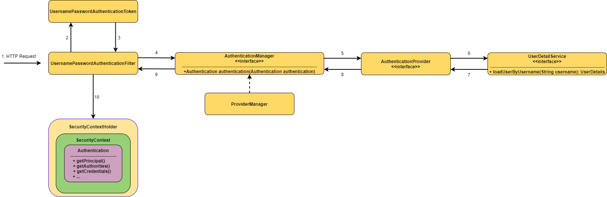

# Spring Security Architecture  

서블릿 기반의 애플리케이션에서 스프링 시큐리티의 아키텍쳐를 알아본다. 
스프링 시큐리티는 서블릿 기반 애플리케이션에서는 필터 기반으로 동작을 한다. 

## Security Filter


서블릿 필터에서는 스프링에서 구현된 빈을 직접 사용할 수 없는데, 
둘 사이의 브릿지 역할을 하여 필터 처리를 빈에게 위임하는 것이 ```DelegatingFilterProxy```이다. 
그리고 스프링 시큐리티에서는 이를 이용하여 ```FilterChainProxy``` 라는 빈을 통해 서비스를 제공한다. 

스프링 시큐리티가 제공하는 전체 필터를 순서대로 나열한 목록은 아래와 같다. 
정해진 순서대로 처리되기에 전후 관계를 파악해야하는 것이 중요하다. 

1. ChannelProcessingFilter
   
2. **WebAsyncManagerIntegrationFilter**  
   Spring MVC에서 Async를 사용할 때, 생성된 다른 스레드에서도 Security Context를 공유할 수 있도록 처리한다.
   
3. **SecurityContextPersistenceFilter**  
   로그인 이후 여러 자원에 접근 가능하도록 HTTP Session을 기반으로 기존의 Security 정보를 읽어온다. Spring Session과 연동 가능하다. 

4. **HeaderWriterFilte**  
   Response Header에 시큐리티 관련 헤더 값을 추가해준다. 
   - XContentTypeOptionsHeaderWriter: Mime Snipping 공격을 방어한다.
   - XXssProtectionHeaderWriter: 브라우저에 내장된 XSS 필터를 적용한다. 
   - CacheControlHeadersWriter: 캐시 히스토리의 취약점을 방어한다.
   - HstsHeaderWriter: https만 허용한다.
   - XFrameOptionsHeaderWriter: clickjacking 공격을 방어한다.

5. **CorsFilter**  
   CORS 요청에 대한 처리를 한다.

6. **CsrfFilter**  
   CSRF 방어를 위한 검증을 한다.

7. **LogoutFilter**   
   로그아웃 요청을 처리한다. 세션 무효화, Remember-me 인증 정리, SecurityContextHolder를 비우는 등의 작업이 이루어진다.

8. OAuth2AuthorizationRequestRedirectFilter  

9. Saml2WebSsoAuthenticationRequestFilter  

10. **X509AuthenticationFilter**  
    X.509 인증서를 통한 인증을 처리한다.

11. **AbstractPreAuthenticatedProcessingFilter**  
    SiteMinder, Java EE Security와 같은 외부 인증이 이루어진 요청에 대한 인증 처리를 한다.

12. **CasAuthenticationFilter**  
    CAS(Central Authentication Service) 기반 인증을 처리한다.

13. OAuth2LoginAuthenticationFilter
    OpenId Connect, Non-Standard OAuth 2.0과 같은 OAuth 2.0 기반 인증을 처리한다.

14. Saml2WebSsoAuthenticationFilter  
    SAML 2.0 기반 인증을 처리한다

15. **UsernamePasswordAuthenticationFilter**  
    폼 기반(Username, Password) 인증을 처리한다.

16. **OpenIDAuthenticationFilter**  
    OpenId 기반 인증을 처리한다.

17. **DefaultLoginPageGeneratingFilter**  
    기본 로그인을 처리하는 폼 화면을 만들어주는 역할을 한다. 커스텀 페이지를 생성할 경우 사라진다.

18. **DefaultLogoutPageGeneratingFilter**  
    기본 로그아웃을 처리하는 폼 화면을 만들어주는 역할을 한다. 커스텀 페이지를 생성할 경우 사라진다.

19. ConcurrentSessionFilter  

20. **DigestAuthenticationFilter**  
    Digest 기반 인증을 처리한다.  

21. **BearerTokenAuthenticationFilter**  
    JWT, Opaque token과 같은 Bearer Token 기반 인증을 처리한다. 

22. **BasicAuthenticationFilter**
    'username:password'를 base64로 인코딩하여 헤더에 포함시키는 HTTP 기본 인증을 처리한다.

23. **RequestCacheAwareFilter**  
    해당 요청과 관련된 캐싱이 되어 있으면 캐싱된 내용으로 처리한다. 예를들어, 특정 URL에 접근했을 때 인증이 안된 상태라면 로그인 화면으로 리다이렉트 되는데, 정상적으로 로그인하면 원래 요청한 URL로 자동으로 넘어간다.

24. **SecurityContextHolderAwareRequestFilter**  
    Servlet 3의 보안 관련 API들 직접 사용할 때 스프링 시큐리티 기반으로 사용할 수 있도록 연동해주는 역할을 한다.

25. **JaasApiIntegrationFilter**  
    JAAS(Java Authentication and Authorization Service) 인증을 처리한다.

26. **RememberMeAuthenticationFilter**  
    쿠키 또는 데이터베이스 토큰 저장 등을 활용하여 세션이 만료되더라도 로그인 상태를 유지할 수 있게한다. 자동 로그인 같은 기능에 사용된다.

27. **AnonymousAuthenticationFilter**  
    요청에 인증 정보가 null이라면 익명 사용자를 나타내는 객체를 생성하여 인증 정보에 주입한다.

28. OAuth2AuthorizationCodeGrantFilter  
    

29. **SessionManagementFilter**  
    Session에 대한 정책을 체크한다. 세션 고정 보호, 타임아웃 처리, 동시에 열 수 있는 최대 세션 개수 등을 설정할 수 있다.

30. **ExceptionTranslationFilter**  
    아래 ```FilterSecurityInterceptor```를 감싸고 있으며 해당 필터에서 인증과 인가에 대한 예외인 ```AuthenticationException```, ```AccessDeniedException```가 발생하면 처리를 한다.
    인증이 필요한 자원에 인증 없이 접근을 할 때 로그인 페이지로 리다이렉트 해주거나, 권한이 없는 자원에 접근을 할 때는 에러 페이지로 리다이렉트 해주는 등의 역할을 한다. 

31. **FilterSecurityInterceptor**  
    권한 정보를 기반으로 해당 자원에 대해 Access Control을 한다. 

32. **SwitchUserFilter**  
    리눅스의 'su' 명령어와 같이 사용자 전환 처리 역할을 한다.
    

## Authentication  

스프링 시큐리티는 수 많은 필터를 기반으로 다양한 인증 방식을 처리할 수 있다. 
그 중 가장 많이 사용되는 방식인 Username, Password 기반 인증의 구조 중를 알아본다. 

해당 인증 방식은 폼 기반 Authentication, Http Basic Authehntication, Digest Authentication을 처리할 수 있다.

  

> Username, Password 기반 방식 인증 아키텍쳐

### SecurityContextHolder, SecurityContext, Authentication  


```SecurityContextHolder```는 인증된 사용자의 세부 정보를 저장하고 있으며 내부의 값이 존재한다면 인증된 사용자임을 의미한다. 
```SecurityContext```는 홀더 내부에서 ```Authentication```를 포함하고 있는 객체이며, 
```Authentication``` 객체는 인증된 사용자의 정보를 포함하고 있다. 

- ```principal``` : '인증한 사용자가 누군가?'에 해당되는 정보이며, 해당 방식 인증 시에는 ```UserDetailService```에서 반환한 ```UserDetails``` 객체를 나타낸다. 
- ```authorities``` : ```GrantAuthoritiy``` 객체는 ```AuthenticationManager```가 부여한 권한 등급을 나타낸다. 
- ```credentials``` : 인증한 사용자의 암호를 나타낸다.

가장 상위 객체인 ```SecurityContextHolder```는 ```ThreadLocal``` 을 통해 관리되고 있기에, 
별도의 파라미터 없이 동일 스레드 내부라면 아래와 같이 접근하여 사용할 수 있다.  

``` java
public class SampleService {
    public void sample() {
		// 아래와 같이 접근하여 사용 가능
        SecurityContext context = SecurityContextHolder.getContext();
        Authentication authentication = context.getAuthentication();
        String username = authentication.getName();
        Object principal = authentication.getPrincipal();
        Collection<? extends GrantedAuthority> authorities = authentication.getAuthorities();
    }
}
```

### UsernamePasswordAuthenticationToken  

요청의 ```HttpServletRequest``` 로 부터 해당 방식 인증을 위해 인증 정보인 ```Authentication``` 객체를 생성한다. 


### AuthenticationManager  

각 Spring Security Filter가 인증을 수행하는 방법을 정의하고 있는 부분이며 넘어온 Authentication 정보가 유효한 인증 정보인지 확인하는 역할을 한다. 

``` java
Authentication authentication(Authentication authentication) throws AuthenticationException;
```

이 인터페이스는 하나의 메서드만 구현되어 있다.
필요에 맞게 직접 구현할 수도 있지만 대체로 그럴 일은 없으며, 이를 구현하고 있는 ```ProviderManager```를 주로 사용한다.

### ProviderManager  

```AuthenticationManager```의 구현체이다. 


이는 여러 개의 ```AuthenticationProvider``` 을 가지고 있으며 각각 Form 인증, OAuth 인증 등 요청에 맞는 인증 수행 로직을 포함하고 있다. 
이 중에 적합한 ```AuthenticationProvider``` 을 찾아 인증 역할을 위임한다. 

인증 과정에서 DisabledException(비활성화 계정), BadCredentialsException(잘못된 비밀번호) LockedExcpetion(잠긴 계정) 등의 예외를 생성할 수 있다. 
최종적으로, 인증이 되면 Authentication 객체를 반환하며 ```SecurityContextHolder``` 에 저장되어 사용할 수 있게 된다. 

### AuthenticationProvider  

```ProviderManager```에 주입되어 사용되며, 특정 유형의 인증을 수행한다. 
샘플에서는 ```DaoAuthenticationProvider```를 사용하여 넘어온 Username과 Password가 유효한 것인지 검증을 하는 부분이다. 

### UserDetailsService  

데이터베이스에 저장되어 있는 사용자 인증 정보를 가져오는 역할을 하는 서비스이다. 
```UserDetailsService``` 인터페이스를 구현하면 되고, ```DaoAuthenticationProvider``` 에서는 해당 객체를 활용해 인증 정보를 가져온다. 

구현이 필요한 ```loadUserByUsername()``` 메서드는 ```UserDetails``` 객체를 반환하며, 
이는 스프링 시큐리티가 사용하고 있는 ```Authentication``` 객체 사이의 어댑터 역할을 한다. 

``` java
@Service
public class UserRepositoryUserDetailService implements UserDetailsService {
    private final UserRepository userRepository;

    @Autowired
    public UserRepositoryUserDetailService(UserRepository userRepository) {
        this.userRepository = userRepository;
    }

    @Override
    public UserDetails loadUserByUsername(String username) throws UsernameNotFoundException {
        User user = userRepository.findByUsername(username);
        if(user != null){
            return user;
        }

        throw new UsernameNotFoundException("User " + username + " not found");
    }
}
```

인증 정보가 데이터베이스에 저장되 있고, SQL Mapper나 ORM 같은 Persistence Framework를 사용하는 경우에는 이 방식으로 직접 구현하는 것이 일반적이다. 
하지만 이 외에도 Storage에 따라 ```UserDetailsService``` 가 자동 구현되도록할 수 있다. 

|Storage|Description|
|:---|:---|
|Inmemory 방식|사용자 정보가 변경 없이 사전 정의된 계정만 사용된다면 인증 정보를 메모리에 올려둔다|
|JDBC 방식|```org/springframework/security/core/userdetails/jdbc/users.ddl```에 정의된 기본 스키마를 기본으로 인증처리를 한다|
|LDAP 방식|LDAP(Lightweight Directory Access Protocol) 기반으로 인증처리를 한다|

## Authorization  

스프링 시큐리티에서는 인증 방법과는 완전히 별개로 인가에 관한 룰을 정할 수 있다. 
인증 과정에서 발생한 ```Authentication``` 객체에는 권한 정보인 ```GratedAuthority``` 객체를 가지고 있다. 
이 객체는 권한 정보를 나타내며 스프링 시큐리티에서는 하나의 문자열로 권한을 표현하는 ```SimpleGrantedAuthority```를 기본 구현체로 제공한다.

**```AccessDecisionManager```** 는 이를 기반으로 접근에 대한 결정을 하게 된다. 

<br/>

참고  
- [Spring Security Reference](https://docs.spring.io/spring-security/site/docs/current/reference/html5/)
- [Topical Guide](https://spring.io/guides/topicals/spring-security-architecture)
- Craig Walls, Spring in Action 5/E, 심재철, 제이펍  
  
--------------------------------------------------------------------------

정리해야할 것

9.6. Handling Security Exceptions
10.9. AbstractAuthenticationProcessingFilter
10.19 Run-As Authentication Replacement
11.1 Authorization Architecture
11.2 Authrozie HttpServletRequest with FilterSecurityInterceptor
11.3 Expression-Based Access Control

AccessDecisionManager
Access Control 결정을 내리는 인터페이스... 3가지 구현체를 기본 제공

AffirmativeBased : 여러 Voter 중 한 명이라도 허용하면 허용이며 기본 전략
ConsensusBased : 다수결
UnanimousBase : 만장일치

ExceptionTranslationFilter

앞의 FilterSecurityInterceptor에서 발생한 AuthenticationException과 AccessDeniedException 발생 시.. 처리

Authentication Exception 발생하면
authenticationEntryPoint 실행
AbstractSecurityInterceptor 하위 클래스(예, FilterSecurityInterceptor)에서 발생하는 예외만 처리.
그렇다면 UsernamePasswordAuthenticationFilter에서 발생한 인증 에러는?

AccessDeniedException 발생 시
익명 사용자라면 AuthenticationEntryPoint 실행 (로그인)
익명 사용자가 아니면 AccessDeniedHandler에게 위임

#### ```authorizeRequests()```  

```authorizeRequests()``` 는 URL 경로와 패턴에 대한 요구사항을 구성할 수 있다. 
위 코드에서 "/design"과 "/order"은 ROLE_USER 권한이 있어야하고, 그 외의 페이지는 모두 접근이 허용된다는 의미이다. 
그리고 이를 구성할 때 주의할 점은 순차적으로 패턴을 검사해서 매칭 검사를 하게 되므로 순서가 중요하다. 
이 경우 ```antMatchers```의 순서를 바꾸면 "/design"과 "/order" 모두 ```.antMatchers("/", "/**").permitAll()``` 에 걸려 인증 없이 접근이 된다.

|method|description|
|:---|:---|
|```hasRole(String)```|해당 롤을 가지고 있어야 허용한다|
|```permitAll()```|접근을 모두 허용한다||
|```anonymous()```|익명 사용자의 접근도 허용한다|
|```authenticated()```|익명이 아닌 인증된 사용자면 허용한다|
|```rememberMe()```|이전 로그인 정보가 쿠키나 DB에 남아있을 때 허용한다|
|```fullyAuthenticated()```|익명이 아니거나 remember-me가 아닌 사용자면 허용한다|
|```hasAuthority(String)```|지정된 권한을 가지고 있으면 허용한다|
|```hasAnyAuthority(String...)```|지정된 권한 중 하나 이상을 가지고 있으면 허용한다|
|```hasRole(String)```|지정된 역할을 가지고 있으면 허용한다|
|```hasAnyRole(String...)```|지정된 역할 중 하나 이상을 가지고 있으면 허용한다|
|```hasIpAddress(String)```|지정된 IP의 요청을 허용한다|
|```not()```|다른 접근 메서드를 무효화한다|
|```access(String)```|인자로 전달된 SpEL 식이 참이면 허용한다|

------------------------------------------------------------------------------------------------