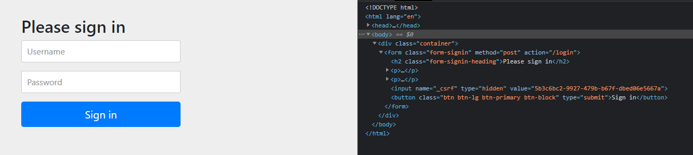

## CSRF  

**CSRF(Cross-Site Request Forgery)** 사용자가 서비스에 로그인한 상태에서 어느 악의적인 사이트에 접속을 하면, 
기존 서비스에 로그인한 권한을 가지고 공격자의 의도에 맞는 요청을 하는 공격이다. 

예를 들어 은행 사이트에서 아래와 같은 폼을 제공한다고 가정한다. 

``` html
<form method="post" action="/transfer">
  <input type="text" name="amount"/>
  <input type="text" name="routingNumber"/>
  <input type="text" name="account"/>
  <input type="submit" value="Transfer"/>
</form>
```

그리고 악의적인 사이트에서는 아래와 같은 폼을 구현했다고 가정한다. 

``` html
<form method="post" action="https://bank.example.com/transfer">
  <input type="hidden" name="amount" value="100.00"/>
  <input type="hidden" name="routingNumber" value="evilsRoutingNumber"/>
  <input type="hidden" name="account" value="evilsAccountNumber"/>
  <input type="submit" value="Win Money!"/>
</form>
```

악의적 사이트에서 폼 제출을 하면 은행 사이트로 출금 요청이 들어가게되며, 
은행 사이트에 로그인 상태라면 사용자 본인 계좌에서 돈이 빠져나간다. 

## CSRF 방어  

위 상태에서 공격이 가능한 이유는 은행 사이트에서의 정상적인 폼 제출로 인한 http request와 악의적인 사이트에서의 http request가 완전히 동일하기 때문이다. 
두 요청을 구분할 수 있는 방법이 필요하다. 

스프링 시큐리티에서는 이를 해결하기 위해 Synchronizer Token Pattern을 사용한다. 
CSRF Token이라는 무작위 값을 생성하고 애플리케이션의 상태를 변경 시킬 수 있는 POST, PATCH, DELETE 에 대해서는 요청에 해당 토큰 값이 포함되어 있지 않으면 요청을 거부하는 것이다. 
아래와 같이 폼에 무작위 값이 포함되어 있으면 해당 서비스에서 제공하는 화면이 아닌 외부에서의 폼 제출을 막아낼 수 있다. 

``` html
<form method="post" action="/transfer">
  <input type="hidden" name="_csrf" value="4bfd1575-3ad1-4d21-96c7-4ef2d9f86721"/>
  <input type="text" name="amount"/>
  <input type="text" name="routingNumber"/>
  <input type="hidden" name="account"/>
  <input type="submit" value="Transfer"/>
</form>
```

그렇다면 CSRF token을 어떻게 생성하고 세팅해야하는 것일까? 
템플릿 엔진을 사용하고 폼 기반의 애플리케이션이라면 사실 할게 없다. 
Spring Security 의존성을 추가했을 때 디폴트는 csrf 방어가 활성화 된 상태이다. 
그리고 기본 로그인 폼의 html을 확인해보면 토큰 값이 이미 삽입되어 있음을 확인할 수 있으며, 이는 CSRF token의 생성이 이미 이루어지고 있다는 뜻이다. 



2.1 버전 이상의 타임리프를 사용할 경우에는 자동으로 form tag 아래 hidden input tag가 포함되며 표현식을 통한 명시적인 작성도 가능하다. 
form 전송 이외에 AJAX를 사용하는 경우에는 csrf token은 헤더에 포함되어야 하는데, 
그 때는 아래와 같이 표현식을 통해 토큰 값을 메타 데이터로 만들어 놓고 사용할 수 있다.  

``` html
<!--Thymeleaf-->
<head>
    <title>Hello world</title>
    <meta name="_csrf" th:content="${_csrf.token}"/>
</head>
```

그리고 csrf 방어가 활성화된 상태에서 테스트 코드는 아래와 같이 작성하여 토큰 값을 삽입할 수 있다. 

``` java
mockMvc
	.perform(...)
	.with(csrf());
```

<br/>

참고  
- [Spring Security Reference](https://docs.spring.io/spring-security/site/docs/current/reference/html5/)