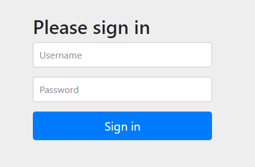

## Spring Security  

스프링 시큐리티는 스프링 애플리케이션에서 **인증**과 **권한** 부분을 핸들링하여 보안을 처리할 수 있게 해준다. 
간단히 스타터팩을 추가함으로써 시작할 수 있다.

``` groovy
// build.gradle
implementation 'org.springframework.boot:spring-boot-starter-security'
```



의존성을 추가하고 로그인을 하면 다짜고짜 로그인 화면이 뜬다. 
이처럼 스타터팩을 빌드 파일에 추가하는 것만으로도 아래 내용의 기본적인 보안이 적용된다. 

- 모든 HTTP Request는 인증되어야 한다. 
- 사용자는 'user' 하나이며, 비밀번호는 서버 구동 시 콘솔에 제공된다. 
- 로그인 페이지는 따로 없으며, 스프링 시큐리티의 기본 인증 화면으로 진행된다. 
- 권한과 특정 권한을 가지는 role은 없다. 

하지만 기본적인 조건만으로 실제 서비스를 할 수는 없다. 
그래서 아래 코드처럼 ```WebSecurityConfigurerAdapter```를 상속하여 설정 값을 정의하면, 
개발자 입맛대로 보안을 설정할 수 있다. 

``` java
@Configuration
@EnableWebSecurity
public class SecurityConfig extends WebSecurityConfigurerAdapter {

    @Override
    protected void configure(HttpSecurity http) throws Exception {
        http
            .authorizeRequests()
                .antMatchers("/design", "/orders")
                    .access("hasRole('ROLE_USER')")
                .antMatchers("/", "/**").access("permitAll")
            .and()
                .httpBasic();
    }

    @Override
    protected void configure(AuthenticationManagerBuilder auth) throws Exception {
        auth.inMemoryAuthentication()
                .withUser("user1")
                .password("{noop}password1")
                .authorities("ROLE_USER")
                .and()
                .withUser("user2")
                .password("{noop}password2")
                .authorities("ROLE_USER");
    }
}
```

## 사용자 스토어 관리  

```configure(AuthenticationManagerBuilder auth)``` 로 구성된 메소드는 유저를 관리하는 설정 메소드이며 
파라미터인 ```AuthenticationManagerBuilder``` 는 빌더 형태로 인증 명세를 구성할 수 있게 한다. 

사용자 인증 정보를 관리하는 방법은 여러 방법이 존재할 수 있다. 

- 인메모리 기반 스토어
- JDBC 기반 스토어
- LDAP 기반 스토어
- 커스텀 사용자 명세 서비스 

#### 인메모리 기반 스토어    

만약 사용자 정보가 변경이 발생하지 않고 사전 정의된 방식으로만 관리가 된다면 그 위치는 메모리가 될 수 있다. 

``` java
@Override
    protected void configure(AuthenticationManagerBuilder auth) throws Exception {
        auth.inMemoryAuthentication()
                .withUser("user1")
                .password("{noop}password1")
                .authorities("ROLE_USER")
                .and()
                .withUser("user2")
                .password("{noop}password2")
                .authorities("ROLE_USER");
    }
```

```AuthenticationManagerBuilder```에서는 메모리에 유저 정보를 관리할 수 있게 등록하는 ```inMemoryAuthentication``` 메소드를 제공한다. 
```withUser```, ```password```, ```authorities```를 통해 아이디, 비밀번호, 권한을 지정할 수 있다. 

그리고 스프링5에서 부터는 비밀번호는 반드시 암호화되어야 한다. 
하지만 간단한 테스트를 위해 암호화를 피하는 구문으로 ```{noop}```을 지정하였다. 

#### JDBC 기반 스토어  

사용자 정보는 사실 관계형 데이터베이스 안에서 관리되는 경우가 제일 많다. 
그리고 이를 활용하기 위해 JDBC 기반으로 스토어 관리를 지정할 수 있다. 

``` java
@Configuration
@EnableWebSecurity
public class SecurityConfig extends WebSecurityConfigurerAdapter {
    private final DataSource dataSource;

    @Autowired
    public SecurityConfig(DataSource dataSource){
        this.dataSource = dataSource;
    }

    @Override
    protected void configure(AuthenticationManagerBuilder auth) throws Exception {
        auth
            .jdbcAuthentication()
            .dataSource(dataSource)
            .passwordEncoder(new NoEncodingPasswordEncoder());
    }
}
```

설정 값은 이게 전부이다. 
스프링 시큐리티 내부에 이미 사용자 정보를 찾는 쿼리가 내부적으로 정의되어 있으며 DataSource만 지정하면 된다. 

``` sql
-- 사용자 존재유무, 계정 활성화 여부 확인
SELECT
	username,
	password,
	enabled
FROM
	users
WHERE
	username = ?
```

``` sql
-- 사용자의 권한 확인
SELECT
	username,
	enabled
FROM
	authorities
WHERE
	username = ?
```

``` sql
-- 사용자의 그룹과 그룹의 권한 확인
SELECT
	g.id,
	g.group_name,
	ga.authority
FROM
	authorities g,
	group_members gm,
	group_authorities ga
WHERE
	gm.username = ? AND
	g.id = ga.group_id AND
	g.id = gm.group_id
```

그리고 또 지정된 옵션이 ```passwordEncoder```이다. 
스프링 5에서 부터는 비밀번호에 대한 암호화를 안해주면 에러가 난다. 
이 메소드는 아래 인터페이스를 구현한 클래스를 통해 비밀번호의 인코딩 방식을 지정한다. 

``` java
public interface PasswordEncoder{
	String encode(CharSequence rawPassword);
	boolean matches(CharSequence rawPassword, String encodedPassword);
}
```

``` java
public class NoEncodingPasswordEncoder implements PasswordEncoder {
    @Override
    public String encode(CharSequence rawPassword) {
        return rawPassword.toString();
    }

    @Override
    public boolean matches(CharSequence rawPassword, String encodedPassword) {
        return rawPassword.toString().equals(encodedPassword);
    }
}
```

위 예시에는 평문을 그대로 사용하기 위해 임의로 클래스를 구성했다. 
원하는 암호화 알고리즘을 사용하여 구현하면 되며, 이미 내장 클래스로 구현되어 있는 것을 사용해도 무방하다. 

|Class|Description|
|:---|:---|
|BCryptPasswordEncoder|bcrypt를 해싱 암호화|
|Pbkdf2PasswordEncoder|PBKDF2 암호화|
|SCryptPasswordEncoder|scrypt를 해싱 암호화|
|StandardPasswordEncoder|SHA-256을 해싱 암호화|

그리고, 스프링 시큐리티에서 기본적인 쿼리에 맞춰서 테이블 구조와 데이터가 잡혀있으면 그대로 이용하면 되지만, 
별도의 설계로 사용하게 되면 쿼리를 직접 정의하면 된다. 

``` java
@Override
    protected void configure(AuthenticationManagerBuilder auth) throws Exception {
        auth
            .jdbcAuthentication()
            .dataSource(dataSource)
            .usersByUsernameQuery(
                    "select username, password, enalbed from users " +
                    "where username=?"
            )
            .passwordEncoder(new NoEncodingPasswordEncoder());
    }
```

#### LDAP 기반 스토어  

LDAP는 Lightweight Directory Access Protocol의 약자이며 
스프링 시큐리티에서는 이를 기반으로 인증을 설정할 수 있다. 
기본적으로는 'localhost:33389'를 바라보도록 되어있다.

``` java
@Override
    protected void configure(AuthenticationManagerBuilder auth) throws Exception {
        auth
            .ldapAuthentication()
                .userSearchFilter("(uid={0}")
                .groupSearchFilter("(member={0}");
    }
```

#### 사용자 커스텀  

관계형 데이터베이스를 사용하는 경우에는 JDBC 기반 인증으로 처리할 수 있다. 
하지만 기본적인 다른 데이터를 처리하기 위한 퍼시스턴스로 다른 것을 사용하고 있다면, 그에 맞게 구성할 수도 있다. 

예를 들어, Spring Data를 사용하는 경우 ```UserDetails```, ```UserDetailService```를 구현하여 적용할 수 있다. 

``` java
@Configuration
@EnableWebSecurity
public class SecurityConfig extends WebSecurityConfigurerAdapter {
    private final UserRepositoryUserDetailService userDetailsService;

    @Autowired
    public SecurityConfig(UserRepositoryUserDetailService userDetailsService){
        this.userDetailsService = userDetailsService;
    }

    @Override
    protected void configure(AuthenticationManagerBuilder auth) throws Exception {
        auth
            .userDetailsService(userDetailsService);
    }
}
```

먼저 User를 정의하는 엔티티를 ```UserDetails```를 구현하여 작성한다.

``` java
@Entity
@Data
@NoArgsConstructor(access=AccessLevel.PROTECTED, force=true)
@RequiredArgsConstructor
public class User implements UserDetails {
    private static final long serialVersionUID = 1L;

    @Id
    @GeneratedValue(strategy=GenerationType.AUTO)
    private Long id;

    private final String username;
    private final String password;
    private final String fullname;
    private final String street;
    private final String city;
    private final String state;
    private final String zip;
    private final String phoneNumber;

	// 사용자 권한을 리스트로 반환 
    @Override
    public Collection<? extends GrantedAuthority> getAuthorities() {
        return Arrays.asList(new SimpleGrantedAuthority("ROLE_USER"));
    }

    @Override
    public boolean isAccountNonExpired() {
        return true;
    }

    @Override
    public boolean isAccountNonLocked() {
        return true;
    }

    @Override
    public boolean isCredentialsNonExpired() {
        return true;
    }

    @Override
    public boolean isEnabled() {
        return true;
    }

}
```

그리고 ```UserDetailsService```의 ```loadUserByUsername``` 를 구현하면 된다. 

``` java
@Service
public class UserRepositoryUserDetailService implements UserDetailsService {
    private final UserRepository userRepository;

    @Autowired
    public UserRepositoryUserDetailService(UserRepository userRepository) {
        this.userRepository = userRepository;
    }

    @Override
    public UserDetails loadUserByUsername(String username) throws UsernameNotFoundException {
        User user = userRepository.findByUsername(username);
        if(user != null){
            return user;
        }

        throw new UsernameNotFoundException("User " + username + " not found");
    }
}
```

## 웹 요청 보안 처리  

기본적으로 스타터를 포함했을 때는 모든 요청에 대해 인증이 필요하다. 
하지만 기본적으로 로그인 화면, 회원 가입 화면 등은 누구나 접근이 가능해야 한다. 

이는 ```configure(HttpSecurity http)``` 로 구성된 메소드를 오버라이딩하여 설정한다. 
파라미터로 넘어오는 ```HttpSecurity```는 웹 수준에서 보안을 처리하는 방법을 구성할 수 있다.

- HTTP 요청에 충족되어야할 보안 조건 구성
- 커스텀 로그인 페이지 구성
- 로그아웃
- CSRF 공격으로부터의 보호

``` java
@Override
protected void configure(HttpSecurity http) throws Exception {
	http
		.authorizeRequests()
			.antMatchers("/design", "/orders")
			.hasRole("ROLE_USER")
			.antMatchers("/", "/**").permitAll();
}
```

#### ```authorizeRequests()```  

```authorizeRequests()``` 는 URL 경로와 패턴에 대한 요구사항을 구성할 수 있다. 
위 코드에서 "/design"과 "/order"은 ROLE_USER 권한이 있어야하고, 그 외의 페이지는 모두 접근이 허용된다는 의미이다. 
그리고 이를 구성할 때 주의할 점은 순차적으로 패턴을 검사해서 매칭 검사를 하게 되므로 순서가 중요하다. 
이 경우 ```antMatchers```의 순서를 바꾸면 "/design"과 "/order" 모두 ```.antMatchers("/", "/**").permitAll()``` 에 걸려 인증 없이 접근이 된다.

|method|description|
|:---|:---|
|```hasRole(String)```|해당 롤을 가지고 있어야 허용한다|
|```permitAll()```|접근을 모두 허용한다||
|```anonymous()```|익명 사용자의 접근도 허용한다|
|```authenticated()```|익명이 아닌 인증된 사용자면 허용한다|
|```rememberMe()```|이전 로그인 정보가 쿠키나 DB에 남아있을 때 허용한다|
|```fullyAuthenticated()```|익명이 아니거나 remember-me가 아닌 사용자면 허용한다|
|```hasAuthority(String)```|지정된 권한을 가지고 있으면 허용한다|
|```hasAnyAuthority(String...)```|지정된 권한 중 하나 이상을 가지고 있으면 허용한다|
|```hasRole(String)```|지정된 역할을 가지고 있으면 허용한다|
|```hasAnyRole(String...)```|지정된 역할 중 하나 이상을 가지고 있으면 허용한다|
|```hasIpAddress(String)```|지정된 IP의 요청을 허용한다|
|```not()```|다른 접근 메서드를 무효화한다|
|```access(String)```|인자로 전달된 SpEL 식이 참이면 허용한다|

#### 로그인 페이지 설정  

``` java
@Override
protected void configure(HttpSecurity http) throws Exception {
	http
		.authorizeRequests()
			.antMatchers("/design", "/orders")
			.hasRole("ROLE_USER")
			.antMatchers("/", "/**").permitAll()
	.and()
		.formLogin()
			.loginPage("/login")
			.defaultSuccessUrl("/design");
}
```

- ```loginPage(String)```: 로그인 페이지 화면을 지정한다|
- ```defaultSuccessUrl(String, boolean)```: 기본적으로는 로그인을 하면 그전에 있던 화면으로 넘어가는데, 로그인 화면을 바로 붙었으면 갈 곳이 없다. 그 때 이동할 페이지를 지정해준다. 그리고 두 번째 값을 ```true```로 주면 이전에 있던 페이지와 상관 없이 무조건 해당 페이지로 넘어간다. 

스프링 시큐리티에서는 로그인에 대한 처리를 디폴트로 "/login" 경로에 "username"과 "password"를 POST로 전송하는 방식으로 설정해놨다. 
이를 직접 수정할 수도 있다.

``` java
@Override
protected void configure(HttpSecurity http) throws Exception {
	http
		.authorizeRequests()
			.antMatchers("/design", "/orders")
			.hasRole("ROLE_USER")
			.antMatchers("/", "/**").permitAll()
	.and()
		.formLogin()
			.loginPage("/login")
			.loginProcessingUrl("/authenticate")
			.usernameParameter("user")
			.passwordParameter("pwd");
}
```

#### 로그아웃

POST로 "/logout"을 호출하면 처리된다. 

``` java
@Override
protected void configure(HttpSecurity http) throws Exception {
	http
		.authorizeRequests()
			.antMatchers("/design", "/orders")
			.hasRole("ROLE_USER")
			.antMatchers("/", "/**").permitAll()
	.and()
		.formLogin()
			.loginPage("/login")
			.loginProcessingUrl("/authenticate")
			.usernameParameter("user")
			.passwordParameter("pwd")
	.and()
		.logout()
			.logoutSuccessUrl("/");
}
```

#### CSRF 방어  

CSRF를 방어하기 위해서는 애플리케이션에서는 폼에 CSRF 토큰을 hidden 필드로 넣고, 
서버에서 검증하는 식으로 방어할 수 있다. 
스프링 시큐리티에서는 간단하게 방어할 수 있다. 
```csrf()```를 활성화 시키고 템플릿에서는 ```_csrf```를 폼 요청에 포함하면 된다. 
만약 JSP의 태그 라이브러리 또는 Thymeleaf를 dialect와 함께 사용 중이라면 이 히든 필드조차 자동으로 처리된다. 

``` html
<input type="hidden" name="_csrf" th:value="${_csrf.token}" />
```

``` java
@Override
protected void configure(HttpSecurity http) throws Exception {
	http
		.authorizeRequests()
			.antMatchers("/design", "/orders")
			.hasRole("ROLE_USER")
			.antMatchers("/", "/**").permitAll()
	.and()
		.formLogin()
			.loginPage("/login")
			.loginProcessingUrl("/authenticate")
			.usernameParameter("user")
			.passwordParameter("pwd")
	.and()
		.logout()
			.logoutSuccessUrl("/")
	.and()
		.csrf();
}
```

<br/>

참고  
- Craig Walls, Spring in Action 5/E, 심재철, 제이펍  