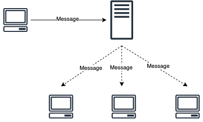
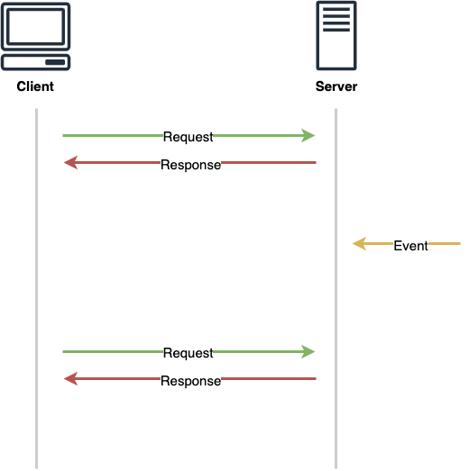
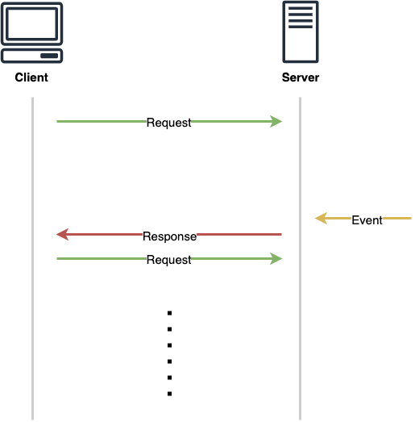
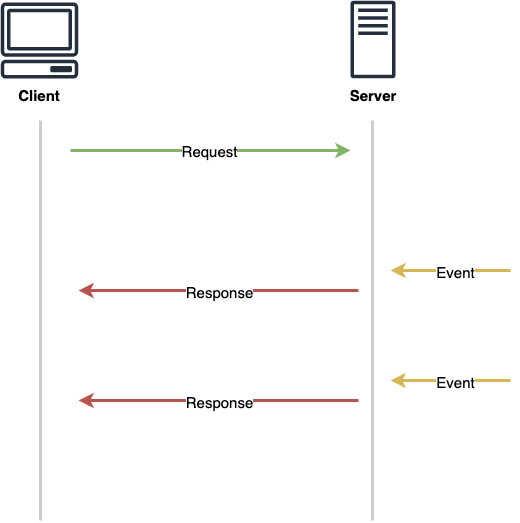
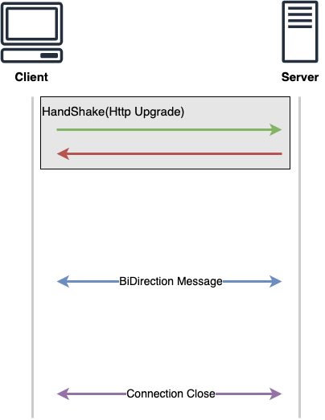

### 채팅 서버 구현의 요구 조건  

채팅 서버의 역할은 아래와 같이 클라이언로 부터 수신한 메시지를 연결된 다른 클라이언트들에게 broadcast하는 것이 핵심적인 기능이다. 
그리고 이를 구현하는데는 다양한 방법이 존재할 수 있다. 

### HTTP와 한계  

직관적으로 생각해보면 서버에서는 수신한 메시지를 클라이언트에게 푸쉬해줄 수 있어야 한다. 
하지만 HTTP는 클라이언트에서 요청을 하고 서버에서 응답을 하는 구조와 동시에 half-duplex로 동작한다. 
또한, 비연결성(Connectionless), 무상태(Stateless)라는 특성 때문에 필요한 기능을 완벽하게 구현하기는 어렵다. 
서버에서 새로운 이벤트가 발생하더라도 이를 클라이언트에서 캐치하기 위해서는 반드시 클라이언트에서 요청을 보내야 하며 아래와 같은 트릭을 통해 유사하게 채팅 기능을 구현할 수 있다. 

#### HTTP Polling  

클라이언트가 일정 시간마다 HTTP 요청을 보내 응답을 받는 방식이다. 
하지만 TCP 위에서 동작하는 HTTP 특성 상, 
매 번 연결을 맺고 끊기 위해서는 3 Way-Handshake와 4 Way-Handshake가 발생하고 이는 결국 서버의 오버헤드로 이어지게 된다. 

#### HTTP Long Polling  

클라이언트가 HTTP 요청을 보내고 응답이 올 때 까지 커넥션을 유지한다. 
그리고 서버에서 새로운 이벤트가 발생하면 그 때 응답을 내리고 연결은 해지되며 클라이언트는 다시 HTTP 요청을 보내고 응답을 기다린다. 
이상적인 경우에는 Polling 보다 서버의 부담을 줄일 수 있으나, 
이벤트가 잦은 경우에는 Polling과 차이가 큰 차이가 없다는 점, 많은 클라이언트가 연결되어 있는 경우 이벤트 발생 후 한 번에 모든 요청이 들어오기 때문에 부담이 갈 수 있다는 것을 고려해야 한다. 

#### HTTP Streaming  

클라이언트가 HTTP가 요청을 보내고 커넥션을 계속 유지한다. 
연결을 맺고 끊는데 사용되는 리소스가 줄어들기 때문에 위 방법들 보다는 더 효율적이다. 
하지만 Half-Duplex라는 특성 상 동시에 클라이언트와 서버가 메시지를 주고 받는 것은 불가능하기에, 
채팅에 있어서는 웹소켓과 같이 완전한 전이중 방식에 비해 조금 부족하다. 

이 방식은 HTML5에 **SSE(Server-Sent Events)**라는 표준으로도 등록되어 있다. 
HTTP/1.1을 통해서도 구현 가능하나 HTTP/2.0과 결합되어 많이 사용된다. 
대부분 브라우저에서는 특정 서버에 대한 커넥션을 6개까지 유지할 수 밖에 없는데, 
HTTP/2.0를 사용하면 Multiplexing을 활용하여 효율적으로 사용할 수 있다. 

> [TCP 연결 관리](https://stalker5217.netflify.app/network/tcp-connection)

----------

### WebSocket

일반 TCP Socket에 비해 WebSocket이 가지는 특징은, WebSocket은 연결 과정에 있어 HTTP 프로토콜을 사용한다는 것이다. 
HTTP Upgrade 헤더를 사용하여 연결 이 후 WebSocket Protocol로 전환된다. 
연결이 HTTP를 통해 진행되기에 80, 443 포트를 그대로 사용할 수 있다는 특징을 가진다. 
또한 상태적(Stateful)인 특성을 가지기에 연결 이 후 계속 통신이 가능하며, Full Duplex 기반 양방향 통신을 제공한다. 

WebSocket으로 커넥션을 맺으면 Binary Stream을 주고 받게 된다. 
어떠한 규약이 없는 low level이기 때문에 보통 이를 직접 사용하기 보다는 웹 소켓 위에서 동작하는 고수준의 프로토콜을 이용한다. 
예를 들면 채팅을 구현할 때 pub/sub 방식의 **STOMP(Simple Text Oriented Message Protocol)**를 사용한다거나, 
WebFlux 기반의 Reactive Stream을 사용한다면 **RSocket**을 사용한 예시들을 찾아볼 수 있다.  