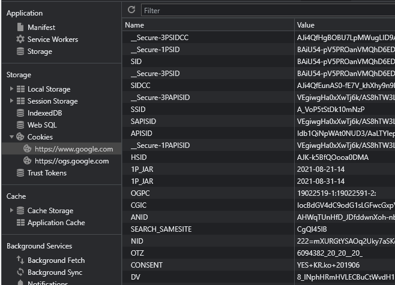

## 클라이언트 식별

HTTP는 익명으로 동작하며 상태 값이 존재하지 않으며 모든 요청은 독립적으로 발생한다. 
그렇기에 사용자 세션을 유지하는 등 특정 사용자를 식별하기 위해서는 부가적인 정보가 필요하다. 

사용자 정보를 포함하는 헤더에는 여러 종류가 있다. 

1. **User-Agent**  
사용 중인 브라우저의 이름과 버전 정보, 운영체제 정보 등을 포함하고 있다. 
현재 사용 중인 크롬은 아래와 같은 내용을 값으로 가진다. 

```
Mozilla/5.0 (Windows NT 10.0; Win64; x64) AppleWebKit/537.36 (KHTML, like Gecko) Chrome/92.0.4515.159 Safari/537.36
```

2. **Referer**  
해당 페이지에 어떤 경로로 접근했는가를 나타낸다. 
예를 들어 구글 검색을 통해 특정 페이지에 접근했다면 referer은 'https://www.google.com'이 된다.

3. **From**    
사용자 이메일을 포함하고 있는 헤더 값이다. 
특정 사용자를 구분해낼 수 있는 수단이 될 수 있지만 이를 수집하여 스팸 메일에 사용하는 등 악용되는 경우가 많아서 이를 헤더에 포함하는 브라우저는 많지 않다. 

4. **Client-ip, X-Forwarded-For**  
일반적으로 IP 정보는 헤더 값에 존재하지 않는다.
프록시나 로드 밸런서를 통해 웹 서버에 접근하는 경우 클라이언트의 원래 IP를 식별하기 위해 X-Forwarded-For, Client-ip와 같은 헤더를 포함하기도 한다. 
하지만 표준 헤더가 아니기에 모든 프록시가 저렇게 동작하지 않는다는 문제가 있으며 또한, IP만으로도 사용자를 특정하기에는 부족한 점이 많다. 

   - IP는 특정 사용자가 아닌 사용하는 PC 자체를 나타내기 때문에 한 대의 PC에 여러 명의 사용자가 있으면 식별할 수 없다.
   - ISP(Internet Service Provider)에서는 주로 동적으로 IP를 할당하기 때문에 특정 사용자를 식별할 수 없다.
   - NAT(Network Address Translation)에서는 실제 IP 주소를 숨기고 방화벽 IP 주소로 변환한다. 


## Cookie  

위 방법들은 현재 사용자에 대한 부가적인 정보로 밖에 활용할 수 없으며 사용자를 특정하지는 못한다. 
현재 사용자를 식별하고 세션을 유지하는 방식 중 가장 보편적인 방식은 **쿠키**를 사용하는 것이다. 

사용자가 처음 접속했을 때 웹 서버에서 해당 사용자를 식별하기 위한 유일 값을 생성하여 ```Set-Cookie```를 헤더에 포함시켜 응답한다. 
그리고 브라우저들은 나름대로 쿠키를 관리하는 Store를 가지고 있으며 이를 저장하여 이 후 요청에서는 ```Cookie```를 헤더를 포함하여 요청하게 된다. 
아래는 크롬 브라우저에서 확인할 수 있는 쿠키 정보이다.




쿠키를 정의하는데 있어 필수 속성에는 쿠키의 name과 value를 포함해야하며, 나머지는 부가적인 속성으로 정의된다. 

```
Set-Cookie: <cookie-name>=<cookie-value>
```

**라이프 타임에 따른 구분**   

- Session Cookie : 브라우저에서 정의한 세션이 종료되면 삭제되는 쿠키이다. 주로 브라우저를 닫으면 삭제된다. 
- Persistent Cookie : 디스크에 저장되며 쿠키 설정 시 Expires에 명시된 날짜에 삭제하거나, Max-Age에 명시된 기간 이후에 삭제를 하게된다. 

```
Set-Cookie: id=a3fWa; Expires=Wed, 21 Oct 2015 07:28:00 GMT;
```

**보안 관련 옵션**  

- Secure : HTTPS 위에서 암호화되었을 때만 쿠키를 전송하게 된다. 
- HttpOnly : XSS를 방지하기 위해 ```Document.cookie```에 접근할 수 없게 된다. 

```
Set-Cookie: id=a3fWa; Expires=Wed, 21 Oct 2015 07:28:00 GMT; Secure; HttpOnly
```

**스코프 관련 옵션**  

- Domain : 쿠키 전달하는 도메인을 지정한다.  
- Path : 해당 경로를 포함하는 URL에만 쿠키를 전달한다.

<br/>

참고

- [HTTP 쿠키 - HTTP | MDN](https://developer.mozilla.org/ko/docs/Web/HTTP/Cookies)
- David Gourley, Brian Totty, Majorie Sayer, Sailu Reddy, Anshu Aggarwal, HTTP 완벽 가이드, 이용준, 정상일, 프로그래밍 인사이트