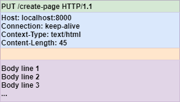

## HTTP Message  

  

HTTP 메시지는 단순하게 구조화된 데이터 블록이다. 
크게 세 가지로 구성되어 있다. 

- **Start Line**
- **Header**
- Blank Line
- **Body**

Start line과 Header는 단순히 Carriage Return으로 구분된 문자열이다. 

### Start Line  

- 요청 : [method] [request url] [http version]
- 응답 : [http version] [status code] [status text]

### Method  

HTTP Method는 서버에게 주어진 리소스에 대해 어떤 동작을 해야하는지 알려준다. 

1. **GET**, **HEAD**  

GET은 주로 서버에게 어떤 리소스를 달라고 요청할 때 사용된다. 
그리고 HEAD는 GET처럼 동작하지만 서버에서는 응답 본문 없이 헤더만을 반환한다. 
HTTP 1.1 스펙을 준수하기 위해서는 HEAD 메서드가 반드시 구현되어야하며, HEAD는 GET의 헤더 결과와 일치함을 보장해야한다.

HEAD는 다음과 같은 목적으로 사용될 수 있다. 
- 해당 리소스를 가져오지 않고 헤더 값으로 리소스에 대한 타입 등의 정보를 알 수 있다.
- 반환된 상태 코드를 통해 리소스가 존재하는지 확인할 수 있다. 
- 헤더를 통해 리소스가 변경되었는지 검사할 수 있다. 

그리고 GET과 HEAD는 Safe Method여야 한다. 
리소스를 단순히 READ하는 역할이지 이 메서드에 의해 서버의 상태가 바뀌어서는 안된다. 
마지막으로 GET과 HEAD는 요청 바디가 존재하지 않는다. 

2. **POST**  

POST는 서버에 입력 데이터를 전송하기 위해 설계되었다. 
HTTP Message Body를 통해 데이터를 전송할 수 있다. 
POST는 대상 리소스가 가지고 있는 의미에 따라 적절한 처리를 한다. 
새로운 리소스를 생성한다거나 기존 리소스에 데이터를 추가할 수도 있다. 

3. **PUT**, **PATCH**  

PUT은 특정 리소스의 위치에 새로운 내용을 생성하거나 만약 이미 존재한다면 새로운 내용으로 교체하는 것이다. 
PUT이 기존 리소스 내용과는 상관 없이 덮어쓰는 개념이라면 PATCH는 이미 존재하는 리소스의 부분 수정의 개념이다. 

예를 들어 다음과 같은 리소스가 존재한다고 하자.

|seq|id|email|phone_number|  
|:--|:--|:--|:--|
|1|stalker|stalker5217@gmail.com|010-1234-5678|

```
PUT /customers/1 HTTP1.1

{
  id: "stalker",
  phone_number: "010-1111-1111"
}
```

|seq|id|email|phone_number|  
|:--|:--|:--|:--|
|1|stalker|null|010-1234-5678|  

PUT의 결과는 위 처럼 항상 전체 리소스에 대한 전송을 전제로 한다. 
그렇기에 필드에 대한 값이 누락된다면 null처리가 된다. 

```
PATCH /customers/1  
{
  id: "stalker",
  phone_number: "010-1111-1111"
}
```

|seq|id|email|phone_number|  
|:--|:--|:--|:--|
|1|stalker|stalker5217@gmail.com|010-1111-1111|  

PATCH는 기존 리소스에서 전송된 내용에 대해서만 수정을 하게된다. 

4. **DELETE**

지정한 리소스를 삭제한다. 

5. **TRACE**  

TRACE 요청은 주로 진단에 사용된다. 
클라이언트의 요청은 서버에 도달하기 까지에는 방화벽, 프록시, 게이트웨이 등을 거쳐서 애플리케이션으로 최종 전달될 수 있다. 
TRACE 요청은 서버에서 Loopback Test를 진행하며, 수신한 메시지를 그대로 본문에 넣어 응답으로 돌려준다. 
이를 통해 클라이언트는 자신의 요청이 서버에서 어떻게 보이게 되는지 알 수 있으며 필요시 요청 내용을 수정할 수 있게된다. 

6. **OPTIONS**  

OPTIONS는 서버에게 특정 리소스에 대해 어떤 메서드가 허용되는지를 응답한다. 

------------------

||GET|HEAD|POST|PUT|PATCH|DELETE|TRACE|OPTIONS|
|:---|:---:|:---:|:---:|:---:|:---:|:---:|:---:|:---:|
|Request Body|X|X|O|O|O|X|X|X|
|Response Body|O|X|O|X|O|O|X|O|
|Safe|O|O|X|X|X|X|O|O|
|Idempotent|O|O|X|O|X|O|O|O|
|Cacheable|O|O|O|X|X|X|X|X|
|Allowed in HTML forms|O|X|O|X|X|X|X|X|

Ideompotent(멱등성)은 동일한 요청을 한 번 보내는 것과 여러번 보냈을 떄 서버의 상태가 같아 동일한 결과를 반환함을 의미한다. 이는 장애 상황 등에 활용될 수 있다. 만약 타임아웃과 같은 오류로 정상적으로 서버로부터 응답을 받지 못했을 때 결과와 상관없이 클라이언트는 미리 새 연결을 통해 요청을 발생시킬 수 있다. 


### Status Code  

Status code는 클라이언트에게 서버 작업에 대한 결과를 말해준다. 
아래는 일반적으로 많이 나타나는 코드에 대한 정리이다. 

**2XX (정상 응답)**

|응답 코드| 설명|
|:---|:---|
|200 OK|요청이 성공적으로 이루어짐|
|201 Created|리소스 생성 요청이 성공적으로 이루어짐|
|202 Accepted|요청 자체는 성공하였으나 아직 그에 대한 작업은 수행하지 않음(이후 Batch Job에서 실행하는 등)|
|203 Non-Authoritative Information|엔티티 헤더에 들어있는 정보가 원래 서버가 아닌 리소스의 사본으로부터 왔음|
|204 No Content|엔티티의 본문이 존재하지 않으며 페이지 이동 없는 갱신에 사용될 수 있음|
|205 Reset Content|브라우저에게 현재 페이지에 있는 HTML 폼의 모든 값을 비우라고 말함|
|206 Partial Content|Range 헤더에 기술된 범위 요청이 성공적으로 이루어짐|


**3XX (리다이렉션)**  

|응답 코드| 설명|
|:---|:---|
|300 Multiple Choice|동시에 여러 리소스를 가리키는 URL을 요청한 경우 리소스 목록과 함께 해당 코드 반환|
|301 Moved Permanently|요청한 URI이 영구적으로 변경되었음을 나타되며 Location 헤더에는 변경된 리소스 위치가 포함됨. 그리고 이는 GET 요청으로 변경됨(Maybe)|
|302 Found|요청한 URI이 일시적 변경되었음을 나타내며 리다이렉션 URL은 리소스를 임시로 가리키는 용도로 사용됨. 그리고 GET 요청으로 변경됨(Maybe)|
|303 See Other|302와 유사하나, 리다이렉션 URL이 GET 요청으로 변경됨을 보장함|
|304 Not Modified|캐싱에 사용됨. GET, HEAD를 통해 조건부 요청을 보내고, 해당 리소스가 수정된 적이 없으면 해당 코드 반환|
|305 Use Proxy|반드시 프록시를 통해 접근되어야 함을 나타냄|
|307 Temporary Redirect|302와 유사하나, 리다이렉션 시 원래의 Method를 유지함|
|308 Permanent Redirect|301과 유사하나, 리다이렉션 시 원래의 Method를 유지함|


**4XX(클라이언트 에러)**  

|응답 코드| 설명|
|:---|:---|
|400 Bad Request|잘못된 요청으로 서버에서 이해할 수 없음|
|401 Unauthorized|인증 자격이 유효하지 않음|
|402 Payment Required|현재 사용되고 있지는 않으며 추후 사용을 위한 코드|
|403 Forbidden|현재 인증 권한으로는 접근할 수 없음|
|404 Not Found|요청한 URL이 서버에 존재하지 않음|
|405 Method not Allowed|요청한 URL에 대해 서버에서 지원하지 않는 메서드로 호출|
|406 Not Acceptable|요청이 클라이언트가 받아들일 수 있는 엔티티가 아님|
|407 Proxy Authentication Required|401과 같으나 인증을 요구하는 프록시 서버를 위해 사용됨|
|408 Request Timeout|클라이언트 요청이 너무 오래 걸리는 경우 서버에서 이를 반환하고 연결을 끊음|
|409 Conflict|서버에서 해당 요청이 충돌을 일으킬 가능성이 있다고 판단함|
|410 Gone|404와 유사하나 존재하던 리소스가 삭제되었음|
|411 Length Required|요청에 Content-Length 헤더가 필요함|
|412 Precondition Failed|조건부 요청을 했는데 그 중 하나가 실패함|
|413 Request Entity Too Large|서버가 처리할 수 있는 크기를 넘은 요청임|
|414 Request URI Too Long|URL이 서버가 처리할 수 있는 길이보다 긴 요청임|
|415 Unsupported Media Type|서버가 지원하지 않는 엔터티 요청임|
|416 Requested Range Not Satisfiable|Range 범위 요청을했으나 그 범위가 잘못되었음|
|417 Expectation Failed|Expect 헤더에 대해 서버가 만족시킬 수 없는 결과임|


**5XX(서버 에러)**  

|응답 코드| 설명|
|:---|:---|
|500 Internal Server Error|요청에 대한 처리 중 서버 내부에서 에러 발생|
|501 Not Implemented|서버가 지원하지 않는 메서드 호출 등 서버 능력 범위를 넘는 요청인 경우 발생|
|502 Bad Gateway|서버가 게이트웨 혹은 프록시 서버 역할을 하면서 업스트림 서버로부터 유효하지 않은 응답을 받음|
|503 Service Unavailable|트래픽이 과도하거나 점검 중인 상태이기에 현재 서버를 이용할 수 없음|
|504 Gateway Timeout|서버가 게이트웨이 혹은 프록시 역할을 하는 동안 업스트림 서버로 부터 응답을 받지 못함|
|505 HTTP Version Not Supported|서버가 지원하지 않는 프로토콜 요청인 경우 발생|

<br/>

참고

- [HTTP | MDN](https://developer.mozilla.org/ko/docs/Web/HTTP)
- David Gourley, Brian Totty, Majorie Sayer, Sailu Reddy, Anshu Aggarwal, HTTP 완벽 가이드, 이용준, 정상일, 프로그래밍 인사이트
