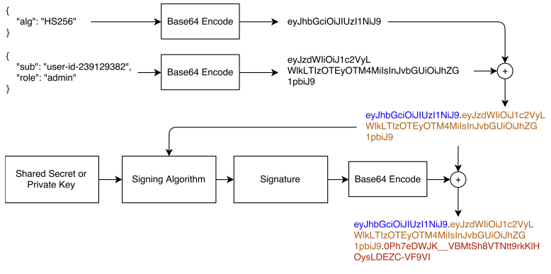

## JWT  

만약 서버가 로드밸런싱을 이유로 여러 개의 인스턴스를 가지고, 인증을 세션을 통해 이루어 질때는 세션을 한 곳에서 관리하기 위해 Redis와 같은 메모리 DB 사용이 필수다. 
JWT는 인증을 위한 값을 토큰 형태로 클라이언트에서 들고 있기 때문에 데이터 스토어에 대한 의존성이 없으며 시스템의 수평 확장에 유리한 구조이다. 

JWT는 3개의 필드로 구성되며 각각은 Base64로 인코딩되어 xxxx.yyyy.zzzz와 같은 포맷을 지닌다. 
각각은 Header, Payload, Signature를 의미한다. 

1. Header  

``` json
{
  "alg": "HS256",
  "typ": "JWT"
}
```

헤더에는 토큰 내용을 해석하는데 필요한 정보들을 담고 있다. 
하나는 토큰의 타입(typ)이고 하나는 HMAC SHA256, RSA 처럼 서명에 사용된 알고리즘을 종류(alg)를 담는다.

2. Payload  

``` json
{
  "sub": "1234567890",
  "name": "John Doe",
  "admin": true
}
```

사용자를 나타내는 데이터가 나타나는 부분이다. 
여기서 나타나는 각 요소들을 정보의 조각을 나타내는 Claim이라고 한다. 
Claim은 크게 3가지로 구분된다.

**Registered Claims**  

이미 의미가 정의 되어있는 클레임을 의미한다. 
그러나 필수 사항은 아니다. 

|claim|description|
|:---|:---|
|iss(Issuer)|JWT를 발급한 주체를 식별하며 문자열 또는 URI가 될 수 있다|
|sub(Subject)|이 JWT를 수신하는 주체를 식별하며 문자열 또는 URI가 될 수 있다|
|aud(Audience)|JWT를 수신하는 주체를 식별하며 문자열 또는 URI가 될 수 있다|
|exp(Expiration)|POSIX Time(1970년 1월 1일 00:00:00 UTC 이후 누적 초)를 기준으로 한다. 이 시간을 초과하면 해당 JWT는 유효하지 않은 상태가 된다|
|nbf(Not before time)|POSIX Time 기준 JWT가 유효한 것으로 간주되는 시간을 의미한다|
|iat(Issued at)|마찬가지로 POSIX Time 기준이며 JWT가 발급된 시간을 나타낸다|
|jti(JWT id)|JWT 자체의 식별자를 나타낸다|
 
**Public Claims** 

JWT를 사용하는 누구나 정의할 수 있는 영역이다. 
claim 충돌 방지를 위해 IANA JSON Web Token Registry에 정의하거나 네임스페이스를 포함하는 URI로 정의되어야 한다.

**Private Clains**  

특정 JWT의 producer와 customer 사이에 정의되는, 
당사자들 사이에 데이터를 공유하기 위한 커스텀 영역이다. 

3. Signature  

```
HMACSHA256(
  base64UrlEncode(header) + "." +
  base64UrlEncode(payload),
  your-256-bit-secret
) 
```

서명은 JWS(Json Web Signature)라고도 하며, 메시지가 중간에 변조되지 않았는지 확인하는데 사용한다. 
비밀키 방식인 HAMC 알고리즘을 사용하거나, RSA나 ECDSA 같은 공개/개인키 쌍을 사용해서도 서명할 수 있다. 특히, 개인키로 서명된 경우 JWT를 보낸 사람이 누구인지도 확인할 수 있다.



참고
- [JSON Web Tokens](https://jwt.io/)