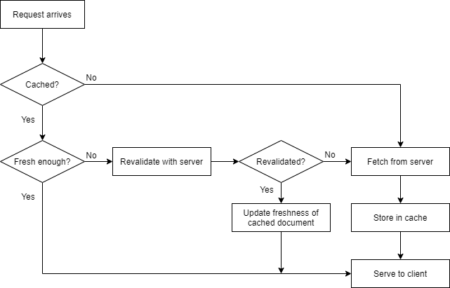

## Cache  

만약 어떠한 컨텐츠가 그 내용이 거의 변하지 않는다고 가정한다면, 이를 매번 요청하고 매번 같은 내용으로 응답해주는 것은 비효율적이다. 
웹 캐시에서는 요청의 사본을 저장해 놓고 이 후 해당 요청에 대해서는 이 사본을 제공한다. 
캐시의 토폴로지는 두 가지로 구분할 수 있다. 
브라우저에 내장되어 로컬에서 관리하게 되는 캐시가 있고, CDN과 같이 프록시 서버 레벨의 캐시가 존재한다. 
캐시의 장점은 가장 직관적으로는 사용자 응답성을 높인다는 것에 있으며, 아래와 같은 이점들을 가지게 된다. 

- 불필요한 데이터 송수신을 줄여서 네트워크 비용을 줄일 수 있다. 
- 네트워크 병목을 감소시킬 수 있다. 
- 서버에 대한 요청이 감소하므로 자연스레 서버의 트래픽 부담이 줄어든다.
- 물리적인 거리로 인한 지연을 줄일 수 있다. 

## Cache 처리 단계  

  

캐시는 일정 기간 동안만 내용을 보관된다. 
만약 기간 내라면 해당 내용으로 바로 응답을 하면 되지만 기간이 지나 만료되었다면 서버에서 내용 변경이 발생했는지 검사가 필요하다. 
HTTP에서는 이 기간을 **Cache-Control**, **Expires** 헤더를 통해서 결정할 수 있다. 
만약 이 값들이 제공되지 않으면 캐시는 환경에 따라 휴리스틱하게 측정될 수 밖에 없다. 

Cache-Control은 HTTP/1.1 스펙이며 max-age 값은 캐시가 생성된 시간부터 수명을 초 단위로 나타낸다. 

```
Cache-Control: max-age=484200
```

Expires는 HTTP/1.0 스펙이며 캐시를 지정한 날짜까지 유효한 것으로 간주한다. 
더 이상 사용은 권장되지 않는다. 
 
```
Expires: Fri, 06 Sep 2021, 05:00:00 GMT
```

그리고 지정한 시간이 만료되었다면 서버에 문서에 변경점이 있는지 확인을 하여 내용을 갱신해야 한다. 
이 때 사용되는 것은 **조건부 요청**이다. 
만약 변경이 없다면 서버에서는 '304 Not Modified'를 응답하여 변경이 없음을 알리고 헤더 값을 갱신한 뒤 캐시로 리다이렉션 된다. 
변경이 있으면 일반 요청과 동일하게 처리되며 해당 내용을 캐시로 저장하여 유지한다. 

클라이언트에서는 **If-Modified-Since** 헤더를 통해 이 조건부 요청을 할 수 있다. 
헤더 값에 지정한 날짜 이후로 변경이 있을 때만 바디를 포함하는 것이다. 
그리고 이 때 서버는 **Last-Modified** 헤더에 변경 날짜를 포함하여 응답한다. 

```
If-Modified-Since: <date>
```

하지만 이처럼 시간 값을 활용한 갱신에는 한계점이 존재한다. 

- 가장 작은 단위가 Second이며 이하 단위로는 조절이 불가능하다. 
- 주석이나 철자 정도의 변경으로 캐시를 굳이 갱신하지 않아도 무방한 상황이 있다. 
- 단순히 문서가 다시 저장되어 실제 내용 변경이 없지만 변경 시각은 바뀌는 경우가 있다.   

이 경우 사용할 수 있는 조건부 헤더는 **If-None-Match**와 **Etag**이다. 
Etag는 말그대로 특정 문서에 지정된 태그이다. 
양식에는 제한이 없으며 예를든다면 "v1.1"과 같이 버전 정보를 표현할 수 있을 것이다. 
그리고 이 값이 캐시 갱신 여부를 결정하는 기준이 된다. 
리소스의 태그가 클라이언트 요청의 If-None-Match에 포함된 태그 값과 다를 때 새로운 Etag를 포함하여 응답하게 된다.  

```
If-None-Match: <tags>
```

## Cache-Control  

Cache-Control 헤더에서는 max-age 외에 캐시를 제어할 수 있는 여러 directive를 제공한다. 
예를 들면 특정 상황에서는 캐시를 제한해야할 수도 있다. 

|directive|description|
|:---|:---|
|no-store|캐시로 저장하는 것을 금지한다|
|no-cache|캐시로 저장될 수 있지만 클라이언트에 제공하기 위해서는 매번 서버와의 검증을 반드시 필요로 한다|
|must-revalidate|만료된 캐시는 반드시 서버와의 검증을 하고 제공해야 한다. 검증 시 서버가 응답이 없는 경우 만료된 캐시를 그대로 제공하는 경우가 있는데 이를 지정하면 504 에러가 발생한다|

이들을 조합하면 캐시는 완전히 무효화된다. 

```
Cache-Control: no-cache, no-store, must-revalidate
Pragma: no-cache
```

> Pragma 헤더는 HTTP/1.0에서 Cache-Control 역할에 해당하는 헤더이다. 

<br/>

참고
- [Cache-Control - HTTP | MDN](https://developer.mozilla.org/ko/docs/Web/HTTP/Headers/Cache-Control)
- [Pragma - HTTP | MDN](https://developer.mozilla.org/ko/docs/Web/HTTP/Headers/Pragma)
- David Gourley, Brian Totty, Majorie Sayer, Sailu Reddy, Anshu Aggarwal, HTTP 완벽 가이드, 이용준, 정상일, 프로그래밍 인사이트